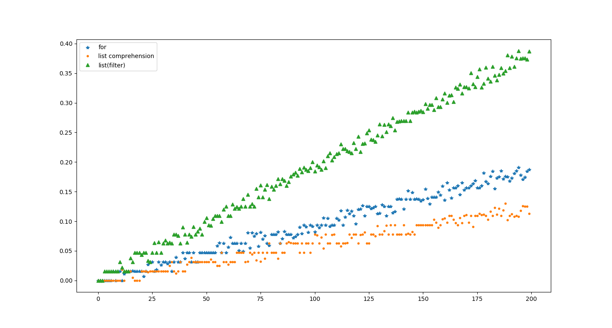

# Python中使用 list comprehension 提高简单循环性能

---
> ## Contact me:
> Blog -> <https://cugtyt.github.io/blog/index>  
> Email -> <cugtyt@qq.com>  
> GitHub -> [Cugtyt@GitHub](https://github.com/Cugtyt)

---

在python中对于列表等迭代类型进行操作是很常见的，比如你可能会遇到类似的处理：

``` python
numbers = list(range(1000))
t1_mod3 = []
t1_mod5 = []
t1_mod7 = []
for num in numbers:
    if not num % 3:
        t1_mod3.append(num)
    if not num % 5:
        t1_mod5.append(num)
    if not num % 7:
        t1_mod7.append(num)
```

但是python提供了更为高效的方案，下面比较下三种方案：  

* for循环
* list comprehension
* filter

---
系统环境  
Anaconda 5.0.1  
Python 3.6  
Windows 10

---

首先引入库，绘出时间曲线直观比较

``` python
from time import time
from itertools import filterfalse
from matplotlib import pyplot as plt
```

其次三个list存储三种方案不同情况下的时间：

``` python
t1 = []         # times for test 1
t2 = []         # times for test 2
t3 = []         # times for test 3
```

我们比较200次，每次增加100个点：

``` python
for i in range(200):
    numbers = list(range(i * 100))
    
    # test 1
    start = time()
    t1_mod3 = []
    t1_mod5 = []
    t1_mod7 = []
    for num in numbers:
        if not num % 3:
            t1_mod3.append(num)
        if not num % 5:
            t1_mod5.append(num)
        if not num % 7:
            t1_mod7.append(num)
    t1.append(time() - start)    

    # test 2
    start = time()
    t2_mod3 = [num for num in numbers if not num % 3]
    t2_mod5 = [num for num in numbers if not num % 5]
    t2_mod7 = [num for num in numbers if not num % 7]
    t2.append(time() - start)

    # test 3
    start = time()
    t3_mod3 = list(filterfalse(lambda n: n % 3, numbers))
    t3_mod5 = list(filterfalse(lambda n: n % 5, numbers))
    t3_mod7 = list(filterfalse(lambda n: n % 7, numbers))
    t3.append(time() - start)
```

最后绘出时间图：

``` python
plt.plot(t1, '*', t2, '.', t3, '^')
plt.legend(['for', 'list comprehension', 'list(filter)'])
plt.show()
```




可以看到三者差别比较明显，for循环性能居中，list comprehension时间最短，  
令人惊讶的是，filter性能如此差, 应该是官方优化了list comprehension。

**注意**，这里  

**for循环只是遍历一遍numbers，而list comprehension和filter是遍历了三遍**

因此，list comprehension的性能比for高了不少，因此在实际使用python中，使用list comprehension会获得不少性能优势。