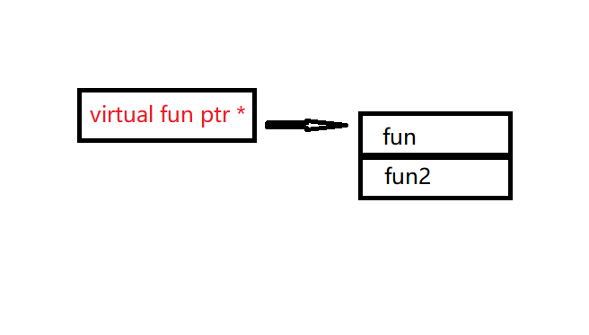

# sizeof(struct)是多少

## Contact me

* Blog -> <https://cugtyt.github.io/blog/index>
* Email -> <cugtyt@qq.com>
* GitHub -> [Cugtyt@GitHub](https://github.com/Cugtyt)

---

C++代码：

``` c++
#include <iostream>

struct Test {};

int main()
{
    Test t;
    std::cout << sizeof(t);
}
```

运行（64位系统）结果是多少？1，为什么？C++为了标志一个空的类，让空的类依旧有1个字节的空间，这样当我们写这个类的数组的时候，就不会出现长度为0的情况了。

但是如果你运行C代码：

``` c
#include <stdio.h>

struct Test {};

int main() {
    struct Test t;
    printf("%d", sizeof(t));
}
```

结果是多少？0，为什么？C没有为空的结构体标志为1，直接是0，那么我们就发现：

``` c
struct Test t[3];
```

的长度是0。非常有趣，这也是C和C++的一个区别。

我们继续探究C++：

``` c++
include <iostream>

struct Test {
    char c;
    int i;
};

int main()
{
    Test t;
    std::cout << sizeof(t);
}
```

结果是多少？8，为什么？这是因为内存对齐，可以参考[这篇文章](https://cugtyt.github.io/blog/2018/07211744)。


``` c++
#include <iostream>

struct Test {
    void fun() {};
};

int main()
{
    Test t;
    std::cout << sizeof(t);
}
```

结果是多少？1，为什么？普通函数和类不放在一起，因此类里面的普通函数不占类的空间。

为啥说普通函数，看这个：

``` c++
#include <iostream>

struct Test {
    virtual void fun() {};
    virtual void fun2() {};
};

int main()
{
    Test t;
    std::cout << sizeof(t);
}
```

结果是多少？8，为什么？这个函数是虚函数，不是普通函数，因此占内存一个指针的长度。因为是64位，所以是8个字节的指针。



``` c++
#include <iostream>

struct Test {
    static int i;
};

int main()
{
    Test t;
    std::cout << sizeof(t);
}
```

结果是多少？1，为什么？静态成员和类不在一起，所以也不占类的空间。