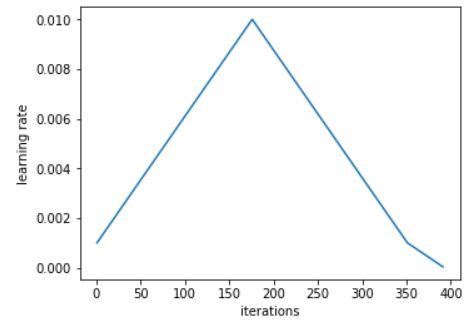
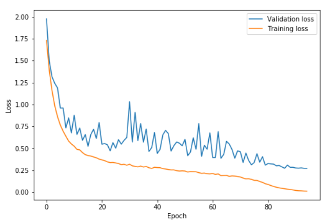
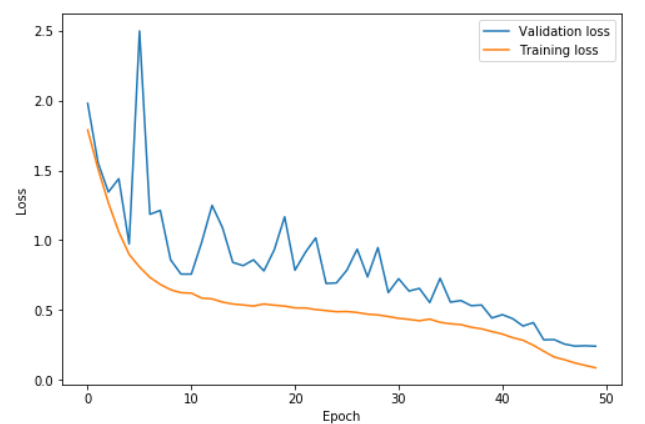
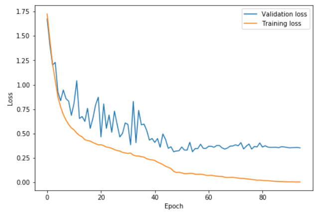
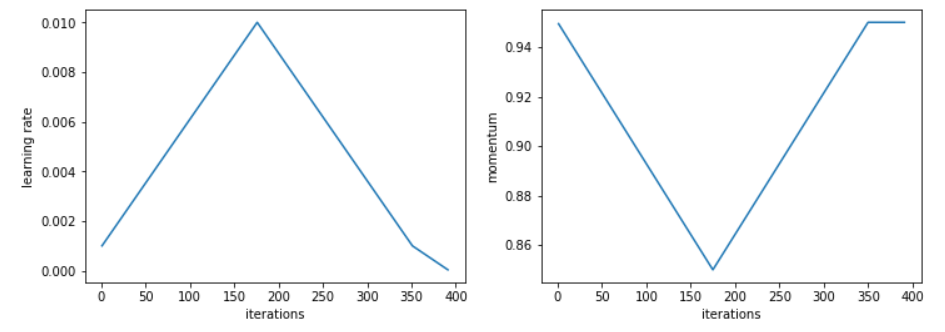

# The 1cycle policy

## Contact me

* Blog -> <https://cugtyt.github.io/blog/index>
* Email -> <cugtyt@qq.com>
* GitHub -> [Cugtyt@GitHub](https://github.com/Cugtyt)

---

来自[the-1cycle-policy](https://sgugger.github.io/the-1cycle-policy.html).

这里我们深挖Leslie Smith的[第一部分](https://arxiv.org/abs/1803.09820)，它是关于超参数（学习率，动量和权重衰减）设置的工作。其中1cycle策略可以在训练复杂的模型上快速的给出结果。例如，我们可以在cifar10上训练一个resnet56达到和原始论文相同甚至更好的精确度，同时迭代次数更少。

使用较高的学习率我们可以在70个epoch达到93%的准确率，远少于7k次迭代。（原始论文使用了360个epoch，大概64k次迭代）

这个[notebook](https://github.com/sgugger/Deep-Learning/blob/master/Cyclical%20LR%20and%20momentums.ipynb)包含了所有的实验。它们都是使用和原始论文相同的数据增强：我们随机水平翻转了图像，在每个边缘填充4个像素后做了随机剪切。我们做了一点修改：我们不用黑色来填充，而是使用reflection填充，这是内置在fastai库中的。这可能也是我们为什么会在相同情况下得到比论文中更好结果的原因。

## 使用更高的学习率

我们已经看到过如何实现学习率搜索器[learning rate finder](https://sgugger.github.io/how-do-you-find-a-good-learning-rate.html)。训练模型时，从很低的学习率开始，不断增加到很大的学习率，在开始出现失控的时候停止。把损失和学习率画出来，在最小值稍微前一点选一个损失还在增加的值。在这里的例子中，在1e-2到3e-2之间都可以：

同样作者建议使用两个等长步骤来做一个循环，第一个长度从第学习率到高学习率，第二个返回到最低点。最大值应该使用上面的学习率查找器来选择，最小的可以是最大的1/10。这个循环的长度应该稍微比epoch的数量稍微小一些，同时，在训练的最后一部分，我们应该让学习率比最小值更小几个数量级：

从小学习率开始的想法并不新：通常使用小学习率来warm-up训练，这也是第一个步骤做的事。Leslie并不建议直接切换到高的学习率，而是缓慢的线性增加到高学习率，同样相同的时间内再降下来。

他在试验中观察到的是，在循环的中间阶段，高学习率可以看作是一个正则方法，让网络免于过拟合。让网络倾向于停留在平坦的最小值，而不是陡峭的区域。他在[另一篇文章](https://arxiv.org/abs/1708.07120)中解释到，通过这种策略，海森近似更低，表示着SGD可以找到更大的平坦区域。

在训练的最后一个部分，随着学习率的下降，直到最小将使我们能够在更平滑的部分内进入更陡峭的局部最小值。在高学习率的部分，我们没看到损失或准确率的大幅度提升，验证集的损失有时候会很高，但是在学习率降低后就能看到这个做法的好处。

在这个图中，学习率在0到41的epoch中从0.08升到0.8，在然后在41到82的epoch中降到0.08，然后在最后的几个epoch中降到0.08的百分之一。我们可以看到验证损失在高学习率部分有些抖动，但是其中重要的一点是，训练集和验证集的距离并没有增加。只是在最后的部分才开始过拟合。

令人惊讶的是，这个策略可以让我们选择一个较大的学习率。有个风险是损失可能太高而导致整体发散。这种情况下，可以在降低学习率前尝试更长的循环期，因为看起来warm-up会有帮助。

这个图中，学习率在0到22.5的epoch中从0.15升到3，在22.5到45中降到0.15，然后最后几个epoch降到0.15的百分之一。更高的学习率可以学的更快，同时防止过拟合。验证损失和训练损失的距离依旧很近，直到最后的那几个epoch。这个情况被Leslie Smith描述为超级收敛。

通过这个方法，我们可以训练在50个epoch中让resnet56到达92.3的准确率。70个epoch的循环可以到93%的准确率。

使用小的学习率可能导致如下情况：

这里，训练在42epoch时停止，随后学习率慢慢减少。验证损失不再降低，出现了过拟合。

## 循环动量

为了达到更高的学习率，Leslie发现降低动量会出现更好的结果。这验证了一个直觉，在训练中，我们希望SGD快速到达新的方向来寻找更平坦的区域，因此新的梯度需要更大的权重。实践中，他建议挑选两个值例如0.85和0.95，在增加学习率时减少动量，减少学习率时增加动量。

Leslie说，从整个训练中选出的最好的动量值可以达到相同的结果，但是使用循环动量可以减少多次尝试不同值，运行多次循环的宝贵时间。

即使使用循环动量总能给出不错的结果，但是我没有找到论文中说的常值动量和循环动量相同的gap。

## 其他的参数也重要

其他超参数的调整也会影响到最优学习率。所以使用学习率查找器时要在相同的条件下。例如，对于不同的批量大小或权重衰减会如下影响结果：

这对于设置一些超参数也是有帮助的。例如，对于权重衰减而言，Leslie建议在一些权重衰减值上运行学习率查找器，挑可以让我们用更大学习率来训练的那个最大的。这也是我们在实验中用1e-4的原因。

他的观点是，批量大小应该选内存放得下的最大值。然后其他超参数（例如dropout）可以像权重衰减那样来调整，或者试下循环学习率看看结果怎么样。有一件事一定不要忘记，就是在决定使用更大学习率时多次次运行学习率查找器。

使用循环策略来训练是一种正则方法，因此需要减少其他正则项的时候不用惊讶。因为我们可以用大学习率长时间训练，所以训练效率很高。