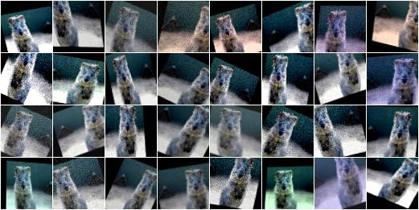
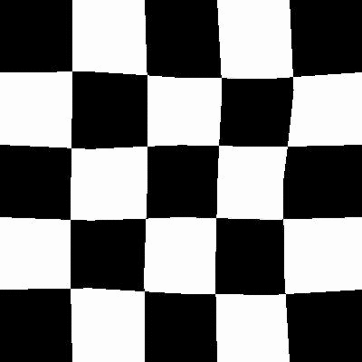

# CNN图像分类改进方法

## Contact me

* Blog -> <https://cugtyt.github.io/blog/index>
* Email -> <cugtyt@qq.com>
* GitHub -> [Cugtyt@GitHub](https://github.com/Cugtyt)

---

<head>
    
    
</head>

参考[博客](https://cugtyt.github.io/blog/effective-pytorch/index),
[Bag of Tricks for Image Classification with Convolution Neural Networks论文](https://arxiv.org/abs/1812.01187v2)，
和[图像分类训练技巧包](https://zhuanlan.zhihu.com/p/66393448)

## 数据角度

* 基础的图片旋转，剪切，平移，[pytorch自带Transforms](https://pytorch.org/docs/stable/torchvision/transforms.html)
* 亮度变化，饱和度变化，噪声, [imgaug](https://github.com/aleju/imgaug)

* 扭曲等操作, [Augmentor](https://github.com/mdbloice/Augmentor)

* 图片叠加操作, https://segmentfault.com/a/1190000015624467, https://www.cnblogs.com/mfryf/archive/2012/03/08/2385304.html

### EfficientNet对于不同数据增强的实验结果

[来源](https://github.com/tensorflow/tpu/tree/master/models/official/efficientnet)

* [AutoAugment](https://github.com/tensorflow/tpu/blob/master/models/official/efficientnet/autoaugment.py), 

* [RandAugment](https://github.com/tensorflow/tpu/blob/master/models/official/efficientnet/autoaugment.py)

* [AdvProp](https://arxiv.org/pdf/1911.09665v1.pdf), 尚无代码

## 模型角度

SOTA模型[EfficientNet](https://github.com/tensorflow/tpu/blob/master/models/official/efficientnet/)

待补充

## Tricks

主要总结自[Bag of Tricks for Image Classification with Convolution Neural Networks](https://arxiv.org/abs/1812.01187v2)

### 增大batch-size, [DON’T DECAY THE LEARNING RATE, INCREASE THE BATCH SIZE](https://arxiv.org/pdf/1711.00489.pdf)

* 等比例增大学习率，学习率预热， [Accurate, Large Minibatch SGD: Training ImageNet in 1 Hour](https://arxiv.org/pdf/1706.02677.pdf)

* 零γ初始化

* 无偏置衰减, [Highly Scalable Deep Learning Training System with Mixed-Precision: Training ImageNet in Four Minutes](https://arxiv.org/pdf/1807.11205.pdf)

* 混合精度训练 FP16, [MIXED PRECISION TRAINING](https://arxiv.org/pdf/1710.03740v3.pdf)

### 训练技巧

* 余弦学习率衰减，[SGDR: STOCHASTIC GRADIENT DESCENT WITH WARM RESTARTS](https://arxiv.org/pdf/1608.03983.pdf)

* 标签平滑，[Label Smoothing](https://www.cv-foundation.org/openaccess/content_cvpr_2016/papers/Szegedy_Rethinking_the_Inception_CVPR_2016_paper.pdf)

* 知识蒸馏，[Knowledge Distillation](https://arxiv.org/pdf/1503.02531v1.pdf)

* mixup增强, [mixup: Beyond empirical risk minimization](https://arxiv.org/pdf/1710.09412v2.pdf)

