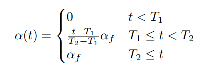

# Pseudo-Label 伪标签训练 <!-- omit in toc -->

## Contact me <!-- omit in toc -->

* Blog -> <https://cugtyt.github.io/blog/index>
* Email -> <cugtyt@qq.com>
* GitHub -> [Cugtyt@GitHub](https://github.com/Cugtyt)

---

重点参考 [Pseudo-Label : The Simple and Efficient Semi-Supervised Learning Method for Deep Neural Networks](http://deeplearning.net/wp-content/uploads/2013/03/pseudo_label_final.pdf)和[知乎博客](https://zhuanlan.zhihu.com/p/35753177)

---

用模型预测无标签数据，得到伪标签：

用有标签数据和伪标签数据训练模型，loss为：

这里的权重可以这样设置：

结果：

整个流程：

