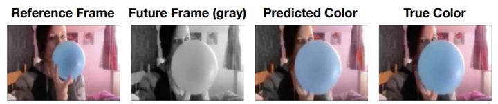
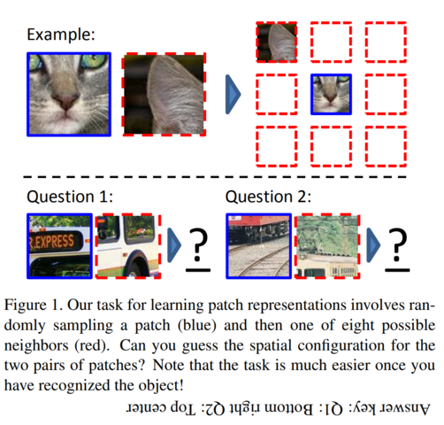
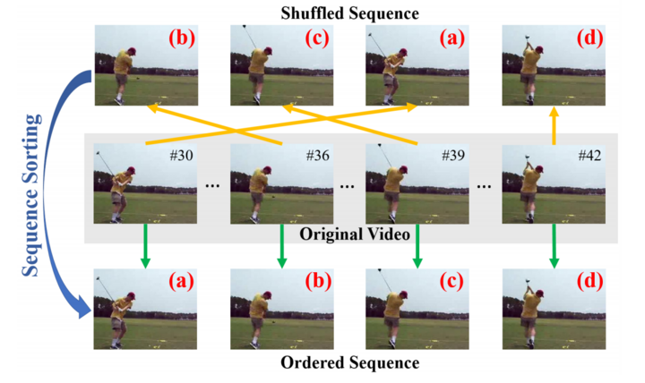
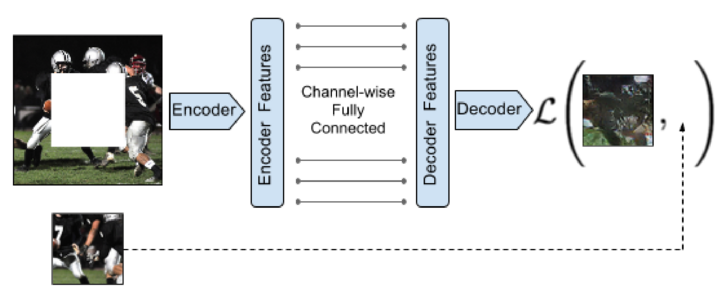
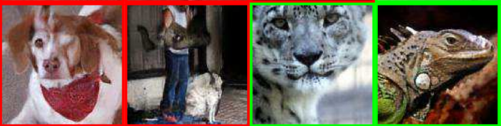
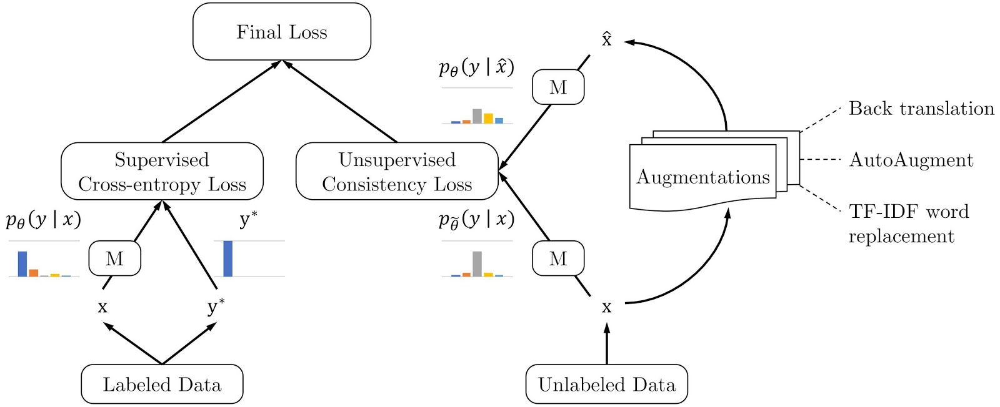

# Self-supervised learning and computer vision

## Contact me

* Blog -> <https://cugtyt.github.io/blog/index>
* Email -> <cugtyt@qq.com>
* GitHub -> [Cugtyt@GitHub](https://github.com/Cugtyt)

---

https://www.fast.ai/2020/01/13/self_supervised/

## 自监督学习

使用预训练的模型比从头训练少使用1000x的数据，而且还快。

即使是当前任务没有预训练模型，我们也可以使用在其他任务上的预训练模型。[Transfusion: Understanding Transfer Learning for Medical Imaging](https://arxiv.org/abs/1902.07208)，发现使用ImageNet预训练的模型也可以帮助医疗图像任务。虽然还有很大的进步空间，而提升的秘诀是**自监督学习**。自监督学习使用数据本身的特点训练模型，并不需要额外的数据标签来训练。

[ULMFiT](https://arxiv.org/abs/1801.06146)就是这样做的，先预训练一个语言模型，这个模型用于预测语句中的下一个词。这个模型并不是我们的目标任务，但是做这个任务用于预训练我们的模型，可以让模型在目标任务上使用少量的数据做的更好。

## 计算机视觉的自监督学习

自监督学习中用于预训练的任务称为pretext task，可以称为前置任务。后续微调的目标任务成为downstream tasks，可以称为下游任务。

计算机视觉中的自监督学习任务的一个关键问题是：使用什么前置任务？下面是一些可以使用的任务：

* 填色 Colorization

* 图像拼图 Placing image patches in the right place

* 视频帧排序 Placing frames in the right order

* 图像补全 

* 分类损坏的图像 Classify corrupted images

### 挑选前置任务

前置任务应该让模型对下游任务的数据有一定的了解。例如自动编码器通常用作前置任务，但是这个任务不仅要恢复原始图像的内容，还要生成原始图像的噪声，因此如果下游任务要生成高质量的图像，这个前置任务就不是很好。

同时前置任务应该是人类本身可以完成的。例如前置任务可以是生成下一帧视频帧，但是如果生成的目标帧太远，可能人类自己也无法监督模型的学习。

## 下游任务微调

这步可以看做是迁移学习，但是注意不要太影响已经学会的权重信息。可以使用ULMFiT的方法，比如逐层解冻网络，不同的学习率，one-cycle训练等。

总之，不要花太多时间用于搞一个特别好的复杂的前置任务，有些起色就可以快速的帮助下游任务开始学习了。快速简单的搞起来最好，除非你真的需要一个复杂的前置任务。

## 一致性损失

一致性损失可以帮助自监督学习的训练。比如[Advancing Semi-supervised Learning with Unsupervised Data Augmentation](https://ai.googleblog.com/2019/07/advancing-semi-supervised-learning-with.html)：

## 进一步阅读：

* [Self-Supervised Learning of Pretext-Invariant Representations](https://arxiv.org/abs/1912.01991) 

* [Momentum Contrast for Unsupervised Visual Representation Learning](https://arxiv.org/abs/1911.05722)

* [Self-supervised Visual Feature Learning with Deep Neural Networks: A Survey](https://arxiv.org/pdf/1902.06162.pdf)

* [Revisiting Self-Supervised Visual Representation Learning](http://openaccess.thecvf.com/content_CVPR_2019/papers/Kolesnikov_Revisiting_Self-Supervised_Visual_Representation_Learning_CVPR_2019_paper.pdf)

* [Self-Supervised Representation Learning](https://lilianweng.github.io/lil-log/2019/11/10/self-supervised-learning.html)