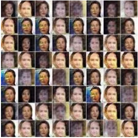
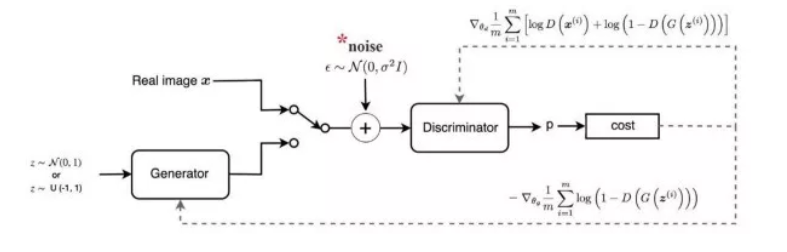
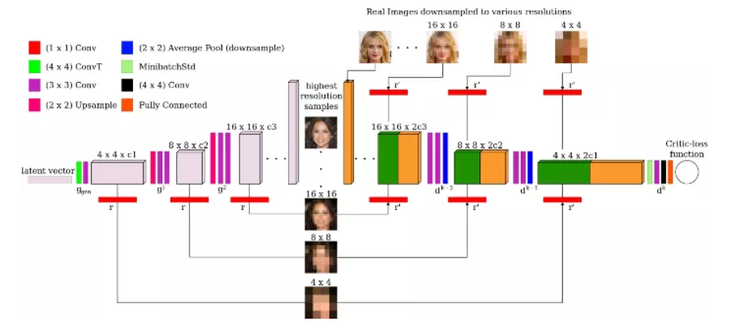

# 训练GAN的方法

## Contact me

* Blog -> <https://cugtyt.github.io/blog/index>
* Email -> <cugtyt@qq.com>
* GitHub -> [Cugtyt@GitHub](https://github.com/Cugtyt)

---

## 训练 GANs 一年我学到的 10 个教训 

来自 https://zhuanlan.zhihu.com/p/79959150

### 1. 稳定性和容量

当我开始我的第一个独立的GAN项目时，我注意到在训练过程的早期，判别器的对抗损失总是趋于零，而生成器的损失却非常高。我立即得出结论，一个网络没有足够的“容量”(或参数数量)来跟上另一个网络，因此我匆忙更改生成器的架构，在卷积层上添加更多的滤波器，但令我惊讶的是，什么也没有改变。

在进一步探究网络容量变化对训练稳定性的影响后，我没有发现任何明显的相关性。两者之间肯定存在某种联系，但它并不像你刚开始想象的那么重要。

因此，如果你发现自己的训练过程不平衡，而且你没有任何明显超过对方的网络能力，我不建议你添加或删除滤波器作为主要解决方案。

当然，如果你对自己的网络容量非常不确定，你可以在线查看一些用于类似场景的架构示例。

### 2. 提前停止

在GANs训练中，你可能会遇到的另一个常见错误是，当你看到生成器或判别器损失突然增加或减少时，立即停止训练。我自己也这么做过无数次：在看到损失增加之后，我立刻想到整个训练都完蛋了，而责任在于某个调得不完美的超参数。

直到后来，我才意识到，通常损失的上升或下降几乎是随机的，这没有什么错。我取得了一些很好的实验 的结果，而生成器的损失远高于判别器的损失，这是完全正常的。因此，当你在训练过程中遇到突然的不稳定时，我建议你多训练一会儿，在训练过程中注意生成图像的质量，因为视觉理解通常比一些损失数字更有意义。

### 3. 损失函数的选择

在选择用于训练GAN的损失函数时，我们应该选择哪一个？

最近的一篇论文解决了这个问题(https://arxiv.org/abs/1811.09567)，其中对所有不同的损失函数进行了基准测试和比较：出现了一些非常有趣的结果。显然，选择哪个损失函数并不重要，没有哪个函数绝对优于其他函数，GAN能够在每个不同的情况下学习。

因此，我的建议是从最简单的损失函数开始，留下一个更具体和“最先进的”选项作为可能的最后一步，正如我们从文献中了解到的，你很可能会得到一个更糟的结果。

### 4. 平衡生成器和判别器的权重更新

在许多GAN论文中，特别是一些早期的论文中，在实现部分中经常可以看到，作者每更新生成器两次或三次才更新一次判别器。

在我的第一次尝试中，我注意到在不平衡训练的情况下，几乎每次判别器网络会压过另一个(损失大大减少)。因此，当我读到即使是著名论文的作者也有类似的问题，并实施了一个极其简单的解决方案来克服它时，我对自己所做的一切充满信心。

不幸的是，在我看来，通过不同的网络权重更新来平衡训练是一个非常短视的解决方案。最终，稳定我训练的解决方案是几乎不改变生成器更新其权重的频率：它有时可以推迟“不稳定”，但永远无法解决它，直到收敛。当我注意到这种技术的无效时，我甚至试图使它更加动态，根据两个网络损失的当前状态改变权值update schedule，直到后来我才发现，我并不是唯一一个试图走这条路的人，和其他许多人一样，我也没有成功地克服不稳定性。

我后来才明白，其他技术，在本文后面的解释中，在提高训练稳定性方面有更大的作用。

### 5. 模式坍塌和学习率

如果你正在处理GANs，你肯定知道什么是模式坍塌。它包含在生成器“坍塌”中，并且总是为输入的每个可能的潜向量生成同一个图像。在GAN训练中，这是一个相当常见的障碍，在某些情况下，它会变得非常烦人。

模式坍塌的例子



如果您发现自己处于这种情况，我建议您使用最直接的解决方案是尝试调整GAN的学习率，因为根据我的个人经验，我总是能够克服这个障碍，改变这个特定的超参数。**根据经验，当处理模式坍塌时，尝试使用一个较低的学习率并从头开始训练。**

学习速度是最重要的超参数之一，即使不是最重要的超参数，因为即使是很小的变化也会导致在训练过程中发生根本性的变化。通常，当使用更大的批处理大小时，你可以允许更高的学习率，但是在我的经验中，处于保守的一边几乎总是一个安全的选择。

还有其他方法可以对抗模式坍塌，比如Feature Matching和Minibatch Discrimination，我从来没有在自己的代码中实现过，因为我总能找到另一种方法来避免这种特别的麻烦，但是如果需要的话，可以给予它们一些关注。

### 6. 加噪声

众所周知，增加判别器的训练难度有利于提高系统的整体稳定性。增加判别器训练复杂度的最著名的方法之一是在真实数据和合成数据(例如由生成器生成的图像)中添加噪声，在数学世界中，这应该是可行的，因为它有助于为两个相互竞争的网络的数据分布提供一定的稳定性。它确实是一个简单的解决方案，我建议您尝试一下，因为**它在实践中可以很好地工作**(即使它不能神奇地解决您可能遇到的任何不稳定问题)，同时只需要很少的设置工作。话虽如此，我开始的时候使用这种技术，但过了一段时间后就放弃了，而是更喜欢其他一些在我看来更有效的技术。



### 7. 标签平滑

实现相同目标的另一种方法是标签平滑，这更容易理解和实现：如果真实图像的标签设置为1，我们将它更改为一个较低的值，比如0.9。这个解决方案不鼓励判别器对其分类过于自信，或者换句话说，不依赖非常有限的一组特征来判断图像是真还是假。我完全赞同这个小技巧，因为**它在实践中表现得非常好**，并且只需要更改代码中的一两个地方。

#### 实现

来自 https://www.cnblogs.com/itmorn/p/11254448.html

假设有一批数据在神经网络最后一层的输出值和他们的真实标签
```
out = np.array([[4.0, 5.0, 10.0], [1.0, 5.0, 4.0], [1.0, 15.0, 4.0]])

y = np.array([[0, 0, 1], [0, 1, 0], [0, 1, 0]])
```
直接计算softmax交叉熵损失：
```
res = tf.losses.softmax_cross_entropy(onehot_labels=y, logits=out, label_smoothing=0)

结果为：0.11191821843385696
```

使用标签平滑后：
```
res2 = tf.losses.softmax_cross_entropy(onehot_labels=y, logits=out, label_smoothing=0.001)

结果为：0.11647378653287888
```

可以看出，损失比之前增加了，标签平滑的原理是对真实标签做了改变，源码里的公式为：
```
new_onehot_labels = onehot_labels * (1 - label_smoothing) + label_smoothing / num_classes

new_onehot_labels = y * (1 - 0.001) + 0.001 / 3
```

### 8. 多尺度梯度

当处理不是太小的图像(如MNIST中的图像)时，你必须查看多尺度梯度。这是一个特殊的GAN实现，由于两个网络之间有多个跳过连接，使得梯度流从判别器到生成器，类似于传统用于语义分割的U-Net中所发生的情况。

MSG-GAN结构



多尺度梯度论文的作者能够训练GAN直接生成高清晰度 1024x1024图像，**没有任何特定的障碍(模式坍塌等)**，而以前只有progressively growing GANs(英伟达ProGAN)才有可能。我已经在我的项目中实施了它，我注意到这是**一个更稳定的训练和具有令人信服的结果**。

### 9. TTUR

当我说Two Time-Scale Update Rule，或者TTUR的时候，你可能会认为我指的是GAN训练中使用的一种复杂的技术，你可能完全错了。它只包含为生成器和判别器选择不同的学习率，仅此而已。在首次引入TTUR的论文中，作者提供了一个收敛于Nash均衡的数学证明，并证明了使用不同的学习率实现著名的GANs (DCGAN, WGAN-GP)可以获得最先进的结果。

但是当我说“使用不同的学习速度”时，我在实践中真正的意思是什么呢？一般来说，我建议**为判别器选择更高的学习速度，而为生成器选择更低的学习速度：这样一来，生成器就必须采取更小的步骤来欺骗判别器，并且不会选择快速、不精确和不现实的解决方案来赢得对弈。**为了给出一个实际的例子，我经常为discriminator选择0.0004，为generator选择0.0001，我发现这些值在我的一些项目中运行得很好。请记住，在使用TTUR时，你可能会注意到生成器的具有更好的损失。

### 10. 谱归一化

在一些文献中，如介绍SAGAN(或Self - Attention GAN)的文献中，表明谱归一化是应用于卷积核上的一种特殊的归一化，可以极大地提高训练的稳定性。它最初只在判别器中使用，后来被证明是有效的，如果也用于生成器的卷积层，我完全赞同这个决定!

我几乎能说的发现和实现谱归一化改变了我的GAN旅程方向，我坦率地说没有看到任何理由不使用它，我几乎可以保证它会把你带到一个更好的结果以及更稳定的训练，从而让可以你关注其他更有趣的方面。

## GAN性能不稳？这九大技术可“镇住”四类缺陷

来自 https://blog.csdn.net/dQCFKyQDXYm3F8rB0/article/details/87871048

### 1. Alternative Loss Functions （替代损失函数）

修复 GAN 缺陷的最流行的补丁是  Wasserstein GAN （https://arxiv.org/pdf/1701.07875.pdf）。该 GAN 用 Earth Mover distance ( Wasserstein-1 distance 或 EM distance) 来替换传统 GAN 的 Jensen Shannon divergence ( J-S 散度) 。EM 距离的原始形式很难理解，因此使用了双重形式。这需要判别网络是 1-Lipschitz，通过修改判别网络的权重来维护。

使用 Earth Mover distance 的优势在于即使真实的生成数据分布是不相交的，它也是连续的。同时，在生成的图像质量和损失值之间存在一定关系。使用 Earth Mover distance 的劣势在于对于每个生成模型 G  都要执行许多判别网络 D 的更新。而且，研究人员认为权重修改是确保 1-Lipschitz 限制的极端方式。


640?wx_fmt=png

左图中 earth mover distance 是连续的, 即便其分布并不连续, 这不同于优图中的 the Jensen Shannon divergence。


另一个解决方案是使用均方损失（ mean squared loss ）替代对数损失（ log loss ）。LSGAN （https://arxiv.org/abs/1611.04076）的作者认为传统 GAN 损失函数并不会使收集的数据分布接近于真实数据分布。


原来 GAN  损失函数中的对数损失并不影响生成数据与决策边界（decision boundary）的距离。另一方面，LSGAN 也会对距离决策边界较远的样本进行惩罚，使生成的数据分布与真实数据分布更加靠近，这是通过将均方损失替换为对数损失来完成的。


### 2. Two Timescale Update Rule (TTUR)


在 TTUR 方法中，研究人员对判别网络 D 和生成网络 G 使用不同的学习速度。低速更新规则用于生成网络 G ，判别网络 D使用 高速更新规则。使用 TTUR 方法，研究人员可以让生成网络 G 和判别网络 D 以 1:1 的速度更新。 SAGAN （https://arxiv.org/abs/1805.08318） 就使用了 TTUR 方法。


### 3. Gradient Penalty （梯度惩罚）


论文Improved Training of WGANs（https://arxiv.org/abs/1704.00028）中，作者称权重修改会导致优化问题。权重修改会迫使神经网络学习学习更简单的相似（simpler approximations）达到最优数据分布，导致结果质量不高。同时如果 WGAN 超参数设置不合理，权重修改可能会出现梯度消失或梯度爆炸的问题，论文作者在损失函数中加入了一个简单的梯度惩罚机制以缓解该问题。

DRAGAN （https://arxiv.org/abs/1705.07215）的作者称，当 GAN 的博弈达到一个局部平衡态（local equilibrium state），就会出现 mode collapse 的问题。而且判别网络 D 在这种状态下产生的梯度是非常陡（sharp）的。一般来说，使用梯度惩罚机制可以帮助避免这种状态的产生，极大增强 GAN 的稳定性，尽可能减少 mode collapse 问题的产生。

### 4. Spectral Normalization（谱归一化）

Spectral normalization 是用在判别网络 D 来增强训练过程的权重正态化技术 （weight normalization technique），可以确保判别网络 D 是 K-Lipschitz 连续的。 SAGAN (https://arxiv.org/abs/1805.08318)这样的实现也在判别网络 D 上使用了谱正则化。而且该方法在计算上要比梯度惩罚方法更加高效。

### 5. Unrolling and Packing (展开和打包)

文章 Mode collapse in GANs（http://aiden.nibali.org/blog/2017-01-18-mode-collapse-gans/）中提到一种预防 mode hopping 的方法就是在更新参数时进行预期对抗（anticipate counterplay）。展开的 GAN ( Unrolled GANs ）可以使用生成网络 G 欺骗判别网络 D，然后判别网络 D 就有机会进行响应。

另一种预防 mode collapse 的方式就是把多个属于同一类的样本进行打包，然后传递给判别网络 D 。PacGAN （https://arxiv.org/abs/1712.04086）就融入了该方法，并证明可以减少 mode collapse 的发生。

### 6. 多个 GAN

一个 GAN 可能不足以有效地处理任务，因此研究人员提出使用多个连续的 GAN ，每个 GAN 解决任务中的一些简单问题。比如，FashionGAN（https://www.cs.toronto.edu/~urtasun/publications/zhu_etal_iccv17.pdf）就使用 2 个 GAN 来执行图像定位翻译。


FashionGAN 使用两个 GANs 进行图像定位翻译。

因此，可以让 GAN 慢慢地解决更难的问题。比如 Progressive GANs (ProGANs，https://arxiv.org/abs/1710.10196) 就可以生成分辨率极高的高质量图像。

### 7. Relativistic GANs（相对生成对抗网络）

传统的 GAN 会测量生成数据为真的可能性。Relativistic GANs 则会测量生成数据“逼真”的可能性。研究人员可以使用相对距离测量方法（appropriate distance measure）来测量相对真实性（relative realism），相关论文链接：https://arxiv.org/abs/1807.00734。

图 A 表示 JS 散度的最优解，图 B 表示使用标准 GAN 损失时判别网络 D 的输出，图 C 表示输出曲线的实际图。

在论文中，作者提到判别网络 D 达到最优状态时，D 的输出应该聚集到 0.5。但传统的 GAN 训练算法会让判别网络 D 对图像输出“真实”（real，1）的可能性，这会限制判别网络 D 达到最优性能。不过这种方法可以很好地解决这个问题，并得到不错的结果。

经过 5000 次迭代后，标准 GAN (左)和相对 GAN (右)的输出。


### 8. Self Attention Mechanism（自注意力机制）

Self Attention GANs（https://arxiv.org/abs/1805.08318）作者称用于生成图像的卷积会关注本地传播的信息。也就是说，由于限制性接收域这会错过广泛传播关系。

将 attention map (在黄色框中计算)添加到标准卷积操作中。

Self-Attention Generative Adversarial Network 允许图像生成任务中使用注意力驱动的、长距依赖的模型。自注意力机制是对正常卷积操作的补充，全局信息（长距依赖）会用于生成更高质量的图像，而用来忽略注意力机制的神经网络会考虑注意力机制和正常的卷积。（相关论文链接：https://arxiv.org/pdf/1805.08318.pdf）。

使用红点标记的可视化 attention map。

### 9. 其他技术

其他可以用来改善 GAN 训练过程的技术包括：

特征匹配

Mini Batch Discrimination（小批量判别）

历史平均值

One-sided Label Smoothing（单侧标签平滑）

Virtual Batch Normalization（虚拟批量正态化）