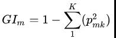
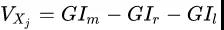

# 白面机器学习 知识整理

## Contact me

* Blog -> <https://cugtyt.github.io/blog/index>
* Email -> <cugtyt@qq.com>
* GitHub -> [Cugtyt@GitHub](https://github.com/Cugtyt)

---

来自 百面机器学习 公众号

## 随机森林需要交叉验证吗？

不需要

原因如下：

随机森林属于bagging集成算法，采用Bootstrap，理论和实践可以发现Bootstrap每次约有1/3的样本不会出现在Bootstrap所采集的样本集合中。故没有参加决策树的建立，这些数据称为袋外数据oob，歪点子来了，这些袋外数据可以用于取代测试集误差估计方法，可用于模型的验证。

袋外数据(oob)误差的计算方法如下：

* 对于已经生成的随机森林,用袋外数据测试其性能,假设袋外数据总数为O,用这O个袋外数据作为输入,带进之前已经生成的随机森林分类器,分类器会给出O个数据相应的分类
* 因为这O条数据的类型是已知的,则用正确的分类与随机森林分类器的结果进行比较,统计随机森林分类器分类错误的数目,设为X,则袋外数据误差大小=X/O
关于这部分的论证经过理论证明是无偏的，也就是你自己划分训练测试集来做交叉验证的话，也是那个误差。大佬们已经在paper中说了，需要看理论的可以看看参考文献中的论文。

参考文献：

1. Bias,variance and prediction error for classification rules.<Robert Tibshiranni>
2. An Efficient Method To Estimate Baggin’s Generalization Error.<David H.Wolpert and William G.Macready>
3. Bagging Predictors,Machine Learning (1996)<Breiman>
4. cnblogs.com/justcxtowor

## 树模型怎么查看特征重要性

随机森林树模型的特征重要性排序常见有两种方法：

### 通过OOB

OOB的具体介绍可以看我之前的专栏https://zhuanlan.zhihu.com/p/77473961

那么OOB是怎么做到可以对特征重要性进行排序的呢，先用训练好的模型对OOB数据进行打分，计算出AUC或其他业务定义的评估指标；接着对OOB数据中的每个特征：

(1) 随机shuffle当前特征的取值；

(2) 重新对当前数据进行打分，计算评估指标；

(3) 计算指标变化率。按照上面方式，对每个特征都会得到一个变化率，最后按照变化率排序来量化特征重要性。

### 通过Gini

说白了就是看看每个特征在随机森林中的每颗树上做了多大的贡献，然后取个平均值，最后比一比特征之间的贡献大小。对于生成的每棵树，计算每个分裂节点的Gini指数，计算公式如下：

其中，k表示k个类别，pmk 表示节点 m 中类别所占的比例。特征 Xj 在节点m的重要性可以通过分裂前后的特征 GIm 的差值来表示，可以表示为

最后，把所有求得的重要性评分做一个归一化处理即可，这里就不列出公式了。
