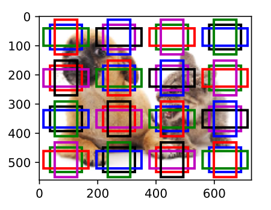
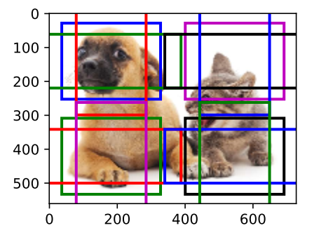

# D2L 多尺度目标检测

## Contact me

* Blog -> <https://cugtyt.github.io/blog/index>
* Email -> <cugtyt@qq.com>
* GitHub -> [Cugtyt@GitHub](https://github.com/Cugtyt)

<head>
    
    
</head>

---

如果以每个像素为中心生成多个锚框，数量太多。一个简单的方法是均匀采样一小部分像素，以它们为中心生成锚框。不同尺度下生成不同数量和大小的锚框。小锚框检测小目标时，采样较多的区域。大锚框检测大目标时，采样较少的区域。

小目标检测，设锚框大小为0.15，特征图高和宽分别为4，结果为：

特征图高和宽减半，锚框0.4，结果为：

在某个尺度下，根据$c_i$张形状为$h \times w$的特征图生成$h \times w$组不同中心的锚框，每组锚框个数为$a$。例如，在刚才实验的第⼀个尺度下，我们依据10（通道数）张形状为4 × 4的特征图⽣成了16组不同中⼼的锚框，且每组含3个锚框。在当前的尺度下，⽬标检测模型需要根据输⼊图像预测$h \times w$组不同中⼼的锚框的类别和偏移量。假设这⾥的$c_i$张特征图为卷积神经⽹络根据输⼊图像做前向计算所得的中间输出。

既然每张特征图上都有$h \times w$个不同的空间位置，那么相同空间位置可以看作含有$c_i$个单元。特征图在相同空间位置的$c_i$个单元在输⼊图像上的感受野相同，并表征了同⼀感受野内的输⼊图像信息。因此，我们可以将特征图在相同空间位置的ci个单元变换为以该位置为中⼼⽣成的a个锚框的类别和偏移量。不难发现，本质上，我们⽤输⼊图像在某个感受野区域内的信息来预测输⼊图像上与该区域位置相近的锚框的类别和偏移量。当不同层的特征图在输⼊图像上分别拥有不同⼤小的感受野时，它们将分别⽤来检测不同⼤小的⽬标。例如，我们可以通过设计⽹络，令较接近输出层的特征图中每个单元拥有更⼴阔的感受野，从而检测输⼊图像中更⼤尺⼨的⽬标。