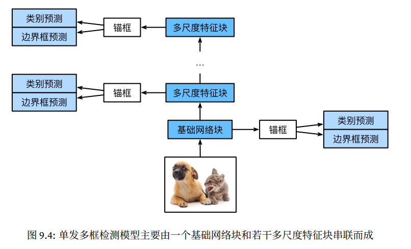

# D2L 单发多框检测

## Contact me

* Blog -> <https://cugtyt.github.io/blog/index>
* Email -> <cugtyt@qq.com>
* GitHub -> [Cugtyt@GitHub](https://github.com/Cugtyt)

<head>
    <script src="https://cdn.mathjax.org/mathjax/latest/MathJax.js?config=TeX-AMS-MML_HTMLorMML" type="text/javascript"></script>
    <script type="text/x-mathjax-config">
        MathJax.Hub.Config({
            tex2jax: {
            skipTags: ['script', 'noscript', 'style', 'textarea', 'pre'],
            inlineMath: [['$','$']]
            }
        });
    </script>
</head>

---



## 类别预测

设目标类别个数$q$，那么锚框类别个数$q+1$，在某个尺度下，特征图高和宽为$h$和$w$，如果以每个中心生成$a$的锚框，那么需要对$hwa$个锚框进行分类。使⽤卷积层的通道来输出类别预测。

具体来说，类别预测层使⽤⼀个保持输⼊⾼和宽的卷积层。这样⼀来，输出和输⼊在特征图宽和⾼上的空间坐标⼀⼀对应。考虑输出和输⼊同⼀空间坐标$(x, y)$：输出特征图上$(x, y)$坐标的通道⾥包含了以输⼊特征图$(x, y)$坐标为中⼼⽣成的所有锚框的类别预测。因此输出通道数为$a(q + 1)$，其中索引为$i(q + 1) + j(0 ≤ j ≤ q)$的通道代表了索引为i的锚框有关类别索引为j的预测。

## 边界框预测层

边界框预测层的设计与类别预测层的设计类似。唯⼀不同的是，这⾥需要为每个锚框预测4个偏移量，而不是q + 1个类别。

## 连结多尺度的预测

单发多框检测根据多个尺度下的特征图⽣成锚框并预测类别和偏移量。由于每个尺度上特征图的形状或以同⼀单元为中⼼⽣成的锚框个数都可能不同，因此不同尺度的预测输出形状可能不同。

在下⾯的例⼦中，我们对同⼀批量数据构造两个不同尺度下的特征图$Y1$和$Y2$，其中$Y2$相对于$Y1$来说⾼和宽分别减半。以类别预测为例，假设以Y1和Y2特征图中每个单元⽣成的锚框个数分别是5和3，当⽬标类别个数为10时，类别预测输出的通道数分别为$5×(10+1) = 55$和$3×(10+1) = 33$。预测输出的格式为(批量⼤小, 通道数, ⾼, 宽)。可以看到，除了批量⼤小外，其他维度⼤小均不⼀样。我们需要将它们变形成统⼀的格式并将多尺度的预测连结，从而让后续计算更简单。

``` python
In [3]: def forward(x, block):
            block.initialize()
            return block(x)
            Y1 = forward(nd.zeros((2, 8, 20, 20)), cls_predictor(5, 10))
            Y2 = forward(nd.zeros((2, 16, 10, 10)), cls_predictor(3, 10))
            (Y1.shape, Y2.shape)
Out[3]: ((2, 55, 20, 20), (2, 33, 10, 10))
```

通道维包含中⼼相同的锚框的预测结果。我们⾸先将通道维移到最后⼀维。因为不同尺度下批量⼤小仍保持不变，我们可以将预测结果转成⼆维的(批量⼤小, ⾼×宽×通道数)的格式，以⽅便之后在维度1上的连结。

``` python
def flatten_pred(pred):
    return pred.transpose((0, 2, 3, 1)).flatten()
def concat_preds(preds):
    return nd.concat(*[flatten_pred(p) for p in preds], dim=1)
concat_preds([Y1, Y2]).shape
(2, 25300)
```

## 定义损失函数和评价函数

⽬标检测有两个损失：⼀是有关锚框类别的损失，我们可以重⽤之前图像分类问题⾥⼀直使⽤的交叉熵损失函数；⼆是有关正类锚框偏移量的损失。预测偏移量是⼀个回归问题，但这⾥不使⽤前⾯介绍过的平⽅损失，而使⽤L1范数损失，即预测值与真实值之间差的绝对值。掩码变量bbox_masks令负类锚框和填充锚框不参与损失的计算。最后，我们将有关锚框类别和偏移量的损失相加得到模型的最终损失函数。