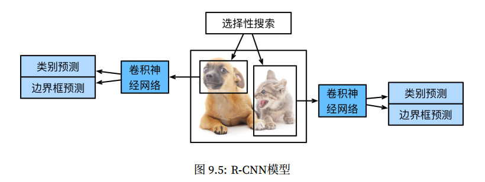
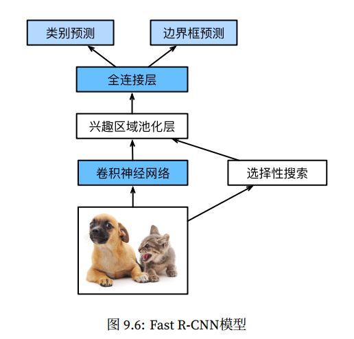
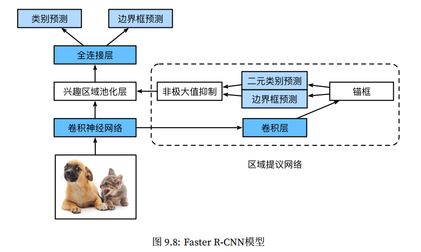
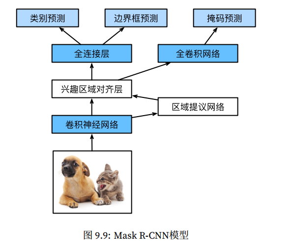

# D2L R-CNN系列

## Contact me

* Blog -> <https://cugtyt.github.io/blog/index>
* Email -> <cugtyt@qq.com>
* GitHub -> [Cugtyt@GitHub](https://github.com/Cugtyt)

<head>
    
    
</head>

---

## R-CNN

1. 对输⼊图像使⽤选择性搜索（selective search）来选取多个⾼质量的提议区域。这些提议区域通常是在多个尺度下选取的，并具有不同的形状和⼤小。每个提议区域将被标注类别和真实边界框。
2. 选取⼀个预训练的卷积神经⽹络，并将其在输出层之前截断。将每个提议区域变形为⽹络需要的输⼊尺⼨，并通过前向计算输出抽取的提议区域特征。
3. 将每个提议区域的特征连同其标注的类别作为⼀个样本，训练多个⽀持向量机对⽬标分类。其中每个⽀持向量机⽤来判断样本是否属于某⼀个类别。
4. 将每个提议区域的特征连同其标注的边界框作为⼀个样本，训练线性回归模型来预测真实边界框。
 
R-CNN虽然通过预训练的卷积神经⽹络有效抽取了图像特征，但它的主要缺点是速度慢。想象⼀下，我们可能从⼀张图像中选出上千个提议区域，对该图像做⽬标检测将导致上千次的卷积神经⽹络的前向计算。这个巨⼤的计算量令R-CNN难以在实际应⽤中被⼴泛采⽤。

## Fast R-CNN

R-CNN的主要性能瓶颈在于需要对每个提议区域独⽴抽取特征。由于这些区域通常有⼤量重叠，独⽴的特征抽取会导致⼤量的重复计算。 Fast R-CNN对R-CNN的⼀个主要改进在于只对整个图像做卷积神经⽹络的前向计算。

1. 与R-CNN相⽐， Fast R-CNN⽤来提取特征的卷积神经⽹络的输⼊是整个图像，而不是各个提议区域。而且，这个⽹络通常会参与训练，即更新模型参数。设输⼊为⼀张图像，将卷积神经⽹络的输出的形状记为$1 × c × h1 × w1$。
2. 假设选择性搜索⽣成n个提议区域。这些形状各异的提议区域在卷积神经⽹络的输出上分别标出形状各异的兴趣区域。这些兴趣区域需要抽取出形状相同的特征（假设⾼和宽均分别指定为h2和w2）以便于连结后输出。 Fast R-CNN引⼊兴趣区域池化（region of interest pooling， RoI池化）层，将卷积神经⽹络的输出和提议区域作为输⼊，输出连结后的各个提议区域抽取的特征，形状为$n × c × h2 × w2$。
3. 通过全连接层将输出形状变换为$n × d$，其中超参数d取决于模型设计。
4. 预测类别时，将全连接层的输出的形状再变换为n × q并使⽤softmax回归（q为类别个数）。预测边界框时，将全连接层的输出的形状变换为n × 4。也就是说，我们为每个提议区域预测类别和边界框。

## Faster R-CNN

Fast R-CNN通常需要在选择性搜索中⽣成较多的提议区域，以获得较精确的⽬标检测结果。 FasterR-CNN提出将选择性搜索替换成区域提议⽹络（region proposal network），从而减少提议区域的⽣成数量，并保证⽬标检测的精度。与Fast R-CNN相⽐，只有⽣成提议区域的⽅法从选择性搜索变成了区域提议⽹络，而其他部分均保持不变。

1. 使⽤填充为1的3 × 3卷积层变换卷积神经⽹络的输出，并将输出通道数记为c。这样，卷积神经⽹络为图像抽取的特征图中的每个单元均得到⼀个⻓度为c的新特征。
2. 以特征图每个单元为中⼼，⽣成多个不同⼤小和宽⾼⽐的锚框并标注它们。
3. ⽤锚框中⼼单元⻓度为c的特征分别预测该锚框的⼆元类别（含⽬标还是背景）和边界框。
4. 使⽤⾮极⼤值抑制，从预测类别为⽬标的预测边界框中移除相似的结果。最终输出的预测边界框即兴趣区域池化层所需要的提议区域。

## Mask R-CNN

如果训练数据还标注了每个⽬标在图像上的像素级位置，那么Mask R-CNN能有效利⽤这些详尽的标注信息进⼀步提升⽬标检测的精度。

