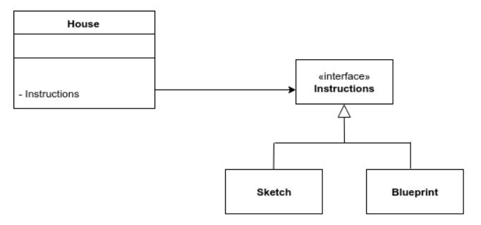

# C++智能指针 - fluentcpp.com

## Contact me

* Blog -> <https://cugtyt.github.io/blog/index>
* Email -> <cugtyt@qq.com>
* GitHub -> [Cugtyt@GitHub](https://github.com/Cugtyt)

---

英文文件见拷贝[Cpp_smart_pointers_ebook](R/Cpp_smart_pointers_ebook.pdf)，原作者网站 fluentcpp.com

笔记：

## unique_ptr​,​shared_ptr​,​weak_ptr​, scoped_ptr​, raw pointers

### std::unique_ptr - OWN

* 表示拥有**own**资源，持有own一个指针，可以在析构器中对指针delete。

* `std::unique_ptr` 是工厂模式的首选。实际上，`std::unique_ptr` 包裹了一个普通指针，因此可以兼容多态性。

* 即使获得了`std::unique_ptr`，其他地方也可能存在其内部指针的拷贝。如果不希望这种事发生，可是让`std::unique_ptr`指向const：

``` c++
std::unique_ptr<const House> buildAHouse();
// for some reason, I don't want you
// to modify the house you're being passed
```

* 为了保证完全拥有资源，`unique_ptr`不能拷贝，但是可以通过移动把资源转移给另一个。

``` c++
std::unique_ptr<int> p1 = std::make_unique<int>(42);
std::unique_ptr<int> p2 = move(p1); // now p2 hold the resource
// and p1 no longer hold anything
```

### Raw pointers - ACCESS

* 虽然原始指针不是智能指针，但是也没有那么“蠢”。原始指针和引用表示可以**access**一个对象，但不拥有。

* 一个有用的场景是：`unique_ptr`拥有一个对象，但是你想把他传给一个接口，此时你不需要传`unique_ptr`或引用，只需要一个原始指针：

``` c++
std::unique_ptr<House> house = buildAHouse();
renderHouse(*house);
```

### std::shared_ptr - HOLD

* 一个对象可以被多个`std::shared_ptr`共享。`std::shared_ptr`内部有个计数器，表示有多少`std::shared_ptr`正在共享当前资源，减到0的时候删除资源。

* `std::shared_ptr`允许拷贝，拷贝会增加计数器。

* `std::shared_ptr`不应该成为默认选择，理由有：
  * 相比于单个`​std::unique_ptr`，多个`std::shared_ptr`让情况变得复杂。
  * 多个`std::shared_ptr`不容易保证线程安全性。
  * 在一个对象不需要共享的时候，使用`std::shared_ptr`会让代码反直觉。
  * 引入时间和空间的性能代价，主要原因是计数器。

* 只在的确是共享的情况下使用`std::shared_ptr`，而且要明显的反映出这种状态。

### std::weak_ptr - ACCESS

* 不增加`std::shared_ptr`计数的状态下和`std::shared_ptr`共享资源。`std::weak_ptr`的存在不影响`std::shared_ptr`对资源的管理，

* 使用`std::weak_ptr`需要先确认资源是否还在，方式是拷贝进一个`std::shared_ptr`：

``` c++
void useMyWeakPointer(std::weak_ptr<int> wp)
{
    if (std::shared_ptr<int> sp = wp.lock())
    {
    // the resource is still here and can be used
    }
    else
    {
    // the resource is no longer here
    }
}
```

* `std::weak_ptr`的典型应用是破坏环形引用，下面的代码中，两个对象都不会被销毁。

``` c++
struct House
{
    std::shared_ptr<House> neighbour;
};
std::shared_ptr<House> house1 = std::make_shared<House>();
std::shared_ptr<House> house2 = std::make_shared<House>();;
house1->neighbour = house2;
house2->neighbour = house1;
```

* 来自Stack Overflow 的一个回答是，`std::weak_ptr`的一个作用是持有缓存，可以不影响缓存的清理。


`boost::scoped_ptr`（不在标准中）和`std::auto_ptr`（废弃）【略】

## How to implement the pimpl idiom by using ​`unique_ptr`

* pimpl 表示 "pointer to implementation"，是广泛用于减少编译依赖的一个方法。

### The pimpl

假设有个冰箱类，里面有个发动机。

``` c++
#include "Engine.h"
class Fridge
{
public:
    void coolDown();
private:
    Engine engine_;
};
```

``` c++
#include "Fridge.h"
void Fridge::coolDown()
{
/* ... */
}
```

这个设计有个问题，由于`Fridge.h` 引入了 `Engine.h`，每个`Fridge`的客户类都间接引入了`Engine`类，因此如果`Engine`改动，多有的客户类`Fridge`都需要重新编译，即使他们并没有直接使用`Engine`。

pimpl的解决方法是，加入一个间接层`FridgeImpl`:

``` c++
class Fridge
{
public:
    Fridge();
    ~Fridge();
    void coolDown();
private:
    class FridgeImpl;
    FridgeImpl* impl_;
};
```

``` c++
#include "Engine.h"
#include "Fridge.h"
class FridgeImpl
{
public:
    void coolDown()
    {
    /* ... */
    }

private:
    Engine engine_;
};

Fridge::Fridge() : impl_(new FridgeImpl) {}

Fridge::~Fridge()
{
    delete impl_;
} 

void Fridge::coolDown()
{
    impl_->coolDown();
} 
```

原理是指针只需要一个前置声明就可以编译，头文件就不需要看到`FridgeImpl`的完整定义。

### Using std::unique_ptr to manage the life cycle

一个直接的想法就是拿`std::unique_ptr`替换掉原来原始指针来做：

头文件：

``` c++
#include <memory>
class Fridge
{
public:
    Fridge();
    void coolDown();
private:
    class FridgeImpl;
    std::unique_ptr<FridgeImpl> impl_;
};
```

实现：

``` c++
#include "Engine.h"
#include "Fridge.h"
class FridgeImpl
{ 
public:
    void coolDown()
    {
    /* ... */
    }
private:
    Engine engine_;
};

Fridge::Fridge() : impl_(new FridgeImpl) {}
```

但是会存在一个问题：

```
use of undefined type 'FridgeImpl'
can't delete an incomplete type
```

### Destructor visibility

在delete指针出现未定义行为的情况有：
* 指针类型为`void*`或
* 指向类型不完整，即只有前置声明，如上面的情况

`std::unique_ptr`会在析构函数里检查类型是否可见才能管理资源，因此上述情况会遇到问题。

因此修改：声明析构器，阻止编译器为我们生成，因此头文件为：

``` c++
#include <memory>
class Fridge
{ 
public:
    Fridge();
    ~Fridge();
    void coolDown();
private:
    class FridgeImpl;
    std::unique_ptr<FridgeImpl> impl_;
};
```

然后需要把析构器的实现放在`FridgeImpl`的实现后面：

``` c++
#include "Engine.h"
#include "Fridge.h"
class FridgeImpl
{ 
public:
    void coolDown()
    {
    /* ... */
    }
private:
    Engine engine_;
};

Fridge::Fridge() : impl_(new FridgeImpl) {}

Fridge::~Fridge() = default;
```

## How to Transfer ​unique_ptr​s From a Set to Another Set

两个`​unique_ptr​s`迁移很容易：

``` c++
std::unique_ptr<int> p1 = std::make_unique<int>(42);
std::unique_ptr<int> p2;
p2 = std::move(p1); // the contents of p1 have been transferred to p2
```

但是`​unique_ptr​s`的集合迁移就不是很容易了。

### Sets of unique_ptrs: unique and polymorphic

假设`Derived`类继承自`Base`类这种清理，为了多态，我们使用`std::unique_ptr<Base>`。然后我们就可以使用`std::unique_ptr<Base>`的集合，为了避免重复，使用`std::set`: `std::set<std::unique_ptr<Base>>`。

元素之间的比较会调用`​std::unique_ptr`的`​operator<`，用于比较内存地址。但是这不是我们想要的，我们希望的是两个元素没有相同的值，而不是相同的地址。因此我们需要自定义比较：

``` c++
struct ComparePointee
{
    template<typename T>
    bool operator()(std::unique_ptr<T> const& up1, std::unique_ptr<T>
    const& up2)
    {
        return *up1 < *up2;
    }
};

std::set<std::unique_ptr<int>, ComparePointee> mySet;
```

为了便于使用：

``` c++
template<typename T>
using UniquePointerSet = std::set<std::unique_ptr<T>,ComparePointee>;
```

### Transferring unique_ptrs between two sets

``` c++
UniquePointerSet<Base> source;
source.insert(std::make_unique<Derived>());
UniquePointerSet<Base> destination;

destination.insert(begin(source), end(source));
```

但是会出错：

``` 
error: use of deleted function 'std::unique_ptr<_Tp,
_Dp>::unique_ptr(const std::unique_ptr<_Tp, _Dp>&) [with _Tp =
Base; _Dp = std::default_delete<Base>]'
```

这表示insert函数要采用拷贝元素。

### C++17's new method on set: merge

set和map在c++内部用树实现。c++17提供了合并功能：

``` c++
destination.merge(source);
```

可以让destination接管source的树节点，之后source为空。由于只有节点修改了，节点内部没有修改，因此​`​unique_ptr​s`对此毫无察觉，甚至也没有移动。

但是c++17之前怎么办？

### We can't move from a set

在集合间移动元素的标准做法是`​std::move`：

``` c++
std::vector<std::unique_ptr<Base>> source;
source.push_back(std::make_unique<Derived>());
std::vector<std::unique_ptr<Base>> destination;
std::move(begin(source),end(source),std::back_inserter(destination));
```

之后，`destination`拥有了元素，`source`不为空，而是拥有一堆空的`​unique_ptr​`。

同样用于集合：

``` c++
UniquePointerSet<Base> source;
source.insert(std::make_unique<Derived>());
UniquePointerSet<Base> destination;
std::move(begin(source), end(source), std::inserter(destination,
end(destination)));
```

错误为：

``` 
error: use of deleted function 'std::unique_ptr<_Tp,
_Dp>::unique_ptr(const std::unique_ptr<_Tp, _Dp>&)
```

这表明要进行拷贝，奇怪的是明明用的move为什么会拷贝/

这是集合访问元素的特性，解引用的时候，集合的迭代器不会返回`​unique_ptr&`，而返回`const ​unique_ptr&`，这是为了保证集合元素不被修改。因此完整的情况为：

* `std::move`解引用集合的迭代器，得到了`const ​unique_ptr&`。
* 对`const ​unique_ptr&`进行`​std::move​`得到了`​const unique_ptr&&`。
* 对输出迭代器调用`insert`方法，传入`​const unique_ptr&&`。
* `insert`有两个重载，一个是接受`​const unique_ptr&`，一个是接受`​const unique_ptr&&`。由于我们传入了const，导致第二个不能被调用，转而调用了第一个。

因此，`​const unique_ptr&`调用了拷贝构造，导致了编译错误。

### Making a sacrifice

因此在c++17 之前，在集合之间移动元素看起来不可能，或者不使用move或者不使用集合。

#### Keeping the set but paying up for the copies

``` c++
class Base
{ 
public:
    virtual std::unique_ptr<Base> cloneBase() const = 0;
    // rest of Base...
};

class Derived : public Base
{ 
public:
    std::unique_ptr<Base> cloneBase() const override
    {
        return std::make_unique<Derived>(*this);
    } 
// rest of Derived...
};
```

复制的时候可以使用自定义的函数。

``` c++
auto clone = [](std::unique_ptr<Base> const& pointer){ return
pointer->cloneBase(); };
std::transform(begin(source), end(source), std::inserter(destination,
end(destination)), clone);
```

或者：

``` c++
for (auto const& pointer : source)
{
    destination.insert(pointer->cloneBase());
}
```

#### Keeping the move and throwing away the set

使用vector：

``` c++
std::vector<std::unique_ptr<Base>> source;
source.push_back(std::make_unique<Derived>(42));
std::set<std::unique_ptr<Base>> destination;
std::move(begin(source), end(source), std::inserter(destination,
end(destination)));
```

由于vector的迭代器返回值不加const，因此也没有上面的问题。

## Custom deleters



``` c++
class House
{
public:
    explicit House(std::unique_ptr<Instructions> instructions)
    : instructions_(std::move(instructions)) {}
    House(House const& other)
    : instructions_(other.instructions_->clone()) {}
private:
    std::unique_ptr<Instructions> instructions_;
};
```

这里Instructions就需要支持多态的克隆：

``` c++
class Instructions
{
    public:
    virtual std::unique_ptr<Instructions> clone() const = 0;
    virtual ~Instructions(){};
};
class Sketch : public Instructions
{
public:
    std::unique_ptr<Instructions> clone() const
    {
        return std::unique_ptr<Instructions>(new Sketch(*this));
    }
};
class Blueprint : public Instructions
{
public:
    std::unique_ptr<Instructions> clone() const
    {
        return std::unique_ptr<Instructions>(new Blueprint(*this));
    }
};
```

构建house的方法为：

``` c++
enum class BuildingMethod
{
    fromSketch,
    fromBlueprint
};
House buildAHouse(BuildingMethod method)
{
    if (method == BuildingMethod::fromSketch)
        return House(std::unique_ptr<Instructions>(new Sketch));
    if (method == BuildingMethod::fromBlueprint)
        return House(std::unique_ptr<Instructions>(new Blueprint));
    throw InvalidBuildMethod();
}
```

如果对象来自于其他内存资源，情况就变得复杂了，例如来自栈的对象：

``` c++
Blueprint blueprint;
House house(???); // how do I pass the blueprint to the house?
```

我们无法把`unique_ptr`绑定到一个栈对象上，毕竟无法delete。一个解决方法是拷贝到堆里，但是成本比较大。有没有其他办法呢？

### Seeing the real face of ​std::unique_ptr

完整的类型包括删除器：

``` c++
template<
    typename T, typename Deleter = std::default_delete<T>
> class unique_ptr;
```

因此一个可行的方法是自定义删除器：

``` c++
struct GizmoDeleter
{
    void operator()(Gizmo* p)
    {
        oldFunctionThatDeallocatesAGizmo(p);
    }
};

using GizmoUniquePtr = std::unique_ptr<Gizmo, GizmoDeleter>;
```

### Using several deleters

可以根据情况自定义删除器，因此我们可以使用多个相同函数类型的删除函数，如`void(*)(Instructions*)​`:

``` c++
using InstructionsUniquePtr = std::unique_ptr<Instructions,
void(*)(Instructions*)>;
```

删除函数有：

``` c++
void deleteInstructions(Instructions* instructions){ delete
instructions;}
void doNotDeleteInstructions(Instructions* instructions){}
```

使用的时候：

``` c++
if (method == BuildingMethod::fromSketch)
    return House(InstructionsUniquePtr(new Sketch,
deleteInstructions));
if (method == BuildingMethod::fromBlueprint)
    return House(InstructionsUniquePtr(new Blueprint,
deleteInstructions));

Blueprint blueprint;
House house(InstructionsUniquePtr(&blueprint,
doNotDeleteInstructions));
```

### Safety belt

通常来讲，`std::unique_ptr`表示拥有OWN，意味着可以修改指向的对象，但是如果对象来自栈，那么`std::unique_ptr`就变成了指向外部拥有的对象。这种情况下，我们不希望修改这个对象，因为有可能产生副作用。

因此应该让指针指向一个const对象：

``` c++
using InstructionsUniquePtr =
std::unique_ptr<​const​ Instructions, void(*)(​const
Instructions*)>;
```

删除函数变成：

``` c++
void deleteInstructions(​const​ Instructions* instructions){ delete
instructions;}
void doNotDeleteInstructions(​const​ Instructions* instructions){}
```

### A unique interface

给上面的情况创建一个统一的接口：

``` c++
namespace util
{
    template<typename T>
    void doDelete(const T* p)
    {
        delete p;
    }

    template<typename T>
    void doNotDelete(const T* x)
    { }

    template<typename T>
    using CustomUniquePtr = std::unique_ptr<const T, void(*)(const T*)>;

    template<typename T>
    auto MakeConstUnique(T* pointer)
    {
        return CustomUniquePtr<T>(pointer, doDelete<T>);
    } 

    template<typename T>
    auto MakeConstUniqueNoDelete(T* pointer)
    {
        return CustomUniquePtr<T>(pointer, doNotDelete<T>);
    }
}
```

两种情况的实际使用为：

``` c++
auto myComputer = util::MakeConstUnique(new
store::electronics::gaming::Computer);

auto myComputer = util::MakeConstUniqueNoDelete(new
store::electronics::gaming::Computer);
```

上面这个接口可以：

* 不需要显式的说明删除函数的细节
* 使用auto用于自动推导返回类型

### Whichever way, a resource must be disposed of

在释放资源的时候打印日志：

``` c++
class Computer
{ 
public:
    explicit Computer(std::string&& id) : id_(std::move(id)){}
    ~Computer(){std::cout << id_ << " destroyed\n";}
private:
    std::string id_;
};

store::electronics::gaming::Computer c("stack-based computer");

auto myHeapBasedComputer = util::MakeConstUnique(new
store::electronics::gaming::Computer("heap-based computer"));

auto myStackBasedComputer = util::MakeConstUniqueNoDelete(&c);
```

## Changes of deleter during the life of a `unique_ptr`

如果在`unique_ptr`拥有资源的声明周期中自定义的删除函数要变化怎么办？

``` c++
using IntDeleter = void(*)(int*);
using IntUniquePtr = std::unique_ptr<int, IntDeleter>;
```

假设对于奇数和偶数的删除函数有去呗：

``` c++
void deleteEvenNumber(int* pi)
{
    std::cout << "Delete even number " << *pi << '\n';
    delete pi;
} 

void deleteOddNumber(int* pi)
{
    std::cout << "Delete odd number " << *pi << '\n';
    delete pi;
}
```

### Assigning from another std::unique_ptr

``` c++
IntUniquePtr p1(new int(42), deleteEvenNumber);
IntUniquePtr p2(new int(43), deleteOddNumber);
p1 = move(p2);
```

那么问题来了，p1是用原来的删除函数呢还是move进来的删除函数呢？

``` 
Delete even number 42
Delete odd number 43
```

输出结果可以看到，移动会把正确的删除函数一起move过去。

### Resetting the pointer

``` c++
std::unique_ptr<int> p1(new int(42));
p1.reset(new int(43));
```

reset函数只接受一个参数，不能接受新的删除函数，因此无法指定新的删除函数：

```
Delete even number 42
Delete even number 43
```

但是可以再来一个函数指定：

``` c++
p1.get_deleter() = deleteOddNumber;
```

如果想一步指定的话可以直接赋值：

``` c++
IntUniquePtr p1(new int(42), deleteEvenNumber);
p1 = IntUniquePtr(new int(43), deleteOddNumber);
```

## How to Return a Smart Pointer AND Use Covariance

### The problem: Covariant return type vs. smart pointers

c++支持协变返回类型：

``` c++
struct Base {};
struct Derived : Base {};

struct Parent
{
    virtual Base * foo();
};
struct Child : Parent
{
    virtual Derived * foo() override ;
};
```

这样可以得到多态下的函数返回子类型，对于指针和引用都ok，但是对于智能指针会出错：

``` c++
#include <memory>
struct Base {};
struct Derived : Base {};
struct Parent
{
    virtual std::unique_ptr<Base> foo();
} ;
struct Child : Parent
{
    virtual std::unique_ptr<Derived> foo() override ;
} ;
```


如何处理请看英文文件见拷贝[Cpp_smart_pointers_ebook](R/Cpp_smart_pointers_ebook.pdf)，网站 fluentcpp.com