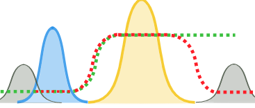
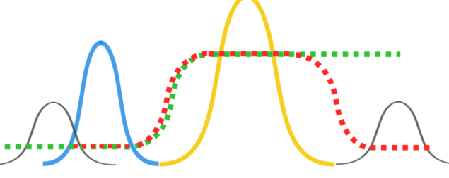

# inkscape中svg转pdf半透明元素消失解决

## Contact me

* Blog -> <https://cugtyt.github.io/blog/index>
* Email -> <cugtyt@qq.com>
* GitHub -> [Cugtyt@GitHub](https://github.com/Cugtyt)

---

方案来自 [How to export an Inkscape SVG file to a PDF and maintain the integrity of the image?](https://graphicdesign.stackexchange.com/questions/5880/how-to-export-an-inkscape-svg-file-to-a-pdf-and-maintain-the-integrity-of-the-im/59017#59017)

遇到的问题：

inkscape将svg导出pdf会出现部分内容丢失的情况




解决方法，linux下安装`librsvg2-bin`，

``` bash
rsvg-convert -f pdf in.svg > out.pdf
```
