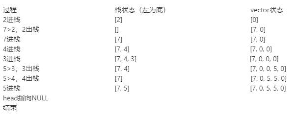

# leetcode 1019 链表中的下一个更大节点

---
> ## Contact me:
> Blog -> <https://cugtyt.github.io/blog/index>  
> Email -> <cugtyt@qq.com>, <cugtyt@gmail.com>  
> GitHub -> [Cugtyt@GitHub](https://github.com/Cugtyt)

---

给出一个以头节点 head 作为第一个节点的链表。链表中的节点分别编号为：node_1, node_2, node_3, ... 。

每个节点都可能有下一个更大值（next larger value）：对于 node_i，如果其 next_larger(node_i) 是 node_j.val，那么就有 j > i 且  node_j.val > node_i.val，而 j 是可能的选项中最小的那个。如果不存在这样的 j，那么下一个更大值为 0 。

返回整数答案数组 answer，其中 answer[i] = next_larger(node_{i+1}) 。

注意：在下面的示例中，诸如 [2,1,5] 这样的输入（不是输出）是链表的序列化表示，其头节点的值为 2，第二个节点值为 1，第三个节点值为 5 。

示例 1：

```
输入：[2,1,5]
输出：[5,5,0]
```

示例 2：

```
输入：[2,7,4,3,5]
输出：[7,0,5,5,0]
```

示例 3：

```
输入：[1,7,5,1,9,2,5,1]
输出：[7,9,9,9,0,5,0,0]
```

提示：

对于链表中的每个节点，1 <= node.val <= 10^9
给定列表的长度在 [0, 10000] 范围内

[思路](https://leetcode-cn.com/problems/next-greater-node-in-linked-list/solution/shi-yong-stackyu-vectordong-tai-cun-chu-by-xiao-hu/)

> 例： [2,7,4,3,5]



``` python 3
class Solution:
    def nextLargerNodes(self, head: ListNode) -> List[int]:
        count = 0
        result = []
        tmp = [] #first为val，second为下标
        while head:
            result.append(0) #给result数组后面+0，1为保证长度，2是默认值（后无更大的值的话）为0
            while len(tmp) > 0 and head.val > tmp[-1][0]: #栈不为空且head指针的val值大于栈顶的元素的值
                result[tmp[-1][1]] = head.val #result数组修改，满足题意要求的最大值，然后出栈，继续循环
                tmp.pop()
            tmp.append((head.val, count)) #count++计数
            head = head.next
            count += 1

        return result
```