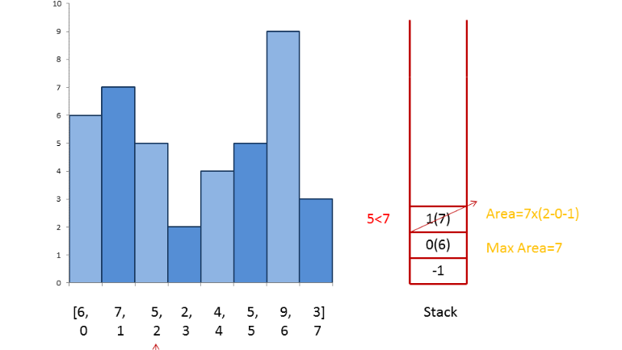

# leetcode [84] 柱状图中最大的矩形

---
> ## Contact me:
> Blog -> <https://cugtyt.github.io/blog/index>  
> Email -> <cugtyt@qq.com>  
> GitHub -> [Cugtyt@GitHub](https://github.com/Cugtyt)

---

给定 n 个非负整数，用来表示柱状图中各个柱子的高度。每个柱子彼此相邻，且宽度为 1 。

求在该柱状图中，能够勾勒出来的矩形的最大面积。


以上是柱状图的示例，其中每个柱子的宽度为 1，给定的高度为 [2,1,5,6,2,3]。


图中阴影部分为所能勾勒出的最大矩形面积，其面积为 10 个单位。

示例:
```
输入: [2,1,5,6,2,3]
输出: 10
```

思路来自[题解](https://leetcode-cn.com/problems/largest-rectangle-in-histogram/solution/zhu-zhuang-tu-zhong-zui-da-de-ju-xing-by-leetcode/)中的栈方法：

遍历，入栈下标，如果当前元素比栈顶元素小，计算以栈顶元素为高度的最大区域：

**【当前下标-1（即目前的最大元素坐标） - 栈中下一个坐标】\* 栈顶元素值**

由于栈记录的是递增坐标，所以可以用栈中下一个坐标 到当前遍历坐标的差值作为栈顶元素值的覆盖范围。



``` python
class Solution:
    def largestRectangleArea(self, heights: List[int]) -> int:
        if len(heights) == 0:
            return 0

        maxarea = 0
        stack = [-1]
        for i, h in enumerate(heights):
            if len(stack) == 1:
                stack.append(i)
                continue
            while h <= heights[stack[-1]] and len(stack) > 1:
                tmp = stack.pop()
                maxarea = max(maxarea, heights[tmp] * (i - 1 - stack[-1]))
            stack.append(i)

        while len(stack) > 1:
            tmp = stack.pop()
            maxarea = max(maxarea, heights[tmp] * (len(heights) - 1 - stack[-1]))
            
        return maxarea
```