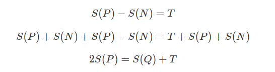

# leetcode [494] 目标和

---
> ## Contact me:
> Blog -> <https://cugtyt.github.io/blog/index>  
> Email -> <cugtyt@qq.com>  
> GitHub -> [Cugtyt@GitHub](https://github.com/Cugtyt)

---

给定一个非负整数数组，a1, a2, ..., an, 和一个目标数，S。现在你有两个符号 + 和 -。对于数组中的任意一个整数，你都可以从 + 或 -中选择一个符号添加在前面。

返回可以使最终数组和为目标数 S 的所有添加符号的方法数。

示例 1:
```
输入: nums: [1, 1, 1, 1, 1], S: 3
输出: 5
解释: 

-1+1+1+1+1 = 3
+1-1+1+1+1 = 3
+1+1-1+1+1 = 3
+1+1+1-1+1 = 3
+1+1+1+1-1 = 3

一共有5种方法让最终目标和为3。
```

注意:
```
数组非空，且长度不会超过20。
初始的数组的和不会超过1000。
保证返回的最终结果能被32位整数存下。
```

思路很奇特，来自[题解](https://leetcode-cn.com/problems/target-sum/solution/c-dfshe-01bei-bao-by-bao-bao-ke-guai-liao/)解释，[题解](https://leetcode-cn.com/problems/target-sum/solution/python-dfs-xiang-jie-by-jimmy00745/)代码：



所以 **正数集的和的两倍 = 目标值 + 序列总和**，因此问题变成在数组中找到和为 **(目标值 + 序列总和) / 2** 的序列

``` python
class Solution:
    def findTargetSumWays(self, nums: List[int], S: int) -> int:
        numsum = sum(nums)
        if abs(S) > numsum or (S + numsum) % 2 != 0:
            return 0
        target = (numsum + S) // 2

        dp = [1] + [0 for _ in range(target)]
        for num in nums:
            for j in range(target, num - 1, -1):
                dp[j] += dp[j - num]
        return dp[target]
```