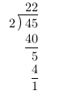
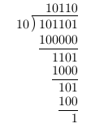

# leetcode [29] 两数相除

---
> ## Contact me:
> Blog -> <https://cugtyt.github.io/blog/index>  
> Email -> <cugtyt@qq.com>  
> GitHub -> [Cugtyt@GitHub](https://github.com/Cugtyt)

---

给定两个整数，被除数 dividend 和除数 divisor。将两数相除，要求不使用乘法、除法和 mod 运算符。

返回被除数 dividend 除以除数 divisor 得到的商。

示例 1:
```
输入: dividend = 10, divisor = 3
输出: 3
```

示例 2:
```
输入: dividend = 7, divisor = -3
输出: -2
```

说明:
```
被除数和除数均为 32 位有符号整数。
除数不为 0。
假设我们的环境只能存储 32 位有符号整数，其数值范围是 [−231,  231 − 1]。本题中，如果除法结果溢出，则返回 231 − 1。
```

来自[题解](https://leetcode-cn.com/problems/divide-two-integers/solution/xiao-xue-sheng-du-hui-de-lie-shu-shi-suan-chu-fa-b/):

让我们先回顾一下小学时，怎么通过列竖式的方法计算两个整数的除法，以 45/2 为例：



仔细观察不难发现，这种算法是把除法化归成移位和减法两种运算方法。对于 10 进制数，移位运算就是乘（左移）除（右移）10，而我们都知道计算机中的移位运算是乘（左移）除（右移）2，因为计算机是通过二进制的方法存储数的。这样，类比十进制，二进制的除法（仍以 45/2 为例）可以写作（注意，这里我们并没有用到乘除法）



``` python
class Solution:
    def divide(self, dividend: int, divisor: int) -> int:
        sign = (dividend > 0) ^ (divisor > 0)
        dividend = abs(dividend)
        divisor = abs(divisor)
        count = 0
        #把除数不断左移，直到它大于被除数
        while dividend >= divisor:
            count += 1
            divisor <<= 1
        result = 0
        while count > 0:
            count -= 1
            divisor >>= 1
            if divisor <= dividend:
                result += 1 << count #这里的移位运算是把二进制（第count+1位上的1）转换为十进制
                dividend -= divisor
        if sign: result = -result
        return result if -(1<<31) <= result <= (1<<31)-1 else (1<<31)-1 
```