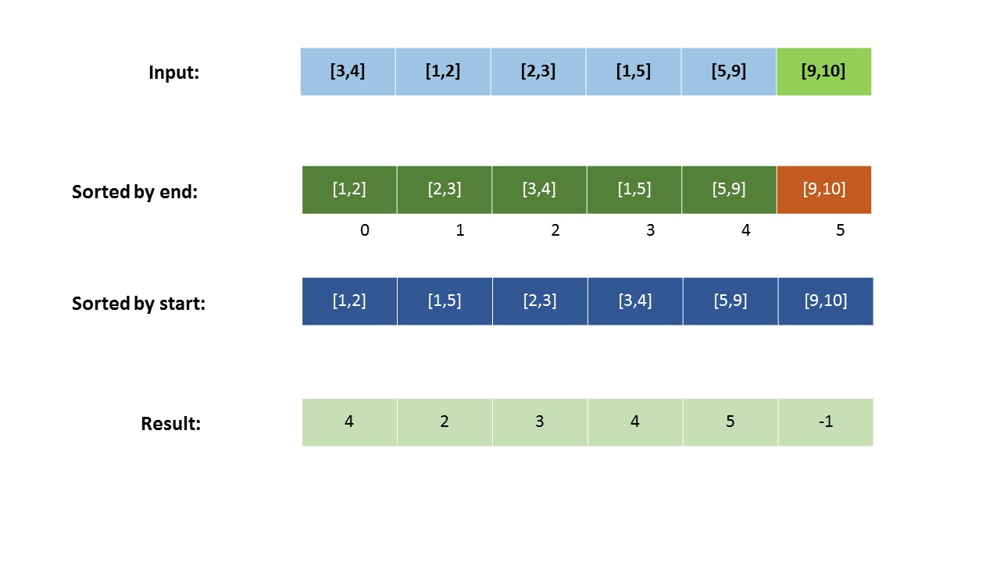

# leetcode [436] 寻找右区间

---
> ## Contact me:
> Blog -> <https://cugtyt.github.io/blog/index>  
> Email -> <cugtyt@qq.com>  
> GitHub -> [Cugtyt@GitHub](https://github.com/Cugtyt)

---

给定一组区间，对于每一个区间 i，检查是否存在一个区间 j，它的起始点大于或等于区间 i 的终点，这可以称为 j 在 i 的“右侧”。

对于任何区间，你需要存储的满足条件的区间 j 的最小索引，这意味着区间 j 有最小的起始点可以使其成为“右侧”区间。如果区间 j 不存在，则将区间 i 存储为 -1。最后，你需要输出一个值为存储的区间值的数组。

注意:
```
你可以假设区间的终点总是大于它的起始点。
你可以假定这些区间都不具有相同的起始点。
```

示例 1:
```
输入: [ [1,2] ]
输出: [-1]

解释:集合中只有一个区间，所以输出-1。
```

示例 2:
```
输入: [ [3,4], [2,3], [1,2] ]
输出: [-1, 0, 1]

解释:对于[3,4]，没有满足条件的“右侧”区间。
对于[2,3]，区间[3,4]具有最小的“右”起点;
对于[1,2]，区间[2,3]具有最小的“右”起点。
```

示例 3:
```
输入: [ [1,4], [2,3], [3,4] ]
输出: [-1, 2, -1]

解释:对于区间[1,4]和[3,4]，没有满足条件的“右侧”区间。
对于[2,3]，区间[3,4]有最小的“右”起点。
```

来自[题解](https://leetcode-cn.com/problems/find-right-interval/solution/xun-zhao-you-qu-jian-by-leetcode/):



若我们维护两个数组，

* startIntervals按照起点排序。
* endIntervals按照终点排序。

一旦我们从 endIntervals 中选择了第一个区间（或者说第 i 个区间），就可以通过在 startIntervals 中从左到右扫描的方法找到满足右区间要求的区间，因为 startIntervals 是按照起点排序的。

比如说，我们从 endIntervals 中选择的元素索引为 j。那么，当我们从 endIntervals 中选取下一个区间（第 (i+1) 个区间）时，我们不需要从头开始扫描 startIntervals。相反，我们可以直接从上次的第 j 个开始。这是因为 endIntervals[i+1] 对应的终点大于 endIntervals[i]，因此对于 0 < k < j 的intervals[k]，都不可能满足要求。

若在任意时刻，我们到达了数组的结尾，j=len(endIntervals)，而 startIntervals 中没有任何元素满足要求，则在 res 中置-1。这对于 endIntervals 中所有剩下的元素均成立，因为它们的终点比前面的区间更大。

同样的，我们使用哈希表 hash 来保存区间的索引。

``` python
class Interval:
    def __init__(self, start, end):
        self.start = start
        self.end = end

class Solution:
    def findRightInterval(self, intervals: List[List[int]]) -> List[int]:
        newintervals = []
        for intv in intervals:
            newintervals.append(Interval(intv[0], intv[1]))
        leng = len(newintervals)
        hashmap = {}
        for i in range(leng):
            hashmap[newintervals[i]] = i
        
        startintv = sorted(newintervals, key=lambda x: x.start)
        endintv = sorted(newintervals, key=lambda x: x.end)
        res = [0] * leng
        j = 0
        for i in range(leng):
            while j < leng and startintv[j].start < endintv[i].end:
                j += 1
            res[hashmap[endintv[i]]] = hashmap[startintv[j]] if j < leng else -1
        
        return res
```