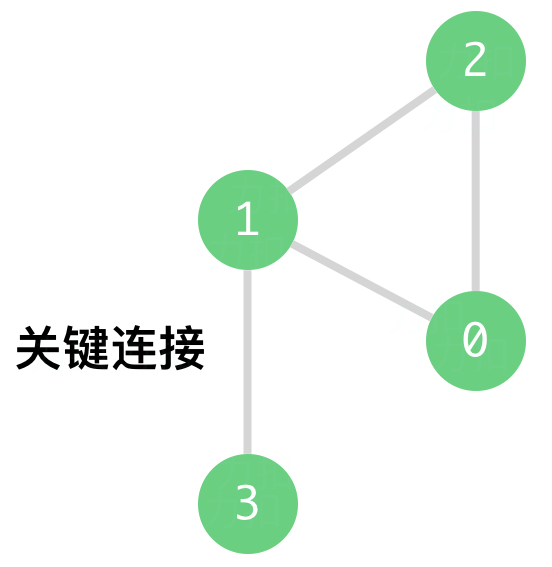
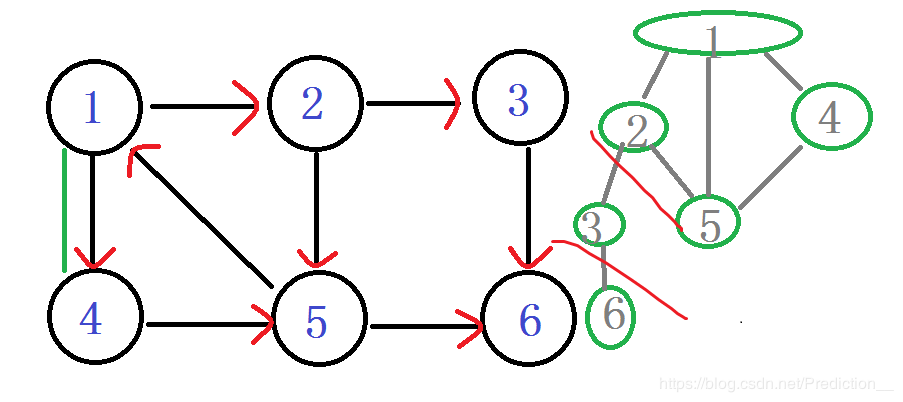
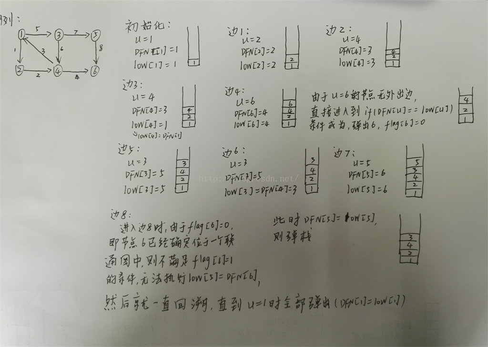

# leetcode [1192] 查找集群内的「关键连接」

---
> ## Contact me:
> Blog -> <https://cugtyt.github.io/blog/index>  
> Email -> <cugtyt@qq.com>  
> GitHub -> [Cugtyt@GitHub](https://github.com/Cugtyt)

---

力扣数据中心有 n 台服务器，分别按从 0 到 n-1 的方式进行了编号。

它们之间以「服务器到服务器」点对点的形式相互连接组成了一个内部集群，其中连接 connections 是无向的。

从形式上讲，connections[i] = [a, b] 表示服务器 a 和  b 之间形成连接。任何服务器都可以直接或者间接地通过网络到达任何其他服务器。

「关键连接」是在该集群中的重要连接，也就是说，假如我们将它移除，便会导致某些服务器无法访问其他服务器。

请你以任意顺序返回该集群内的所有 「关键连接」。

示例 1：



```
输入：n = 4, connections = [[0,1],[1,2],[2,0],[1,3]]
输出：[[1,3]]
解释：[[3,1]] 也是正确的。
```

提示：
```
1 <= n <= 10^5
n-1 <= connections.length <= 10^5
connections[i][0] != connections[i][1]
不存在重复的连接
```

来自[题解](https://leetcode-cn.com/problems/critical-connections-in-a-network/solution/1192-cha-zhao-ji-qun-nei-de-guan-jian-lian-jie-t-2/):

需要使用tarjan算法求解强连通分量 tarjan解法来自[博客](https://blog.csdn.net/qq_34374664/article/details/77488976)和[博客](https://blog.csdn.net/jeryjeryjery/article/details/52829142):




``` python
class Solution:
    def criticalConnections(self, n: int, connections: List[List[int]]) -> List[List[int]]:
        ans, low, d = [], [-1] * n, [[] for _ in range(n)]
        for i, j in connections:
            d[i].append(j)
            d[j].append(i)

        def tarjan(count, current, parent):
            dfn = low[current] = count
            for child in d[current]:
                if child == parent:
                    continue
                if low[child] == -1:
                    tarjan(count + 1, child, current)
                    if low[child] > dfn:
                        ans.append([current, child])
                low[current] = min(low[current], low[child])
        tarjan(0, 0, -1)
        return ans
```
