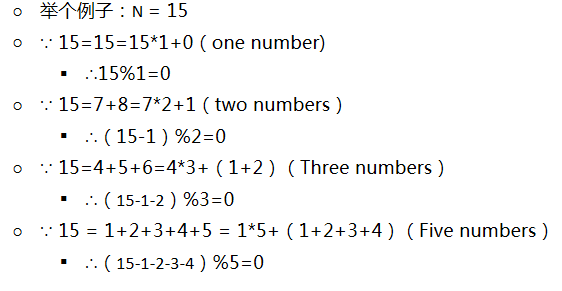

# leetcode [829] 连续整数求和

---
> ## Contact me:
> Blog -> <https://cugtyt.github.io/blog/index>  
> Email -> <cugtyt@qq.com>  
> GitHub -> [Cugtyt@GitHub](https://github.com/Cugtyt)

---

给定一个正整数 N，试求有多少组连续正整数满足所有数字之和为 N?

示例 1:
```
输入: 5
输出: 2
解释: 5 = 5 = 2 + 3，共有两组连续整数([5],[2,3])求和后为 5。
```

示例 2:
```
输入: 9
输出: 3
解释: 9 = 9 = 4 + 5 = 2 + 3 + 4
```

示例 3:
```
输入: 15
输出: 4
解释: 15 = 15 = 8 + 7 = 4 + 5 + 6 = 1 + 2 + 3 + 4 + 5
说明: 1 <= N <= 10 ^ 9
```

来自[题解](https://leetcode-cn.com/problems/consecutive-numbers-sum/solution/c-ji-jian-by-pris_bupt/):



``` python
class Solution:
    def consecutiveNumbersSum(self, N: int) -> int:
        ans = 0
        step = 1
        while N > 0:
            if N % step == 0:
                ans += 1
            N -= step
            step += 1
        return ans
```