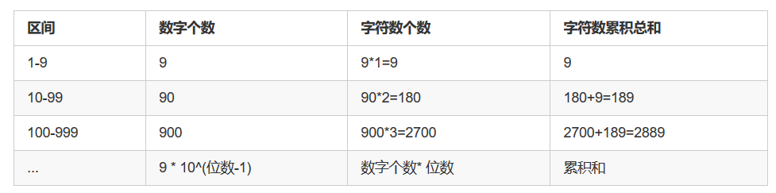

# leetcode [400] 第N个数字

---
> ## Contact me:
> Blog -> <https://cugtyt.github.io/blog/index>  
> Email -> <cugtyt@qq.com>  
> GitHub -> [Cugtyt@GitHub](https://github.com/Cugtyt)

---

在无限的整数序列 1, 2, 3, 4, 5, 6, 7, 8, 9, 10, 11, ...中找到第 n 个数字。

注意:
n 是正数且在32为整形范围内 ( n < 231)。

示例 1:
```
输入:
3

输出:
3
```
示例 2:
```
输入:
11

输出:
0

说明:
第11个数字在序列 1, 2, 3, 4, 5, 6, 7, 8, 9, 10, 11, ... 里是0，它是10的一部分。
```

来自[题解](https://leetcode-cn.com/problems/nth-digit/solution/jian-ji-gui-lu-jie-by-user5707f/):



那么给定位数，可以根据以上规律求得第n个字符数对应的整数，以及对应整数拥有的位数。

例如对于n=999，999小于3位的字符数累积总和（2889），大于2位的字符数累积总和（189），说明其对应数字的位数为3。
随后999-189 - 1 = 809,说明其位于3位数中的第809个字符
div, mod = divmod(809, 3) # div=269, mod = 2
说明其对应的整数为100 + 269 = 369, mod=2 即取369的第2个数，故最后答案为9

``` python
class Solution:
    def findNthDigit(self, n: int) -> int:
        cur_sum = 9
        pre_sum = 0
        # i 为数字位数
        for i in range(1, 100000):
            if n <= cur_sum:
                div, mod = divmod(n - pre_sum - 1, i)
                num = 10 ** (i-1) + div
                return int(str(num)[mod])

            pre_sum = cur_sum
            cur_sum += (10**i) * (i + 1) * 9
```