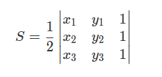

# leetcode [812] 最大三角形面积

---
> ## Contact me:
> Blog -> <https://cugtyt.github.io/blog/index>  
> Email -> <cugtyt@qq.com>  
> GitHub -> [Cugtyt@GitHub](https://github.com/Cugtyt)

---

给定包含多个点的集合，从其中取三个点组成三角形，返回能组成的最大三角形的面积。

示例:
```
输入: points = [[0,0],[0,1],[1,0],[0,2],[2,0]]
输出: 2
解释: 
这五个点如下图所示。组成的橙色三角形是最大的，面积为2。
```

注意:
```
3 <= points.length <= 50.
不存在重复的点。
 -50 <= points[i][j] <= 50.
结果误差值在 10^-6 以内都认为是正确答案。
```

三角形计算公式：注意取绝对值



``` python
class Solution:
    def largestTriangleArea(self, points: List[List[int]]) -> float:
        def area(a, b, c):
            return abs(a[0] * b[1] + b[0] * c[1] + c[0] * a[1]
            - a[1] * b[0] - b[1] * c[0] - c[1] * a[0]) * 0.5
        ans = 0
        for i in range(len(points)):
            for j in range(i + 1, len(points)):
                for k in range(j + 1, len(points)):
                    ans = max(ans, area(points[i], points[j], points[k]))
        return ans
```