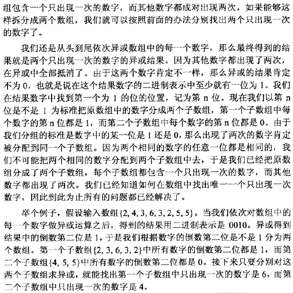

# leetcode [面试题56-I] 数组中数字出现的次数

---
> ## Contact me:
> Blog -> <https://cugtyt.github.io/blog/index>  
> Email -> <cugtyt@qq.com>  
> GitHub -> [Cugtyt@GitHub](https://github.com/Cugtyt)

---

一个整型数组 nums 里除两个数字之外，其他数字都出现了两次。请写程序找出这两个只出现一次的数字。要求时间复杂度是O(n)，空间复杂度是O(1)。

示例 1：
```
输入：nums = [4,1,4,6]
输出：[1,6] 或 [6,1]
```
示例 2：
```
输入：nums = [1,2,10,4,1,4,3,3]
输出：[2,10] 或 [10,2]
```
 
限制：
```
2 <= nums <= 10000
```

来自[题解](https://leetcode-cn.com/problems/shu-zu-zhong-shu-zi-chu-xian-de-ci-shu-lcof/solution/zhi-chu-xian-yi-ci-de-shu-xi-lie-wei-yun-suan-by-a/)
和[题解](https://leetcode-cn.com/problems/shu-zu-zhong-shu-zi-chu-xian-de-ci-shu-lcof/solution/cyu-yan-yi-huo-by-feng-huo-qian-qin-lu/):



``` python
class Solution:
    def singleNumbers(self, nums: List[int]) -> List[int]:
        ret = 0  # 所有数字异或的结果
        for n in nums:
            ret ^= n
        # 找到第一位不是0的
        h = 1
        while(ret & h == 0):
            h <<= 1
        ans = [0, 0]
        for n in nums:
            # 根据该位是否为0将其分为两组
            if h & n:
                ans[0] ^= n
            else:
                ans[1] ^= n

        return ans
```