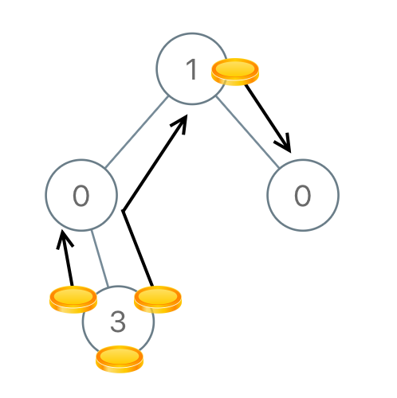

# leetcode [979] 在二叉树中分配硬币

---
> ## Contact me:
> Blog -> <https://cugtyt.github.io/blog/index>  
> Email -> <cugtyt@qq.com>  
> GitHub -> [Cugtyt@GitHub](https://github.com/Cugtyt)

---

给定一个有 N 个结点的二叉树的根结点 root，树中的每个结点上都对应有 node.val 枚硬币，并且总共有 N 枚硬币。

在一次移动中，我们可以选择两个相邻的结点，然后将一枚硬币从其中一个结点移动到另一个结点。(移动可以是从父结点到子结点，或者从子结点移动到父结点。)。

返回使每个结点上只有一枚硬币所需的移动次数。


示例 1：
```
输入：[3,0,0]
输出：2
解释：从树的根结点开始，我们将一枚硬币移到它的左子结点上，一枚硬币移到它的右子结点上。
```


示例 2：
```
输入：[0,3,0]
输出：3
解释：从根结点的左子结点开始，我们将两枚硬币移到根结点上 [移动两次]。然后，我们把一枚硬币从根结点移到右子结点上。
```


示例 3：
```
输入：[1,0,2]
输出：2
```



示例 4：
```
输入：[1,0,0,null,3]
输出：4
```

提示：

```
1<= N <= 100
0 <= node.val <= N
```

``` python
class Solution:
    def distributeCoins(self, root: TreeNode) -> int:
        ans = 0
        def core(root):
            if not root: return 0
            left = core(root.left)
            right = core(root.right)
            nonlocal ans
            if left:
                ans += abs(left)
                root.val -= left
            if right:
                ans += abs(right)
                root.val -= right
            return 1 - root.val
        core(root)
        return ans
```
