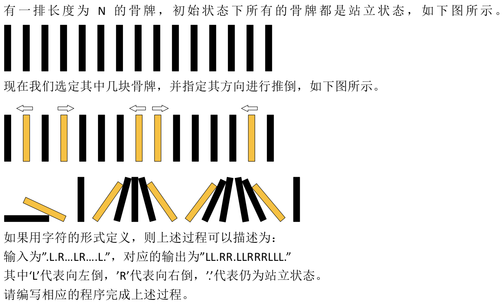

# 牛客 推倒吧骨牌

---
> ## Contact me:
> Blog -> <https://cugtyt.github.io/blog/index>  
> Email -> <cugtyt@qq.com>  
> GitHub -> [Cugtyt@GitHub](https://github.com/Cugtyt)

---

题目描述



输入描述:

输入为一个长度不超过1000的，仅包含‘L’，‘R’，‘.’的字符串

输出描述:

根据输入，输出一个仅由‘L’，‘R’，‘.’组成的结果字符串

示例1

输入
```
.L.R...LR....L.
```
输出
```
LL.RR.LLRRRLLL.
```


``` python
cards = list(input().strip())

def change_card(cards):
    if len(cards) == 0:
        return ''.join(cards)
    
    left = 0
    while left < len(cards) and cards[left] == '.':
        left += 1
    if left == len(cards):
        return ''.join(cards)
    
    if left < len(cards) and cards[left] == 'L':
        for i in range(left):
            cards[i] = 'L'
    #print(cards)
    while left < len(cards):
        right = left + 1
        while right < len(cards) and cards[right] == '.':
            right += 1
        if right == len(cards):
            break
        if cards[right] == cards[left]:
            for i in range(left, right):
                cards[i] = cards[left]
        elif cards[left] == 'R' and cards[right] == 'L':
            for i in range(left + 1, (right + left + 1) // 2):
                cards[i] = cards[left]
            flag = (right - left + 1) % 2
            for i in range((right + left + 1) // 2 + flag, right):
                cards[i] = cards[right]
        left = right
    if left < len(cards) and cards[left] == 'R':
        for i in range(left + 1, len(cards)):
            cards[i] = cards[left]
    return ''.join(cards)
print(change_card(cards))
```
