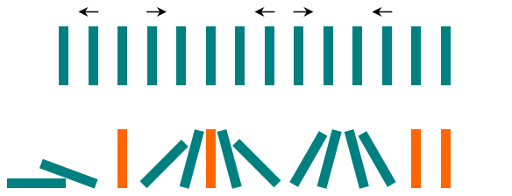

# leetcode [838] 推多米诺

---
> ## Contact me:
> Blog -> <https://cugtyt.github.io/blog/index>  
> Email -> <cugtyt@qq.com>  
> GitHub -> [Cugtyt@GitHub](https://github.com/Cugtyt)

---

一行中有 N 张多米诺骨牌，我们将每张多米诺骨牌垂直竖立。

在开始时，我们同时把一些多米诺骨牌向左或向右推。



每过一秒，倒向左边的多米诺骨牌会推动其左侧相邻的多米诺骨牌。

同样地，倒向右边的多米诺骨牌也会推动竖立在其右侧的相邻多米诺骨牌。

如果同时有多米诺骨牌落在一张垂直竖立的多米诺骨牌的两边，由于受力平衡， 该骨牌仍然保持不变。

就这个问题而言，我们会认为正在下降的多米诺骨牌不会对其它正在下降或已经下降的多米诺骨牌施加额外的力。

给定表示初始状态的字符串 "S" 。如果第 i 张多米诺骨牌被推向左边，则 S[i] = 'L'；如果第 i 张多米诺骨牌被推向右边，则 S[i] = 'R'；如果第 i 张多米诺骨牌没有被推动，则 S[i] = '.'。

返回表示最终状态的字符串。

示例 1：
```
输入：".L.R...LR..L.."
输出："LL.RR.LLRRLL.."
```

示例 2：
```
输入："RR.L"
输出："RR.L"
说明：第一张多米诺骨牌没有给第二张施加额外的力。
```

提示：
```
0 <= N <= 10^5
表示多米诺骨牌状态的
```

``` python
class Solution:
    def pushDominoes(self, dominoes: str) -> str:
        if len(dominoes) == 0 or len(set(dominoes)) == 1: return dominoes

        dominoes = list(dominoes)
        start = 0
        while start < len(dominoes):
            # find left
            left = start
            while left < len(dominoes) and dominoes[left] == '.':
                left += 1
            if left == len(dominoes): break
            if dominoes[left] == 'L':
                for i in range(start, left):
                    if dominoes[i] == '.': 
                        dominoes[i] = dominoes[left]
            

            # find end
            right = left + 1
            while right < len(dominoes) and dominoes[right] == '.':
                right += 1
            if right == len(dominoes) and dominoes[left] == 'R':
                for i in range(left + 1, right):
                    dominoes[i] = dominoes[left]
            if right == len(dominoes):    
                break
            
            if dominoes[left] == dominoes[right]:
                for i in range(left, right):
                    dominoes[i] = dominoes[left]
            elif dominoes[left] == 'R' and dominoes[right] == 'L':
                for i in range(1, (right - left + 1) // 2):
                    dominoes[left + i] = dominoes[left]
                    dominoes[right - i] = dominoes[right]
            start = right

        return ''.join(dominoes)
```

思路来自[题解](https://leetcode-cn.com/problems/push-dominoes/solution/tui-duo-mi-nuo-by-leetcode/):

记录.和LR的距离用于判断最后的结果。

``` python
class Solution:
    def pushDominoes(self, dominoes: str) -> str:
        if len(dominoes) == 0 or len(set(dominoes)) == 1: return dominoes
 
        res = [[len(dominoes), len(dominoes)] for _ in range(len(dominoes))]
        for i, d in enumerate(dominoes):
            if d == 'L':
                res[i][0], left = 0, i - 1
                while left >= 0 and dominoes[left] == '.':
                    res[left][0] = min(i - left, res[left][0])
                    left -= 1
            if d == 'R':
                res[i][1], right = 0, i + 1
                while right < len(dominoes) and dominoes[right] == '.':
                    res[right][1] = min(right - i, res[right][1])
                    right += 1
            
        res = [
            'L' if r[0] < r[1] else 
            'R' if r[0] > r[1] else
            '.'
            for r in res
        ]
        return ''.join(res)
```