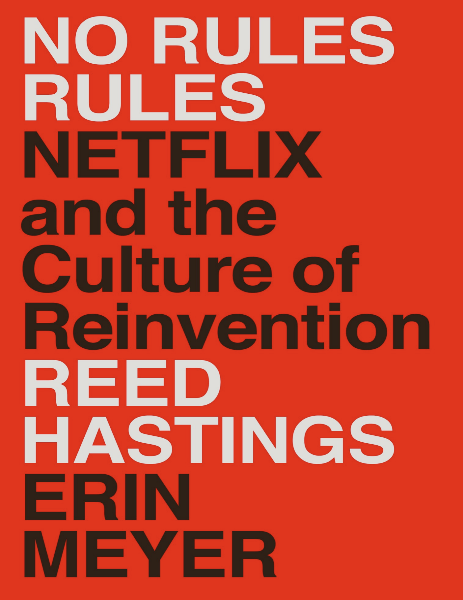
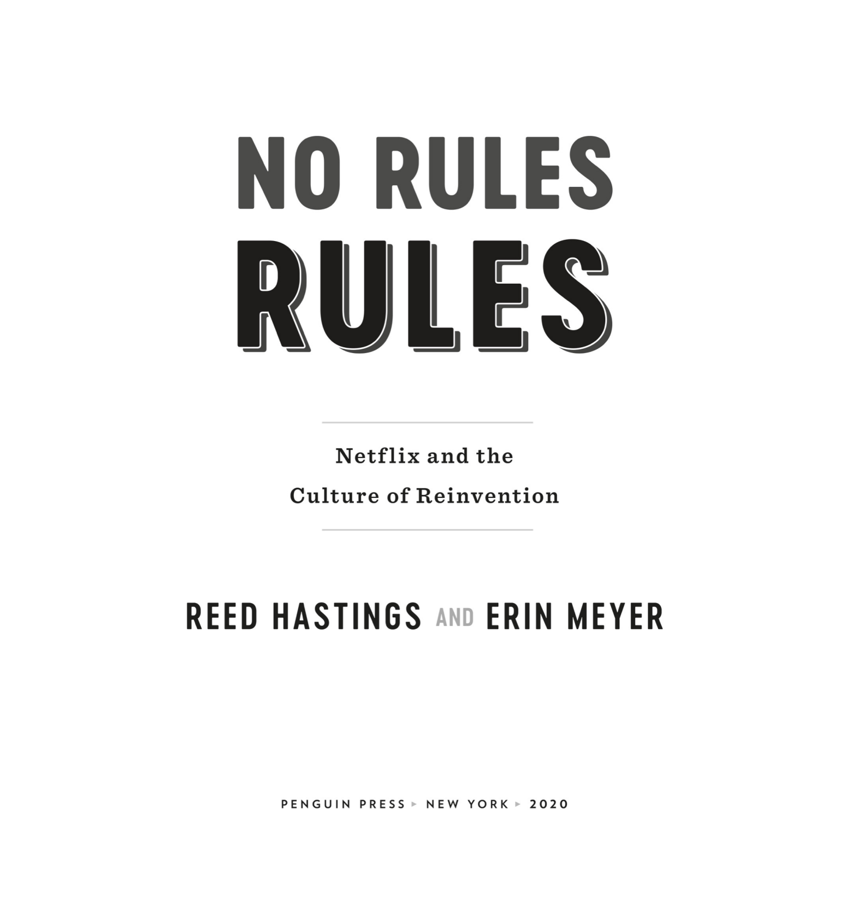
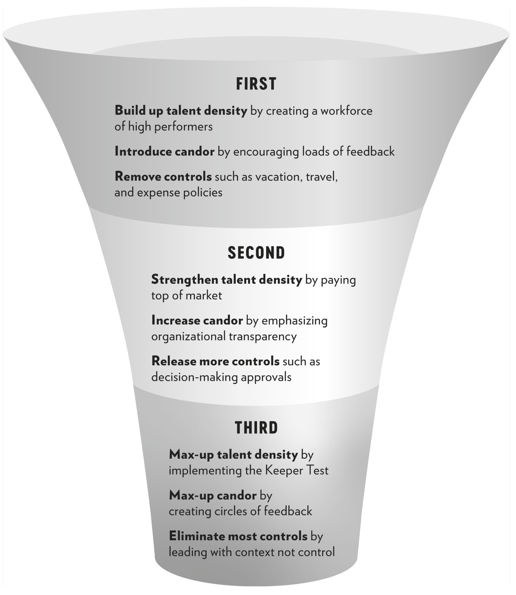
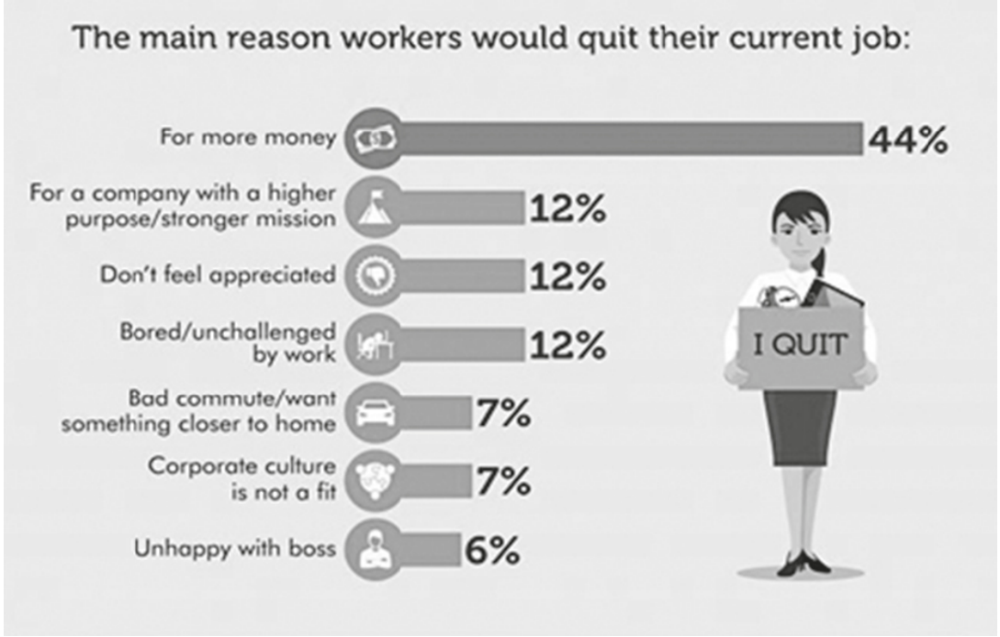

# Netflix NoRulesRules

## Contact me

* Blog -> <https://cugtyt.github.io/blog/index>
* Email -> <cugtyt@qq.com>
* GitHub -> [Cugtyt@GitHub](https://github.com/Cugtyt)

> **本系列博客主页及相关见**[**此处**](https://cugtyt.github.io/blog/corp-culture/index)

---

下面将简单概括一些文章的重点论述。

## Section 1 First steps to a culture of freedom and responsibility

### 1 First build up talent density - A great workplace is stunning colleagues

* **Talented people make one another more effective**

High performers especially thrive in environments where the overall talent
density is high. 

This was increasing individual motivation and satisfaction and leading the
entire company to get more done.

If you have a team of five stunning employees and two adequate ones, the
adequate ones will
    
    * sap managers’ energy, so they have less time for the top performers,
    * reduce the quality of group discussions, lowering the team’s overall IQ,
    * force others to develop ways to work around them, reducing efficiency,
    * drive staff who seek excellence to quit, and
    * show the team you accept mediocrity, thus multiplying the problem.

* **Performance is contagious**

From the 2001 layoffs, Reed learned that performance—both good and bad—is 
infectious. If you have adequate performers, it leads many who could be 
excellent to also perform adequately. And if you have a team consisting
entirely of high performers, each pushes the others to achieve more.

> **Takeaways**
>
> * Your number one goal as a leader is to develop a work
> environment consisting exclusively of stunning colleagues.
>
> * Stunning colleagues accomplish significant amounts of
> important work and are exceptionally creative and passionate.
>
> * Jerks, slackers, sweet people with nonstellar performance, or
> pessimists left on the team will bring down the performance of everyone.
>
> Once you have high talent density in place and have
> eliminated less-than-great performers, you are ready to
> introduce a culture of candor.

### 2 Then increase candor - Say what you really think (with positive intent)

* **High performance + selfless candor = extremely higt performance**

* **The feedback loop: cultivating a cluture of candor**

Giving feedback

    * Aim to assist
    * Actionable

Receiving feedback

    * Appreciate
    * Accept or discard

Perach feedback anywhere anytime

> **Takeways**
>
> * With candor, high performers become outstanding performers.
> Frequent candid feedback exponentially magnifies the speed
> and effectiveness of your team or workforce.
>
> * Set the stage for candor by building feedback moments into
> your regular meetings.
>
> * Coach your employees to give and receive feedback effectively,
> following the 4A guidelines.
>
> * As the leader, solicit feedback frequently and respond with
> belonging cues when you receive it.
>
> * Get rid of jerks as you instill a culture of candor.
>
> With talent density and candor in place, you are ready to begin
releasing controls and offering more workplace freedom.

### 3 Now begin removing controls - 3a Remove vacation policy, 3b remove travel and expense approvals

* **Leaders must model big vacation-taking**

If the CEO is taking only two weeks’ vacation, of course his employees
feel the unlimited plan doesn’t give them much freedom. They’re bound to
take more time off with three allotted weeks than with an indefinite number
and a boss who models just two. In the absence of a policy, the amount of
vacation people take largely reflects what they see their boss and colleagues
taking. Which is why, if you want to remove your vacation policy, start by
getting all leaders to take significant amounts of vacation and talk a lot
about it.

* **Set and reinforce context to guide employee behavior**

In 2007, Leslie Kilgore coined the expression "Lead with context, not
control".

When you remove a policy, employees don’t know how to
operate with the absence. Some will be paralyzed until the boss tells them
explicitly what actions are okay.

In the absence of written policy, every manager must spend time
speaking to the team about what behaviors fall within the realm of the
acceptable and appropriate. The accounting director should have sat down
with the team and explained which months were okay to take vacation—
and that January was off limits for all accountants. The puffy-eyed manager
at the fruit bowl should have worked with the team to set vacation
parameters, such as, “only one team member can be out at a time” and
“make sure you’re not causing the rest of the group undue grief before
booking your vacation.” The clearer the manager is when setting context,
the better. That accounting director might say, “Please give at least three
months’ advance warning for a month out of the office, but a month’s notice
is usually fine for a five-day vacation.”

* **Give freedom to get responsibility**

Giving employees more freedom led them to take more ownership and
behave more responsibly. 

* **Spend compony money as if it were you own**
* **Act in Netflix's best interest**
* **Set context up front and keep and eye on spending out break**

Before you spend any money imagine that you will be asked to stand up in front of me and
your own boss and explain why you chose to purchase that specific flight, hotel, or telephone.
If you can explain comfortably why that purchase is in the company’s best interest, then no
need to ask, go ahead and buy it. But if you’d feel a little uncomfortable explaining your
choice, skip the purchase, check in with your boss, or buy something cheaper.

* **Some people will cheat. but the gains outweight the losses**
* **Great gains: free, fast, and (surprisingly) frugal**

---

Once you have a workforce made up nearly exclusively of
high performers, you can count on people to behave
responsibly. Once you have developed a culture of candor,
employees will watch out for one another and ensure their
teammates’ actions are in line with the good of the
company. Then you can begin to remove controls and give
your staff more freedom. Great places to start are the lifting of your
vacation, travel, and expense policies. These elements give people more
control over their own lives and convey a loud message that you trust your
employees to do what’s right. The trust you offer will in turn instill feelings
of responsibility in your workforce, leading everyone in the company to
have a greater sense of ownership.

---

> **Takeaways**
> * When removing your vacation policy, explain that there is no
> need to ask for prior approval and that neither the employees
> themselves nor their managers are expected to keep track of
> their days away from the office.
>
> * It is left to the employee alone to decide if and when he or she
> feels like taking a few hours, a day, a week, or a month off work.
>
> * When you remove the vacation policy, it will leave a hole. What
> fills the hole is the context the boss provides for the team.
> Copious discussions must take place, setting the scene for how
> employees should approach vacation decisions.
> 
> * The practices modeled by the boss will be critical to guide
> employees as to the appropriate behavior. An office with no
> vacation policy but a boss who never vacations will result in an
> office that never vacations.
>
> * When removing travel and expense policies, encourage
> managers to set context about how to spend money up front
> and to check employee receipts at the back end. If people
> overspend, set more context.
>
>  * With no expense controls, you’ll need your finance department
> to audit a portion of receipts annually.
> 
> * When you find people abusing the system, fire them and speak
> about the abuse openly—even when they are star performers in
> other ways. This is necessary so that others understand the
> ramifications of behaving irresponsibly.
>
> * Some expenses may increase with freedom. But the costs from
> overspending are not nearly as high as the gains that freedom
> provides.
>
> * With expense freedom, employees will be able to make quick
> decisions to spend money in ways that help the business.
>
> * Without the time and administrative costs associated with
> purchase orders and procurement processes, you will waste
> fewer resources.
>
> * Many employees will respond to their new freedom by spending
> less than they would in a system with rules. When you tell
> people you trust them, they will show you how trustworthy they
> are.

## Section 2 Next steps to a culture of freedom and responsibility
### 4 Fortify talent density - Pay top of the personal market

* **Offer rock-star pay**

Wedetermined that for any type of operational role, where there was a clear cap
on how good the work could be, we would pay middle of market rate. But
for all creative jobs we would pay one incredible employee at the top of her
personal market, instead of using that same money to hire a dozen or more
adequate performers. This would result in a lean workforce. We’d be
relying on one tremendous person to do the work of many. But we’d pay
tremendously.

By keeping our
organization small and our teams lean, each manager has fewer people to
manage and can therefore do a better job at it. When those lean teams are
exclusively made up of exceptional-performing employees, the managers
do better, the employees do better, and the entire team works better—and
faster.

* **It's not just what you pay, it'also how you pay it**

If you run a start-up no
one’s ever heard of, you may well wonder whether top
performers will come work for you, even if you are ready
to pay.
The research suggests that they will. A 2018 survey by
OfficeTeam asked twenty-eight hundred workers what
reasons would motivate them to pack up their desk and quit their jobs.
Some 44 percent of respondents, well over any other category, stated they
would leave their current job for one that pays more.

* **Bonuses are bad for flexibility**

I don’t buy the idea that if you dangle cash in front of your
high-performing employees, they try harder. High performers naturally
want to succeed and will devote all resources toward doing so whether they
have a bonus hanging in front of their nose or not. I love this quote from
former chief executive of Deutsche Bank John Cryan: “I have no idea why I
was offered a contract with a bonus in it because I promise you I will not
work any harder or any less hard in any year, in any day because someone
is going to pay me more or less.” Any executive worth her paycheck would
say the same.

Creative work requires that your mind
feel a level of freedom. If part of what you focus on is whether or not your
performance will get you that big check, you are not in that open cognitive
space where the best ideas and most innovative possibilities reside. You do
worse.

People are most creative when
they have a big enough salary to remove some of the stress from home. But
people are less creative when they don’t know whether or not they’ll get
paid extra. Big salaries, not merit bonuses, are good for innovation.

* **Pay higher salaries than anyone else would**

* **Pay top-of-personal-market salaries**

Netflix, on the other hand, wants to pay what will attract and keep
talent, so their conversation with employees is focused on making it clear
that (a) they estimate well what their prospective employee could make at
any other company and (b) they’ll be paying just above that.

* **Staying on top**

At first, a new hire will feel motivated by his top-of-the-range salary. But
soon his skills will grow and competitors will start calling to offer higher
salaries. If he is worth his salt, his market value is going to rise, and 
the risk that he’ll move will grow.

In a high-performance environment, paying top of market is most cost 
effective in the long run. It is best to have salaries a little higher than
necessary, to give a raise before an employee asks for it, to bump up a
salary before that employee starts looking for another job, in order to 
attract and retain the best talent on the market year after year. It costs 
a lot more to lose people and to recruit replacements than to overpay a little in the first place.

> **Takeaways**
>
> * The methods used by most companies to compensate
> employees are not ideal for a creative, high-talent-density
> workforce.
>
> * Divide your workforce into creative and operational employees.
> Pay the creative workers top of market. This may mean hiring
> one exceptional individual instead of ten or more adequate
> people.
>
> * Don’t pay performance-based bonuses. Put these resources
> into salary instead.
>
> * Teach employees to develop their networks and to invest time in
> getting to know their own—and their teams’—market value on
> an ongoing basis. This might mean taking calls from recruiters
> or even going to interviews at other companies. Adjust salaries
> accordingly.

### 5 Pump up candor - Open the books

* **Stuff of secrets = SOS**
* **Knowing when to share**

> QUIZ SCENARIO 1: INFORMATION THAT WOULD BE ILLEGAL TO LEAK
>
> You are the founder of a start-up with one hundred
> employees. You’ve always believed in organizational
> transparency, teaching your staff to understand the P&L
> statements and making all financial and strategic information
> available to them. But next week your company is going
> public and things will change. After that, if you share the
> quarterly numbers with your workforce before you announce
> them to Wall Street and one employee tells a friend, the
> company stock could crash, and the leaker could go to prison
> for insider trading. What will you do?
>
> a. Continue to share all the numbers quarterly, but only AFTER
> you’ve shared them with Wall Street.
>
> b. Continue to keep giving the staff all numbers before anyone
> else knows but stress that, if they leak this information, they
> could be sent to jail.
>
> Answer from Reed: remove the umbrella

> QUIZ SCENARIO 2: POSSIBLE ORGANIZATIONAL RESTRUCTURING
> You have been in discussions with your boss at
> headquarters about a possible organizational
> restructuring that would lead to several project
> managers on your team losing their jobs. You are
> only in discussions at this point and there is a 50
> percent chance it won’t happen. Will you tell your
> project managers now or wait until you are certain?
>
> a. Let time take its course. No need to cause stress now. Plus, if
> you tell your project managers today, they’ll likely start looking
> for new jobs and you risk losing excellent employees.
>
> b. Compromise. You’re worried your employees might be
> blindsided if you let them go without any warning. Yet you don’t
> want to freak them out unnecessarily either. You hint that
> changes are in the air without spelling out what’s actually
> happening. When you hear about another company hiring
> project managers you discreetly leave the job announcement
> on their desks so that they can start considering other options.
>
> c. Tell them the truth. You sit them down and explain there is a 50
> percent chance that some of their jobs will be eliminated in six
> months. You stress that you appreciate them a lot and hope
> they will stay—but you wanted to be transparent, so they had
> all the information they needed to consider their futures.
>
> Answer from Reed: upset the apple cart

> QUIZ SCENARIO 3: POST-FIRING COMMUNICATION
> 
> You have decided to let go a senior member of the
> marketing team, a man named Kurt. He is
> hardworking, kind, and generally effective. But at
> odd moments he becomes verbally clumsy,
> putting his foot in his mouth and getting the
> company in trouble both when addressing
> employees and speaking externally. The liability has become
> too great.
>
> When you tell him he’s lost his job, he’s devastated. He
> tells you how attached he is to the company, his employees,
> and the department. He asks you to tell everyone that he
> decided to leave on his own accord. How will you
> communicate about the firing to your staff?
> 
> a. Tell the whole truth to those who benefit from knowing it. You
> send an email to Kurt’s colleagues at Netflix explaining that
> Kurt, although hardworking, kind, and effective, sometimes
> becomes verbally clumsy, putting his foot in his mouth and
> getting the company in trouble. The liability has become so
> great that you’ve decided to let him go.
> 
> b. Tell some of the truth. You inform the team Kurt’s left, but you’re
> not at liberty to discuss details. He’s gone. What do the reasons
> matter? Give the guy a break and save his reputation.
> 
> c. Announce that Kurt decided to leave on his own accord
> because he wanted to spend more time with his family. Kurt
> worked hard for you. You already fired him. You don’t need to
> humiliate him to boot.
> 
> Answer from Reed: leave the spin in the gym

> QUIZ SCENARIO 4: WHEN YOU SCREW UP
> 
> You are still the founder of a start-up with one
> hundred employees. This is a tough job, and
> despite your best efforts, you make a series of
> serious mistakes. Most notably you hire and fire
> five sales directors within five years. You keep
> thinking you’ve found a good candidate. But each
> time, as you begin to work together, you realize the new
> recruit doesn’t have what it takes to do the job. You realize
> that these mis-hirings are entirely due to your poor judgment.
> Do you admit this to your workforce?
> 
> a. No! You don’t want the group to lose confidence in your ability
> to lead. Some of your best people might even leave in search
> of a better boss. On the other hand, everyone can see that a
> fifth sales manager has just been let go. You have to say
> something—but only a few words about how difficult it is to find
> good sales directors. Focus your efforts on finding a great one
> next time.
> 
> b. Yes! You want to encourage your staff to take risks and to see
> mistakes as an inevitable part of that process. Besides, when
> you speak openly about your errors it makes others trust you
> more. At the next company meeting, you tell the group how
> embarrassed you are to have flubbed the hiring and managing
> of the sales director for the fifth time in a row.
> 
> Answer from Reed: whisper wins and shout mistakes

> **Takeaways**
>
> * To instigate a culture of transparency, consider what symbolic
> messages you send. Get rid of closed offices, assistants who
> act as guards, and locked spaces.
> 
> * Open up the books to your employees. Teach them how to read
> the P&L. Share sensitive financial and strategic information with
> everyone in the company.
> 
> * When making decisions that will impact your employees’ wellbeing, like > reorganizations or layoffs, open up to the workforce
> early, before things are solidified. This will cause some anxiety
> and distraction, but the trust you build will outweigh the
> disadvantages.
> 
> * When transparency is in tension with an individual’s privacy,
> follow this guideline: If the information is about something that
> happened at work, choose transparency and speak candidly
> about the incident. If the information is about an employee’s
> personal life, tell people it’s not your place to share and they can
> ask the person concerned directly if they choose.
> 
> * As long as you’ve already shown yourself to be competent,
> talking openly and extensively about your own mistakes—and
> encouraging all your leaders to do the same—will increase trust,
> goodwill, and innovation throughout the organization.

### 6 Now remove more controls - No decision-making approvals needed

* **Don't seek to please your boss. Seek to do what is best for the company.**

* **You've got high talent density and candor: are you ready to really release controls?**

Our mantra is that employees don’t need the boss’s
approval to move forward (but they should let the boss
know what’s going on). If Sheila comes to you with a
proposal you think is going to fail, you need to remind
yourself why Sheila is working for you and why you paid
top of the market to get her. Ask yourself these four
questions:

    * Is Sheila a stunning employee?
    * Do you believe she has good judgment?
    * Do you think she has the ability to make a positive impact?
    * Is she good enough to be on your team?

If you answer NO to any of these questions, you should get rid of her
(see the next chapter where we’ll learn that “adequate performance gets a
generous severance”). But if your answer is yes, step aside and let her
decide for herself.

* **Steps tp take before (and after) you place your bet**

    1. “Farm for dissent,” or “socialize” the idea.
    2. For a big idea, test it out.
    3. As the informed captain, make your bet.
    4. If it succeeds, celebrate. If it fails, sunshine it.

