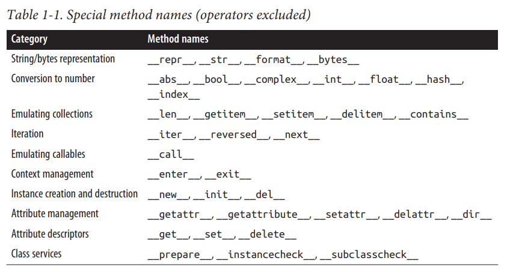
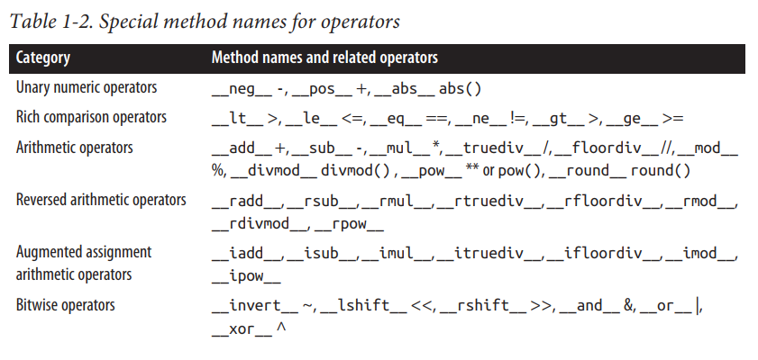
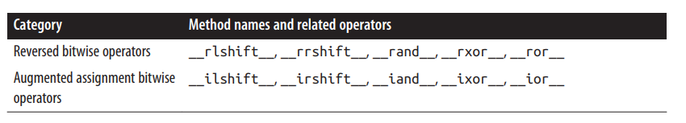

# Fluent Python - Python数据模型

## Contact me

* Blog -> <https://cugtyt.github.io/blog/index>
* Email -> <cugtyt@qq.com>
* GitHub -> [Cugtyt@GitHub](https://github.com/Cugtyt)

> **本系列博客主页及相关见**[**此处**](https://cugtyt.github.io/blog/effective-python/index)

---

Python的数据模型可以看作是一个统一的框架，同意了语言各部分的接口，包括序列，迭代器，函数，类，上下文管理器等。因此你可以使用`len(collection)`统一获得python容器的长度。

## namedtuple

``` python
Card = collections.namedtuple('Card', ['rank', 'suit'])
```

提供了不错的输出表示：

``` python
>>> beer_card = Card('7', 'diamonds')
>>> beer_card
Card(rank='7', suit='diamonds')
```

## __getitem__

``` python
Card = collections.namedtuple('Card', ['rank', 'suit'])
class FrenchDeck:
    ranks = [str(n) for n in range(2, 11)] + list('JQKA')
    suits = 'spades diamonds clubs hearts'.split()
    def __init__(self):
        self._cards = [Card(rank, suit) for suit in self.suits
                                        for rank in self.ranks]
    def __len__(self):
        return len(self._cards)
    def __getitem__(self, position):
        return self._cards[position]
```

* `__len__`提供了len(xxx)的接口
* `__getitem__`提供了随机读取的接口`deck[-1]`
* 可以随机获取元素：
  ``` python
  from random import choice
  choice(deck)
  ```
* 切片操作`deck[:3]`
* 迭代`for card in deck: xxx`
* `in`运算，`Card(args) in deck`。如果没有`__contains__`方法，那就线性扫描。
* `sorted`函数支持，设置key参数。

## 特殊函数的使用

如果一个对象时用户自定义的类，那么`len(obj)`调用的是`__len__`，对于内置的类型，直接访问的是CPyhon内部结构体的值`ob_size`，这比直接调用函数更快。

对于`for i in x`，首先做的是调用`iter(x)`，如果有`x.__iter__()`那就调用这个函数。

常用的特殊函数是`__init__`，用于定义初始化的内容。

通常不要直接调用特殊函数，应该直接使用相对应的内置函数`len`,`iter`等。对于内置类型，这样的调用更快。

不要随意设置`__foo__`

## 定义一个向量

``` python
from math import hypot
class Vector:
    def __init__(self, x=0, y=0):
        self.x = x
        self.y = y
    def __repr__(self):
        return 'Vector(%r, %r)' % (self.x, self.y)
    def __abs__(self):
        return hypot(self.x, self.y)
    def __bool__(self):
        return bool(abs(self))
    def __add__(self, other):
        x = self.x + other.x
        y = self.y + other.y
        return Vector(x, y)
    def __mul__(self, scalar):
        return Vector(self.x * scalar, self.y * scalar)
```

可以做到：

``` python
v1 + v2
abs(v)
v * 3
```

## bool

`bool`通常调用`__bool__`，如果没有实现这个函数，python会尝试调用`__len__`，如果返回0，结果是`False`。

## 总览





## 为什么`len`不是一个方法

如果x是一个内置类型的话，`len(x)`直接读取C结构体的值，非常快。