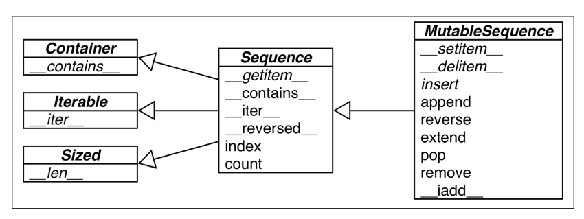

# Fluent Python - 序列

## Contact me

* Blog -> <https://cugtyt.github.io/blog/index>
* Email -> <cugtyt@qq.com>
* GitHub -> [Cugtyt@GitHub](https://github.com/Cugtyt)

> **本系列博客主页及相关见**[**此处**](https://cugtyt.github.io/blog/effective-python/index)

---



* 列表推导的可读性更好，但是不要用来做复杂的循环。

* 虽然map,filter也可以做类似的事情，但是列表推导反而快。

* 生成推导相比于列表推导节省空间，一次仅返回一个值。

* *可以捕获多个值。a, b, *rest = range(5)

* namedtuple可以帮助调试
``` python
>>> from collections import namedtuple
>>> City = namedtuple('City', 'name country population coordinates')
>>> tokyo = City('Tokyo', 'JP', 36.933, (35.689722, 139.691667))
>>> tokyo
City(name='Tokyo', country='JP', population=36.933, coordinates=(35.689722,
139.691667))
>>> tokyo.population
36.933
>>> tokyo.coordinates
(35.689722, 139.691667)
>>> tokyo[1]
'JP
```

* namedtuple有几个特殊函数
``` python
>>> City._fields
('name', 'country', 'population', 'coordinates')
>>> LatLong = namedtuple('LatLong', 'lat long')
>>> delhi_data = ('Delhi NCR', 'IN', 21.935, LatLong(28.613889, 77.208889))
>>> delhi = City._make(delhi_data)
>>> delhi._asdict()
OrderedDict([('name', 'Delhi NCR'), ('country', 'IN'), ('population',
21.935), ('coordinates', LatLong(lat=28.613889, long=77.208889))])
>>> for key, value in delhi._asdict().items():
print(key + ':', value)
```

* slice是个对象
``` python
>>> SKU = slice(0, 6)
>>> DESCRIPTION = slice(6, 40)
>>> UNIT_PRICE = slice(40, 52)
>>> QUANTITY = slice(52, 55)
>>> ITEM_TOTAL = slice(55, None)
```

* 序列可是使用加法和乘法
``` python
>>> l = [1, 2, 3]
>>> l * 5
[1, 2, 3, 1, 2, 3, 1, 2, 3, 1, 2, 3, 1, 2, 3]
>>> 5 * 'abcd'
'abcdabcdabcdabcdabcd'
```

* 注意序列的乘法操作时可变的引用，因此`[[]] * 3 `修改一项就修改了所有项
``` python
>>> board = [['_'] * 3 for i in range(3)]
>>> board
[['_', '_', '_'], ['_', '_', '_'], ['_', '_', '_']]
>>> board[1][2] = 'X'
>>> board
[['_', '_', '_'], ['_', '_', 'X'], ['_', '_', '_']]
```

``` python
>>> weird_board = [['_'] * 3] * 3
>>> weird_board
[['_', '_', '_'], ['_', '_', '_'], ['_', '_', '_']]
>>> weird_board[1][2] = 'O'
>>> weird_board
[['_', '_', 'O'], ['_', '_', 'O'], ['_', '_', 'O']]
```

* tuple的+=
``` python
>>> t = (1, 2, [30, 40])
>>> t[2] += [50, 60]
Traceback (most recent call last):
File "<stdin>", line 1, in <module>
TypeError: 'tuple' object does not support item assignment
>>> t
(1, 2, [30, 40, 50, 60])
```

* sorted的key参数，是一个一个参数的函数

* `bisect`管理有序序列，`bisect`主要提供两个函数，`bisect`和`insort`，使用二分查找插入和查找。`bisect(haystack, needle)`寻找小于或等于needle的位置，然后可以插入`haystack.insert(index, needle)`, `insort`可以做两个步骤，更快。

* `bisect`有个可选参数，指定低和高`lo` 和`hi`，默认为0和`len()`
* `bisect`其实是`bisect_right`，有个相似的`bisect_left`。区别在于相等值的情况，`bisect_right`返回一个存在项后面的位置，`bisect_left`返回存在的位置，因此插入会插在前一个位置。对于简单类型如int没有区别，但是如果包括不同但是相等的情况会有变化，如1和1.0。

* 不使用`List`的情况，如果有存一千万个浮点数，`array`更有效。如果需要先入先出和先入后出，队列更快

* 如果只包括数字，`array.array`更高效，和C的数组一样轻快。` array.tofile`和`array.fromfile `非常快速和方便。
``` python
>>> from array import array
>>> from random import random
>>> floats = array('d', (random() for i in range(10**7)))
>>> floats[-1]
0.07802343889111107
>>> fp = open('floats.bin', 'wb')
>>> floats.tofile(fp)
>>> fp.close()
>>> floats2 = array('d')
>>> fp = open('floats.bin', 'rb')
>>> floats2.fromfile(fp, 10**7)
>>> fp.close()
>>> floats2[-1]
0.07802343889111107
>>> floats2 == floats
True
```

* `memorview`无需拷贝即可操作数组。
``` python
>>> numbers = array.array('h', [-2, -1, 0, 1, 2])
>>> memv = memoryview(numbers)
>>> len(memv)
5
>>> memv[0]
-2
>>> memv_oct = memv.cast('B') # 无符号数
>>> memv_oct.tolist()
[254, 255, 255, 255, 0, 0, 1, 0, 2, 0]
>>> memv_oct[5] = 4
>>> numbers
array('h', [-2, -1, 1024, 1, 2])
```

* 使用`numpy`和`scipy`更高效的处理数字运算。
* `list`在首段插入和删除成本高，`deque`是双向队列，可以旋转
``` python
>>> from collections import deque
>>> dq = deque(range(10), maxlen=10)
>>> dq
deque([0, 1, 2, 3, 4, 5, 6, 7, 8, 9], maxlen=10)
>>> dq.rotate(3)
>>> dq
deque([7, 8, 9, 0, 1, 2, 3, 4, 5, 6], maxlen=10)
>>> dq.rotate(-4)
>>> dq
deque([1, 2, 3, 4, 5, 6, 7, 8, 9, 0], maxlen=10)
>>> dq.appendleft(-1)
>>> dq
deque([-1, 1, 2, 3, 4, 5, 6, 7, 8, 9], maxlen=10)
>>> dq.extend([11, 22, 33])
>>> dq
deque([3, 4, 5, 6, 7, 8, 9, 11, 22, 33], maxlen=10)
>>> dq.extendleft([10, 20, 30, 40])
>>> dq
deque([40, 30, 20, 10, 3, 4, 5, 6, 7, 8], maxlen=10)
```

