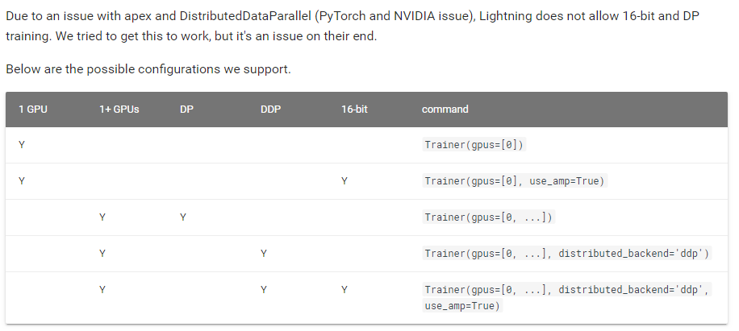

# pytorch-lightning工具，简化Pytorch代码结构

## Contact me

* Blog -> <https://cugtyt.github.io/blog/index>
* Email -> <cugtyt@qq.com>
* GitHub -> [Cugtyt@GitHub](https://github.com/Cugtyt)

> **本系列博客主页及相关见**[**此处**](https://cugtyt.github.io/blog/effective-pytorch/index)

---

来自[pytorch-lightning@GitHub](https://github.com/williamFalcon/pytorch-lightning)

使用Pytorch训练的整个过程无非就是，加载数据，定义前向传播，计算损失，优化，但是手工写起来繁琐，这里pytorch-lightning提供了一个简洁的框架，只需要定义好这些部分，它就可以让这些模块按照标准的流程运行起来，省去了不少工作量。

## 基本用法

一个简单的结构如下，两步骤：

### 第一，定义各个部分

``` python
import os
import torch
from torch.nn import functional as F
from torch.utils.data import DataLoader
from torchvision.datasets import MNIST
import torchvision.transforms as transforms

import pytorch_lightning as pl

class CoolSystem(pl.LightningModule):

    def __init__(self):
        super(CoolSystem, self).__init__()
        # not the best model...
        self.l1 = torch.nn.Linear(28 * 28, 10)

    def forward(self, x):
        return torch.relu(self.l1(x.view(x.size(0), -1)))

    def training_step(self, batch, batch_nb):
        # REQUIRED
        x, y = batch
        y_hat = self.forward(x)
        return {'loss': F.cross_entropy(y_hat, y)}

    def validation_step(self, batch, batch_nb):
        # OPTIONAL
        x, y = batch
        y_hat = self.forward(x)
        return {'val_loss': F.cross_entropy(y_hat, y)}

    def validation_end(self, outputs):
        # OPTIONAL
        avg_loss = torch.stack([x['val_loss'] for x in outputs]).mean()
        return {'avg_val_loss': avg_loss}

    def configure_optimizers(self):
        # REQUIRED
        # can return multiple optimizers and learning_rate schedulers
        return torch.optim.Adam(self.parameters(), lr=0.02)

    @pl.data_loader
    def tng_dataloader(self):
        # REQUIRED
        return DataLoader(MNIST(os.getcwd(), train=True, download=True, transform=transforms.ToTensor()), batch_size=32)

    @pl.data_loader
    def val_dataloader(self):
        # OPTIONAL
        return DataLoader(MNIST(os.getcwd(), train=True, download=True, transform=transforms.ToTensor()), batch_size=32)

    @pl.data_loader
    def test_dataloader(self):
        # OPTIONAL
        return DataLoader(MNIST(os.getcwd(), train=True, download=True, transform=transforms.ToTensor()), batch_size=32)
```

### 第二步，fit

``` python
from pytorch_lightning import Trainer

model = CoolSystem()

# most basic trainer, uses good defaults
trainer = Trainer()    
trainer.fit(model)   
```

## 高级用法

### [设置Checkpointing](https://williamfalcon.github.io/pytorch-lightning/Trainer/Checkpointing/#model-saving)

* 保存

``` python
from pytorch_lightning.callbacks import ModelCheckpoint

checkpoint_callback = ModelCheckpoint(
    filepath='/path/to/store/weights.ckpt',
    save_best_only=True,
    verbose=True,
    monitor='val_loss',
    mode='min'
)

trainer = Trainer(checkpoint_callback=checkpoint_callback)
```

* 加载

``` python
from test_tube import Experiment

exp = Experiment(version=a_previous_version_with_a_saved_checkpoint)
trainer = Trainer(experiment=exp)

# this fit call loads model weights and trainer state
# the trainer continues seamlessly from where you left off
# without having to do anything else.
trainer.fit(model)
```

### [分布式训练](https://williamfalcon.github.io/pytorch-lightning/Trainer/Distributed%20training/#16-bit-mixed-precision)


* DataParallel和DistributedDataParallel

``` python
# DEFAULT uses DataParallel
trainer = Trainer(distributed_backend='dp')

# change to distributed data parallel
trainer = Trainer(distributed_backend='ddp')
```

* 混合精度训练



* 单GPU

``` python
# DEFAULT
trainer = Trainer(gpus=[0])
```

* 多GPU

``` python
# to use DataParallel (default)
trainer = Trainer(gpus=[0,1,2,3,4,5,6,7], distributed_backend='dp')

# RECOMMENDED use DistributedDataParallel
trainer = Trainer(gpus=[0,1,2,3,4,5,6,7], distributed_backend='ddp')
```

* 多节点

``` python
# train on 12*8 GPUs
trainer = Trainer(gpus=[0,1,2,3,4,5,6,7], nb_gpu_nodes=12)
```

### [调试](https://williamfalcon.github.io/pytorch-lightning/Trainer/debugging/)

* 快速验证

只运行一个训练步骤和1个验证步骤，用于快速验证程序正确性

``` python
# DEFAULT
trainer = Trainer(fast_dev_run=False)
```

* 检查梯度正则情况

``` python
# DEFAULT (-1 doesn't track norms)
trainer = Trainer(track_grad_norm=-1)

# track the LP norm (P=2 here)
trainer = Trainer(track_grad_norm=2)
```

* 过拟合一个数据子集

``` python
# DEFAULT don't overfit (ie: normal training)
trainer = Trainer(overfit_pct=0.0)

# overfit on 1% of data 
trainer = Trainer(overfit_pct=0.01)
```

* 打印参数统计，默认行为

* 打印哪些梯度为nan

``` python
# DEFAULT
trainer = Trainer(print_nan_grads=False)
```

### [日志](https://williamfalcon.github.io/pytorch-lightning/Trainer/Logging/)

* 显示进度条

``` python
# DEFAULT
trainer = Trainer(show_progress_bar=True)
```

* 每k个batches记录metric的情况

``` python
# DEFAULT (ie: save a .csv log file every 10 batches)
trainer = Trainer(add_log_row_interval=10)
```

* 为不同任务设置不同的进度位置

``` python
# DEFAULT
trainer = Trainer(process_position=0)

# if this is the second model on the node, show the second progress bar below
trainer = Trainer(process_position=1)
```

* 所有超参数保存快照

``` python
from test_tube import Experiment

exp = Experiment(...)
Trainer(experiment=exp)
```

* 代码保存快照

``` python
from test_tube import Experiment

exp = Experiment(create_git_tag=True)
Trainer(experiment=exp)
```

* 使用tensorboard

``` python
self.experiment

# add image
# Look at PyTorch SummaryWriter docs for what you can do.   
self.experiment.add_image(...)
```

``` python
from test_tube import Experiment, HyperOptArgumentParser

# exp hyperparams
args = HyperOptArgumentParser()
hparams = args.parse_args()

# this is a summaryWriter with nicer logging structure
exp = Experiment(save_dir='/some/path', create_git_tag=True)

# track experiment details (must be ArgumentParser or HyperOptArgumentParser).
# each option in the parser is tracked
exp.argparse(hparams)
exp.tag({'description': 'running demo'})

# trainer uses the exp object to log exp data
trainer = Trainer(experiment=exp)
trainer.fit(model)

# view logs at:
# tensorboard --logdir /some/path   
```

* 每k个batch写入日志文件

``` python
# DEFAULT (ie: save a .csv log file every 100 batches)
trainer = Trainer(log_save_interval=100)
```

### [训练步骤](https://williamfalcon.github.io/pytorch-lightning/Trainer/Training%20Loop)

* 累积梯度

``` python
# DEFAULT (ie: no accumulated grads)
trainer = Trainer(accumulate_grad_batches=1)
```

* 最大最小epoch设置

``` python
# DEFAULT
trainer = Trainer(min_nb_epochs=1, max_nb_epochs=1000)
```

* 早停

```python
# DEFAULT
trainer = Trainer(enable_early_stop=True)
```

* 梯度剪切

``` python
# DEFAULT (ie: don't clip)
trainer = Trainer(gradient_clip=0)

# clip gradients with norm above 0.5
trainer = Trainer(gradient_clip=0.5)
```

### [验证步骤](https://williamfalcon.github.io/pytorch-lightning/Trainer/Validation%20loop)

* 每n个epoch进行验证步骤

``` python
# DEFAULT
trainer = Trainer(check_val_every_n_epoch=1)
```

* 是否完整运行验证步骤

``` python
# DEFAULT
trainer = Trainer(val_percent_check=1.0)

# check 10% only
trainer = Trainer(val_percent_check=0.1)
```

* 是否完整进行测试

``` python
# DEFAULT
trainer = Trainer(test_percent_check=1.0)

# check 10% only
trainer = Trainer(test_percent_check=0.1)
```

* 1个epoch中进行验证的频率

``` python
# DEFAULT
trainer = Trainer(val_check_interval=0.95)

# check every .25 of an epoch 
trainer = Trainer(val_check_interval=0.25)
```