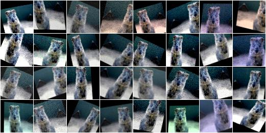
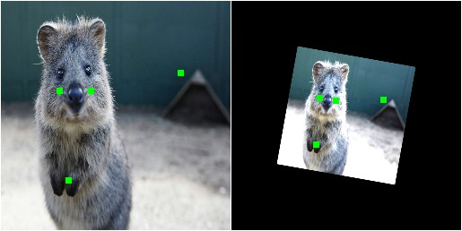
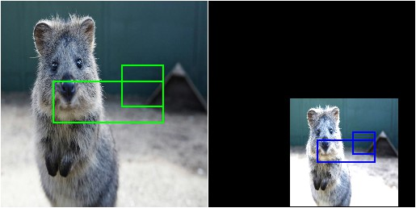
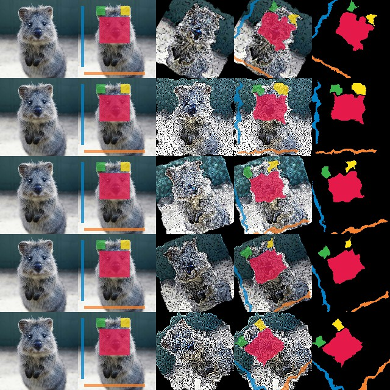

# imgaug图像增强

## Contact me

* Blog -> <https://cugtyt.github.io/blog/index>
* Email -> <cugtyt@qq.com>
* GitHub -> [Cugtyt@GitHub](https://github.com/Cugtyt)

> **本系列博客主页及相关见**[**此处**](https://cugtyt.github.io/blog/effective-pytorch/index)

---

在计算机视觉里图像增强是很常用的，imgaug是专门为图像增强的库，基本需要的操作都有了。[imgaug文档](https://imgaug.readthedocs.io/en/latest/)

## [基本使用](https://imgaug.readthedocs.io/en/latest/source/examples_basics.html)

``` python
from imgaug import augmenters as iaa

seq = iaa.Sequential([
    iaa.Crop(px=(0, 16)), # crop images from each side by 0 to 16px (randomly chosen)
    iaa.Fliplr(0.5), # horizontally flip 50% of the images
    iaa.GaussianBlur(sigma=(0, 3.0)) # blur images with a sigma of 0 to 3.0
])

for batch_idx in range(1000):
    # 'images' should be either a 4D numpy array of shape (N, height, width, channels)
    # or a list of 3D numpy arrays, each having shape (height, width, channels).
    # Grayscale images must have shape (height, width, 1) each.
    # All images must have numpy's dtype uint8. Values are expected to be in
    # range 0-255.
    images = load_batch(batch_idx)
    images_aug = seq(images=images)
    train_on_images(images_aug)
```

**常用的增强操作**

``` python
ia.seed(1)

# Example batch of images.
# The array has shape (32, 64, 64, 3) and dtype uint8.
images = np.array(
    [ia.quokka(size=(64, 64)) for _ in range(32)],
    dtype=np.uint8
)

seq = iaa.Sequential([
    iaa.Fliplr(0.5), # horizontal flips
    iaa.Crop(percent=(0, 0.1)), # random crops
    # Small gaussian blur with random sigma between 0 and 0.5.
    # But we only blur about 50% of all images.
    iaa.Sometimes(0.5,
        iaa.GaussianBlur(sigma=(0, 0.5))
    ),
    # Strengthen or weaken the contrast in each image.
    iaa.ContrastNormalization((0.75, 1.5)),
    # Add gaussian noise.
    # For 50% of all images, we sample the noise once per pixel.
    # For the other 50% of all images, we sample the noise per pixel AND
    # channel. This can change the color (not only brightness) of the
    # pixels.
    iaa.AdditiveGaussianNoise(loc=0, scale=(0.0, 0.05*255), per_channel=0.5),
    # Make some images brighter and some darker.
    # In 20% of all cases, we sample the multiplier once per channel,
    # which can end up changing the color of the images.
    iaa.Multiply((0.8, 1.2), per_channel=0.2),
    # Apply affine transformations to each image.
    # Scale/zoom them, translate/move them, rotate them and shear them.
    iaa.Affine(
        scale={"x": (0.8, 1.2), "y": (0.8, 1.2)},
        translate_percent={"x": (-0.2, 0.2), "y": (-0.2, 0.2)},
        rotate=(-25, 25),
        shear=(-8, 8)
    )
], random_order=True) # apply augmenters in random order

images_aug = seq(images=images)
```



## [关键点处理](https://imgaug.readthedocs.io/en/latest/source/examples_keypoints.html)

``` python

import imgaug as ia
import imgaug.augmenters as iaa
from imgaug.augmentables import Keypoint, KeypointsOnImage


ia.seed(1)

image = ia.quokka(size=(256, 256))
kps = KeypointsOnImage([
    Keypoint(x=65, y=100),
    Keypoint(x=75, y=200),
    Keypoint(x=100, y=100),
    Keypoint(x=200, y=80)
], shape=image.shape)

seq = iaa.Sequential([
    iaa.Multiply((1.2, 1.5)), # change brightness, doesn't affect keypoints
    iaa.Affine(
        rotate=10,
        scale=(0.5, 0.7)
    ) # rotate by exactly 10deg and scale to 50-70%, affects keypoints
])

# Augment keypoints and images.
image_aug, kps_aug = seq(image=image, keypoints=kps)

# print coordinates before/after augmentation (see below)
# use after.x_int and after.y_int to get rounded integer coordinates
for i in range(len(kps.keypoints)):
    before = kps.keypoints[i]
    after = kps_aug.keypoints[i]
    print("Keypoint %d: (%.8f, %.8f) -> (%.8f, %.8f)" % (
        i, before.x, before.y, after.x, after.y)
    )

# image with keypoints before/after augmentation (shown below)
image_before = kps.draw_on_image(image, size=7)
image_after = kps_aug.draw_on_image(image_aug, size=7)
```



## [边界框](https://imgaug.readthedocs.io/en/latest/source/examples_bounding_boxes.html)

``` python
import imgaug as ia
import imgaug.augmenters as iaa
from imgaug.augmentables.bbs import BoundingBox, BoundingBoxesOnImage


ia.seed(1)

image = ia.quokka(size=(256, 256))
bbs = BoundingBoxesOnImage([
    BoundingBox(x1=65, y1=100, x2=200, y2=150),
    BoundingBox(x1=150, y1=80, x2=200, y2=130)
], shape=image.shape)

seq = iaa.Sequential([
    iaa.Multiply((1.2, 1.5)), # change brightness, doesn't affect BBs
    iaa.Affine(
        translate_px={"x": 40, "y": 60},
        scale=(0.5, 0.7)
    ) # translate by 40/60px on x/y axis, and scale to 50-70%, affects BBs
])

# Augment BBs and images.
image_aug, bbs_aug = seq(image=image, bounding_boxes=bbs)

# print coordinates before/after augmentation (see below)
# use .x1_int, .y_int, ... to get integer coordinates
for i in range(len(bbs.bounding_boxes)):
    before = bbs.bounding_boxes[i]
    after = bbs_aug.bounding_boxes[i]
    print("BB %d: (%.4f, %.4f, %.4f, %.4f) -> (%.4f, %.4f, %.4f, %.4f)" % (
        i,
        before.x1, before.y1, before.x2, before.y2,
        after.x1, after.y1, after.x2, after.y2)
    )

# image with BBs before/after augmentation (shown below)
image_before = bbs.draw_on_image(image, size=2)
image_after = bbs_aug.draw_on_image(image_aug, size=2, color=[0, 0, 255])
```




## [分割](https://imgaug.readthedocs.io/en/latest/source/examples_segmentation_maps.html)

``` python
import imageio
import numpy as np
import imgaug as ia
import imgaug.augmenters as iaa
from imgaug.augmentables.segmaps import SegmentationMapOnImage


ia.seed(1)

# Load an example image (uint8, 128x128x3).
image = ia.quokka(size=(128, 128), extract="square")

# Create an example segmentation map (int32, 128x128).
# Here, we just randomly place some squares on the image.
# Class 0 is the background class.
segmap = np.zeros((128, 128), dtype=np.int32)
segmap[28:71, 35:85] = 1
segmap[10:25, 30:45] = 2
segmap[10:25, 70:85] = 3
segmap[10:110, 5:10] = 4
segmap[118:123, 10:110] = 5
segmap = SegmentationMapOnImage(segmap, shape=image.shape, nb_classes=1+5)

# Define our augmentation pipeline.
seq = iaa.Sequential([
    iaa.Dropout([0.05, 0.2]),      # drop 5% or 20% of all pixels
    iaa.Sharpen((0.0, 1.0)),       # sharpen the image
    iaa.Affine(rotate=(-45, 45)),  # rotate by -45 to 45 degrees (affects segmaps)
    iaa.ElasticTransformation(alpha=50, sigma=5)  # apply water effect (affects segmaps)
], random_order=True)

# Augment images and segmaps.
images_aug = []
segmaps_aug = []
for _ in range(5):
    images_aug_i, segmaps_aug_i = seq(image=image, segmentation_maps=segmap)
    images_aug.append(images_aug_i)
    segmaps_aug.append(segmaps_aug_i)

# We want to generate an image of original input images and segmaps
# before/after augmentation.
# It is supposed to have five columns: (1) original image, (2) original
# image with segmap, (3) augmented image, (4) augmented
# segmap on augmented image, (5) augmented segmap on its own in.
# We now generate the cells of these columns.
cells = []
for image_aug, segmap_aug in zip(images_aug, segmaps_aug):
    cells.append(image)                                      # column 1
    cells.append(segmap.draw_on_image(image))                # column 2
    cells.append(image_aug)                                  # column 3
    cells.append(segmap_aug.draw_on_image(image_aug))        # column 4
    cells.append(segmap_aug.draw(size=image_aug.shape[:2]))  # column 5

# Convert cells to grid image and save.
grid_image = ia.draw_grid(cells, cols=5)
imageio.imwrite("example_segmaps.jpg", grid_image)
```



