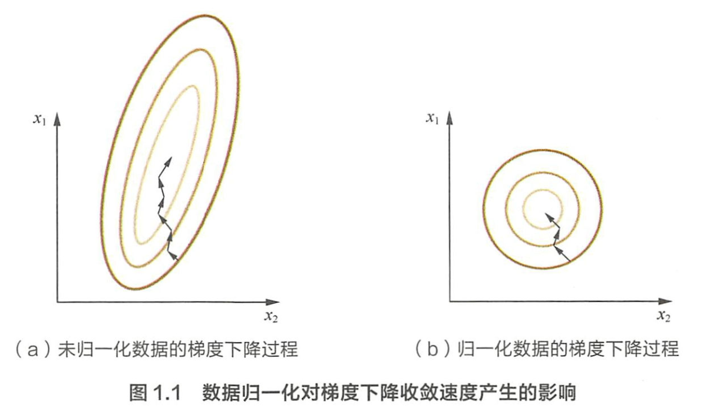
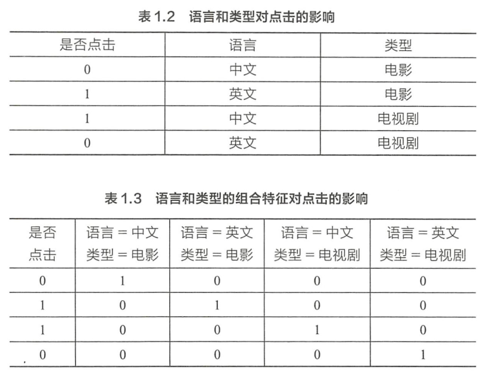
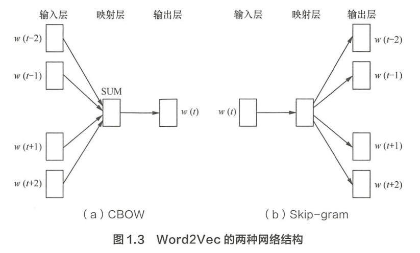

# 百面机器学习——特征工程

## Contact me

* Blog -> <https://cugtyt.github.io/blog/index>
* Email -> <cugtyt@qq.com>, <cugtyt@gmail.com>
* GitHub -> [Cugtyt@GitHub](https://github.com/Cugtyt)

> **本系列博客主页及相关见**[**此处**](https://cugtyt.github.io/blog/intv/index)

---

<head>
    
    
</head>

来自《百面机器学习》

## 为什么要归一化

* 线性函数归一化，缩放到[0,1]范围内：

$$X_{norm} = \frac{X-X_{min}}{X_{max} - X_{min}}$$

* 零均值归一化

$$z = \frac{x-\mu}{\sigma}$$

可以看如下等值图：

通过梯度下降法求解的模型通常是需要归一化的，包括线性回归，逻辑回归，支持向量，神经网络等，但是对于决策树模型并不适用，归一化不会改变样本在特征上的信息增益。

## 处理类别特征

* 序号编码，保留大小关系，例如高表示为3、中表示为2、低表示为1
* one-hot编码，不具有大小关系，例如A型血表示为（1,0,0,0),B型血表示为（0,1,0,0),AB型表示为（0,0,I,0),0型血表示为（0,0,0,1），类别过多需要注意如下问题
    > * 使用稀疏向量来节省空间，目前大部分算法支持稀疏向量形式的输入
    > * 配合特征选择降低维度
* 二进制编码，001，010，011，100，...

## 组合特征

## Word2Vec如何工作

CBOW 的目标是根据上下文出现的词语来预测当前词的生成概率， Skip-gram 是根据当前词来预测上下文中各词的生成概率：

CBOW和Skip-gram都可以表示成由输入层（Input）、映射层(Projection）和输出层（Output）组成的神经网络。输入层每个词由one-hot编码表示，所有词表示成一个N维向量，N表示单词总数。

任务就是训练神经网络的权重，使得语料库中所有单词的整体生成概率最大化。从输入层到隐含层需要一个维度为N×K的权重矩阵，从隐含层到输出层又需要一个维度为 K×N 的权重矩阵，学习权重可以用反向传播算法实现，每次迭代时将权重沿着度更优的方向进行一小步重新。但是由于Softmax激活函数中存在归一化顶的缘故，推导出来的迭代公式需要对词汇表中的所有单词进行遍历。训练得到维度为N×K和 K×N的两个权重矩阵之后可以选择其中一个作为N个词的K维向量表示。

## 图像数据不足会有什么问题，如何解决

训练数据不足带来的问题主要表现在过拟合方面，即模型在训练样本上的效果可能不错，但在测试集上的泛化效果不佳。

* 基于模型的方法，主要是采用降低过拟台风险的措施，包括简化模型（如将非线性模型简化为线性模型）、添加约束I员以缩小假设空间（如 Ll/L2正则顶）、集成学习、 Dropout 超参数等；
* 基于数据的方法， 主要通过数据扩充（ Data Augmentation ），即根据一些先验知识，在保
持特定信息的前提下，对原始数据进行适当变换以达到扩充数据集的效果。或者对图像进行特征提取后，对特征进行变换，例如SMOTE，还有GAN等方法。

此外，还可以使用迁移学习的方法。