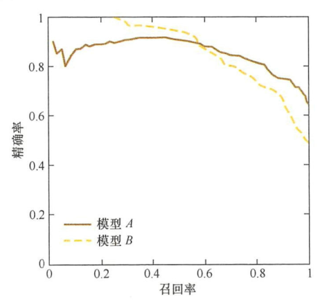
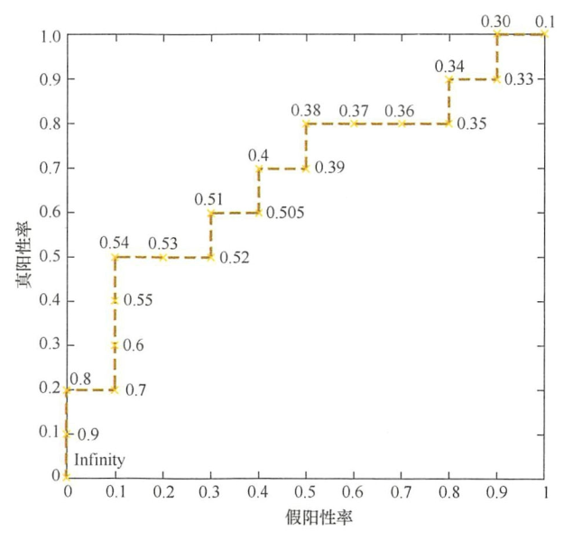
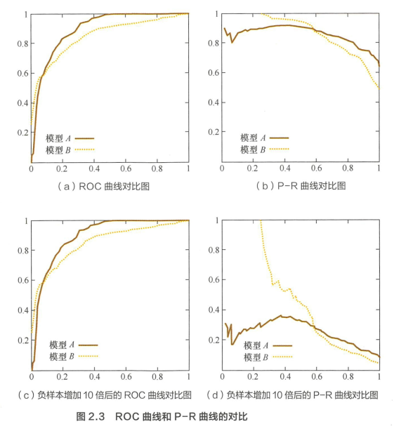

# 百面机器学习——模型评估

## Contact me

* Blog -> <https://cugtyt.github.io/blog/index>
* Email -> <cugtyt@qq.com>
* GitHub -> [Cugtyt@GitHub](https://github.com/Cugtyt)

> **本系列博客主页及相关见**[**此处**](https://cugtyt.github.io/blog/intv/index)

---

<head>
    
    
</head>

来自《百面机器学习》

## 准确率的局限

准确率的定义：

$$Acc = \frac{n_{correct}}{n_{total}}$$

当负样本占99%的时候，全部分类为负样本准确率很高，类别不平衡的时候，占比大的类别往往成为影响准确率的主要因素。

另外，还可能有模型欠拟合和过拟合，测试集和训练集划分不合理、结下评估与线上测试的中羊本分布存在差异等一系列问题。

## 精确率与召回率

精确率是自分类正确的正样本个数占分类器判定为正样本的样本个数的比例。召回率是指分类正确的正样本个数占真正的正样本个数的比例。

如果说模型的Precision@5 的结果非常好，但是依旧效果不好，那么问题出现在召回率上。为了综合评估一个排序模型的好坏，不仅要看模型在不同TopN下的Precision@N和Recall@N，而且最好绘制出模型的
P-R(Precision-Recall）曲线。

P-R曲线的横轴是召回率，纵铀是精确率。对于一个排序模型来说，P-R 曲线上的一个点代表着，在某一阈值下 ，模型将大于该阈值的结果判定为正样本，小于该阈值的结果判定为负样本，此时返回结果对应的召回率和精确率。 整条P-R曲线是通过将阈值从高到低移动而生成的。

除此之外， F1和ROC曲线也能综合地反映一个排序模型的性能。 F1是精准率和召回率的调和平均值，定义为:

$$F1 = \frac{2 \times precision \times recall}{precision + recall}$$

## 平方根误差的局限

模型在95%的时间区间内的预测误差都小于1% ，取得了相当不错的预测结果。那么造成RMSE指标居高不下的最可能的原因是什么？

RMSE的计算公式是：

$$RMSE = \sqrt{\frac{\sum_{i=1}^n (y_i - \hat{y_i})^2}{n}}$$

一般情况下， RMSE 能够很好地反映回归模型预测值与真实值的偏离程度。但在实际问题中，如果存在个别偏离程度非常大的离群点(Outlier）时,即使离群点数量非常少,也会让RMSE指标变得很差。

RMSE一直很差，这很可能是由于在其他的5%时间区间内存在非常严重的离群点。可以从三个角度来思考解决：

* 如果我们认定这些离群点是噪声点的话，就需要在数据预处理的阶段把这些噪声点过滤掉
* 如果不认为这些离群点是噪声点的话，就需要进一步提高模型的预测能力，将离群点产生的机制建模进去
* 可以找一个更合适的指标来评估该模型。关于评估指标，真实是存在比RMSE的鲁棒性更好的指标，比如平均绝对百分比误差（Mean Absolute Percent
Error, MAPE），定义为：

$$MAPE = \sum_{i=1}^n \vert \frac{y_i - \hat{y_i}}{y_i} \vert \times \frac{100}{n}$$

相比RMSE,MAPE相当于把每个点的误差进行了归一化,降低了个别离群点带来的绝对误差的影响。

## ROC曲线

ROC 曲线是 Receiver Operating Characteristic Curve的简称，ROC曲线的横坐标为假阳性率（FalsePositiveRate,FPR），纵坐标为真阳性率（TruePositiveRate,TPR）。FPR和TPR的计算万法分别为：

$$FPR = \frac{FP}{N}$$
$$TPR = \frac{TP}{P}$$

P是真实的正样本的数量，N是真实的负样本的数量，TP是P个正样本中被分类器预测为E样本的个数，FP是N个负样本中被分类器预测为正样本的个数。

## ROC曲线绘制

样本按照预测概率从高到低排序。在输出最终的正例、负例之前，我们需要指定一个阈值，预测概率大于该阈值的样本会被判为正例，小于该阈值的样本则会被判为负例。

通过动态地调整截断点，从最高的得分开始（实际上是从正无穷开始，对应着ROC曲线的零点），逐渐调整到最低得分，每一个截断点都会对应一个FPR和TPR，在 ROC 图上绘制出每个截断点对应的位置，再连接所有点就得到最终的ROC曲线。

还有一种更直观地绘制ROC曲线的方法。首先，根据样本标签统计出正负样本的数量，假设正样本数量为P，负样本数量为N;接下来，把横轴的刻度间隔设置为1/N ，纵轴的刻度间隔设置为1/P;再根据模型输出的预测概率对样本进行排序（从高到低）；依次遍历样本，同时从零点开始绘制ROC 曲线，每遇到一个正样本就沿纵轴方向绘制一个刻度间隔的曲线，每遇到一个负样本就沿横轴万向绘制一个刻度间隔的曲线，直到遍历完所高样本，由线最终停在（1,1）这个点，整个ROC曲线绘制完成。

## 计算AUC

计算ROC曲线下的面积

## ROC曲线与P-R曲线

相比P-R 曲线，ROC曲线有一个特点，当正负样本的分布发生变化时， ROC曲线的形状能够基本保持不变，而P-R曲线的形状一般会发生较剧烈的变化。

正负样本不平衡的时候，使用ROC曲线更好。

## 余弦相似度与欧氏距离

$$cos(A, B) = \frac{A \cdot B}{\Vert A \Vert_2 \Vert B \Vert_2}$$

关注的是向量之间的角度关心，不关心绝对大小，取值范围是[-1,1]。当一对文本相似度的长度差距很大、
但内容相近时，如果使用词频或词向量作为特征，它们在特征空间中的的欧氏距离通常很大；而如果使用余弦相似度的话，它们之间的夹角可能很小，因而相似度高。此外，在文本、圄像、视频等领域，研究的对象的特征维度往往很高 ，余弦相似度在高维情况下依然保持相同时为1，正交时为0，相反时为-l的性质，而欧式距离的数值则受维度的影响，范围不固定，并且含义也比较模糊。

总体来说，欧氏距离体现数值上的绝对差异，而余弦距离体现方向上的相对差异。例如，统计两部剧的用户观看行为，用户A的观看向量为(0, l)，用户 B 为(1 ,0)，此时二者的余弦距离很大，而欧氏距离很小，我们分析两个用户对于不同视频的偏好，更关注相对差异，显然应当使用余弦相似度。而当我们分析用户活跃度，以登陆次数（单位：次）和平均观看时长（单位：分钟）作为特征时，余弦距离会认为(l, l0)、(10,100)两个用户距离很近，但显然这两个用户活跃度是有着极大差异的,此时我们更关注数值绝对差异，应当使用欧氏距离。

## 余弦距离是否是－个严格定义的距离？

距离的定义：在一个集合中，如果每一对元素均可唯一确定一个实数，使得三条距离公理（正定性，对称性， 三角不等式）成立，则该实数可称为这对元素之间的距离。

余弦距离满足正定性和对称性，但是不满足三角不等式，因此并不是严格定义的距离。

* 正定性

由余弦距离定义：

$$dist(A, B) = 1 - cos \theta = \frac{\Vert A \Vert_2 \Vert B \Vert_2 - AB}{\Vert A \Vert_2 \Vert B \Vert_2}$$

$dist(A, B) \ge 0$ 恒成立，特别的有：

$$dist(A, B) = 0 \to A = B$$

* 对称性

$$dist(A, B) = \frac{\Vert A \Vert_2 \Vert B \Vert_2 - AB}{\Vert A \Vert_2 \Vert B \Vert_2}=dist(B, A) = \frac{\Vert B \Vert_2 \Vert A \Vert_2 - AB}{\Vert B \Vert_2 \Vert A \Vert_2}$$

* 三角不等式

A=(l,0), B=(l,l), C=(0,1)

$$dist(A,B) = 1-\frac{\sqrt{2}}{2}$$
$$dist(B,C) = 1-\frac{\sqrt{2}}{2}$$
$$dist(A,C) = 1$$

## 为什么要A/B测试

* 离线评估无法完全消除模型过拟合的影响，因此无法完全替代线上结果
* 离线评估无法完全还原线上的工程环境，不会考虑环境延迟，数据丢失，标签数据缺失等
* 线上系统的某些商业指标在离线评估中无法计算，如用户点击率，留存时长，PV访问量等

## 模型评估方法和优缺点

* Holdout检验

分成训练集和验证集，缺点是最后的评估和原始分组有很大关系。

* 交叉验证

分成K折。

* 自助法

当样本规模比较小时，将样本集进行划分会让训练集进一步减小，这可能会影响模型训练效果。

自助法是基于自助采样法的检验方法。对于总数为n的样本集合，进行n次有放回的随机抽样3得到大小为n的训练集。n次采样过程中，有的样本会被重复采样，有的样本没被抽出过，将这些没被抽出的样本作为验证集，进行模型验证，这就是自助法的验证过程。

## 自助法中，n趋于无穷的时候，有多少数据未被选过？

未被抽中的概率是$(1-\frac{1}{n})$，n次均未中的概率是$(1-\frac{1}{n})^n$，n趋于无穷大的时候，概率为$\underset{n \to \infin}{\lim} (1-\frac{1}{n})^n$。根据重要极限：$\underset{n \to \infin}{\lim} (1+\frac{1}{n})^n=e$，所以有：

$$\underset{n \to \infin}{\lim} (1-\frac{1}{n})^n = \underset{n \to \infin}{\lim} \frac{1}{(1 + \frac{1}{n-1})^n}\\
= \frac{1}{\underset{n \to \infin}{\lim}(1 + \frac{1}{n-1})^{n-1}} \cdot \frac{1}{\underset{n \to \infin}{\lim}(1 + \frac{1}{n-1})}\\
= \frac{1}{e} \approx 0.368$$

## 超参数调优的方法

* 网格搜索
* 随机搜索
* 贝叶斯优化

贝叶斯优化算法充分利用了之前的信息。贝叶斯优化算法通过对目标函数形状进行学习，找到使目标函数向全局最优值提升的参数。具体来说，它学习目标函数形状的万法是，首先根据先验分布，假设一个搜集函数，然后，每一次使用新的采样点来测试目标函数时，利用这个信息来更新目标函数的先验分布；最后，算法测试由后验分布给出的全局最值最可能出现的位置的点。对于贝叶斯优化算法，有一个需要注意的地方，一旦找到了一个局部最优值，它会在该区域不断采样，所以很容易陷入局部最优值。为了弥补这个缺陷，贝叶斯优化算法会在探索和利用之间找到一个平衡点，探索就是在还未取样的区域获取采样点；而利用则是根据后验分布在最可能出现全局最值的区域进行采样。

## 降低欠拟合和过拟合的方法

### 降低过拟合

* 更多的数据
* 降低模型复杂度
* 正则化方法
* 集成学习方法

### 降低欠拟合

* 添加新特征
* 增加模型复杂度
* 减小正则化