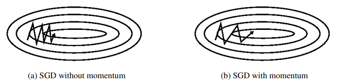
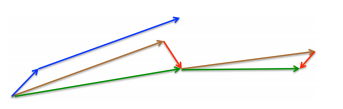

# Super Machine Learning Revision Notes

## Contact me

* Blog -> <https://cugtyt.github.io/blog/index>
* Email -> <cugtyt@qq.com>
* GitHub -> [Cugtyt@GitHub](https://github.com/Cugtyt)

> **本系列博客主页及相关见**[**此处**](https://cugtyt.github.io/blog/intv/index)

---

<head>
    
    
</head>

来自[Super Machine Learning Revision Notes](https://createmomo.github.io/2018/01/23/Super-Machine-Learning-Revision-Notes/#tableofcontents),重点参考[An overview of gradient descent optimization algorithms](https://arxiv.org/pdf/1609.04747.pdf)

## Activation Functions

|Name | Function | Derivative
|:-|:-|:-|
|sigmoid| $\sigma(z)=\frac{1}{1+e^{-z}}$|$g(z)(1-g(z))$|
|tanh| $tanh(z) =2 \sigma(2z) - 1 = \frac{e^z - e^{-z}}{e^z + e^{-z}}$ |$1-(tanh(z))^2$
|Relu|$\max (0, z)$|$0, if \ z<0 \\ 1, if \ z > 0, \\ undefined, if \ z =0$|
|Leaky Relu|$\max (0.01z, z)$|$0.01, if \ z<0 \\ 1, if \ z > 0, \\ undefined, if \ z =0$|

## 梯度下降

### GD: 

$$\theta = \theta - \eta \cdot \nabla_\theta J(\theta)$$

### SGD:

$$\theta = \theta - \eta \cdot \nabla_\theta J(\theta:x^{(i)};y^{(i)})$$

### Mini-batch GD:

$$\theta = \theta - \eta \cdot \nabla_\theta J(\theta:x^{(i:i+n)};y^{(i:i+n)})$$

### Momentum:

$$v_t = \gamma v_{t-1} + \eta \cdot \nabla_\theta J(\theta) \\ \theta = \theta - v_{t}$$

$\gamma$通常取0.9或差不多的值。

### Nesterov：

向前看一步动量

$$v_t = \gamma v_{t-1} + \eta \cdot \nabla_\theta J(\theta - \gamma v_{t-1}) \\ \theta = \theta - v_{t}$$

### RMSprop

$$E[g^2]_t = 0.9 E[g^2]_{t-1} + 0.1 g_t^2\\
\theta_{t+1} = \theta_t - \frac{\eta}{\sqrt{E[g^2]_t + \epsilon}} g_t$$

### Adam

第二步修正是为了解决学习率太小，导致偏向0，因为$\beta$取值接近1。相当于Adadelta和RMSProp加入动量（一阶）。

$$m_t = \beta_1 m_{t-1} + (1 - \beta_1) g_t\\
v_t = \beta_2 v_{t-1} + (1 - \beta_2)g_t^2\\
\hat{m_t} = \frac{m_t}{1-\beta_1^t}\\
\hat{v_t} = \frac{v_t}{1-\beta_2^t}\\
\theta_{t+1} = \theta_t - \frac{\eta}{\sqrt{\hat{v_t}}+\epsilon}\hat{m_t}$$

## BN

$$\mu = \frac{1}{m} \sum Z^{(i)}\\
\sigma^2 = \frac{1}{m} \sum(z^{(i)} - \mu) \\
Z_{normalized}^{(i)} = \alpha \frac{Z^{(i) - \mu}}{\sqrt{\sigma^2}+\epsilon} + \beta$$

## 初始化

### Xavier

Xavier初始化的基本思想是，若对于一层网络的输出和输出可以保持正态分布且方差相近，这样就可以避免输出趋向于0，从而避免梯度弥散情况。

对于$y=wx$，根据假设有：

$$Var(Y) \\= Var(w_i X) \\= Var(w_i) * Var(X) + E^2(X)Var(w_i) + E^2(w_i) Var(X)$$

当$X,w_i$符合均值0的正太分布时，期望$E(X),E(w_i)$均为0，上式可化简：

$$Var(Y) = Var(w_i) * Var(X)$$

如果有$n_i$个神经元，那么

$$Var(Y) = n_i * Var(w_i) * Var(X)$$

要$Var(Y) = Var(X)$，则需要`$n_i * Var(w_i)=1$`，即`$Var(w_i) = 1/n_i$`，同理反向传播时：`$Var(w_i) = 1/n_{i+1}$`，因此：

$Var(w_i) = 2/(n_i+n_{i+1})$

因此正态分布可以为$N(0, 2/(n_i+n_{i+1}))$

对于均匀分布$X\sim U(a,b)$有：

$$E = (a+b)/2=0\\
Var = (b-a)^2/12 = 2/(n_i + n_{i+1})$$

得：

$$a = -b = -\sqrt{6/(n_i + n_{i+1})}$$

### He

在ReLU网络中，假定每一层有一半的神经元被激活，另一半为0，所以要保持方差不变，只需要在 Xavier 的基础上再除以2

$$Var(w_i) = 2/n_i$$

## 逻辑回归

$$p(y=1|x) = \sigma(W^Tx+b) = (1+e^{-W^Tx-b})^{-1}$$

$$L(\hat{y}^i, y^i) = -[y^i \log \hat{y}^i + (1-y^i)log(1-\hat{y}^i)]$$

