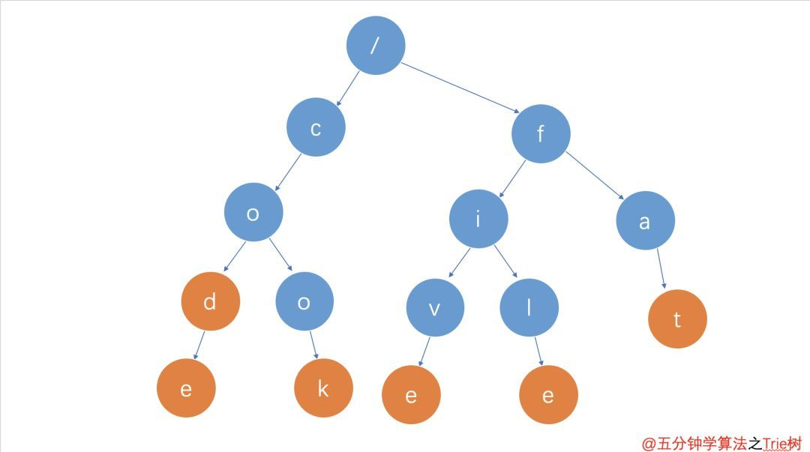

# 英语单词拼写检查

## Contact me

* Blog -> <https://cugtyt.github.io/blog/index>
* Email -> <cugtyt@qq.com>
* GitHub -> [Cugtyt@GitHub](https://github.com/Cugtyt)

> **本系列博客主页及相关见**[**此处**](https://cugtyt.github.io/blog/intv/index)

---

主要参考知乎[鹅厂面试题，英语单词拼写检查算法？](https://www.zhihu.com/question/29592463)中[南葱](https://www.zhihu.com/question/29592463/answer/45393639)的回答和[How to Write a Spelling Corrector](http://norvig.com/spell-correct.html)

一个直接想法是，遍历词典，比较和当前词的编辑距离([leetcode 72 编辑距离](https://cugtyt.github.io/blog/algo/2020/0124))。

这个方法当然是可行的，但是问题是时间复杂度很高，需要遍历整个字典。改进的方法是**空间换时间，用树结构保持字典**，这样可以极大的减小搜索空间。下面是用trie树的方法：



``` python
def make_trie(words):
    trie = {}
    for word in words:
        t = trie
        for c in word:
            if c not in t: t[c] = {}
            t = t[c]
        t[None] = None
    return trie

def check_fuzzy(trie, word, path='', tol=1):
    if word == '':
        return {path} if None in trie else set()
    else:
        p0 = set()
        if word[0] in trie:
            p0 = check_fuzzy(trie[word[0]], word[1:], path+word[0], tol)
        p1 = set()
        if tol > 0:
            for k in trie:
                if k is not None and k != word[0]:
                    p1.update(check_fuzzy(trie[k], word[1:], path+k, tol-1))
        return p0 | p1
```

p0表示准确查找，p1表示相近查找，这里使用了tol参数，用于表示可以容忍几个近似值。

另外为了**支持新的容错如增删字母**，可以如下修改：

``` python
def check_fuzzy(trie, word, path='', tol=1):
    if tol < 0:
        return set()
    elif word == '':
        results = set()
        if None in trie:
            results.add(path)
        # 增加词尾字母
        for k in trie:
            if k is not None:
                results |= check_fuzzy(trie[k], '', path+k, tol-1)
        return results
    else:
        results = set()
        # 首字母匹配
        if word[0] in trie:
            results |= check_fuzzy(trie[word[0]], word[1:], path + word[0], tol)
        # 分情形继续搜索（相当于保留待探索的回溯分支）
        for k in trie:
            if k is not None and k != word[0]:
                # 用可能正确的字母置换首字母
                results |= check_fuzzy(trie[k], word[1:], path+k, tol-1)
                # 插入可能正确的字母作为首字母
                results |= check_fuzzy(trie[k], word, path+k, tol-1)
        # 跳过余词首字母
        results |= check_fuzzy(trie, word[1:], path, tol-1)
        # 交换原词头两个字母
        if len(word) > 1:
            results |= check_fuzzy(trie, word[1]+word[0]+word[2:], path, tol-1)
        return results
```

进一步，可以用**yield减少不需要的计算**，只在有需要的时候继续搜索。

``` python
def check_lazy(trie, word, path='', tol=1):
    if tol < 0:
        pass
    elif word == '':
        if None in trie:
            yield path
        # 增加词尾字母
        for k in trie:
            if k is not None:
                yield from check_lazy(trie[k], '', path + k, tol - 1)
    else:
        if word[0] in trie:
            # 首字母匹配成功
            yield from check_lazy(trie[word[0]], word[1:], path+word[0], tol)
        # 分情形继续搜索（相当于保留待探索的回溯分支）
        for k in trie:
            if k is not None and k != word[0]:
                # 用可能正确的字母置换首字母
                yield from check_lazy(trie[k], word[1:], path+k, tol-1)
                # 插入可能正确的字母作为首字母
                yield from check_lazy(trie[k], word, path+k, tol-1)
        # 跳过余词首字母
        yield from check_lazy(trie, word[1:], path, tol-1)
        # 交换原词头两个字母
        if len(word) > 1:
            yield from check_lazy(trie, word[1]+word[0]+word[2:], path, tol-1)
```

用迭代替换递归：

``` python
from collections import deque

def check_iter(trie, word, tol=1):
    seen = set()
    q = deque([(trie, word, '', tol)])
    while q:
        trie, word, path, tol = q.popleft()
        if word == '':
            if None in trie:
                if path not in seen:
                    seen.add(path)
                    yield path
            if tol > 0:
                for k in trie:
                    if k is not None:
                        q.appendleft((trie[k], '', path+k, tol-1))
        else:
            if word[0] in trie:
                q.appendleft((trie[word[0]], word[1:], path+word[0], tol))
            if tol > 0:
                for k in trie.keys():
                    if k is not None and k != word[0]:
                        q.append((trie[k], word[1:], path+k, tol-1))
                        q.append((trie[k], word, path+k, tol-1))
                q.append((trie, word[1:], path, tol-1))
                if len(word) > 1:
                    q.append((trie, word[1]+word[0]+word[2:], path, tol-1))
```

【可选的一步】纠正的时候往往倾向于认为首字母是无误的，利用这个现象可以减轻不少搜索压力，花费的时间可以少数倍。

``` python
def check_head_fixed(trie, word, tol=1):
    for p in check_lazy(trie[word[0]], word[1:], tol=tol):
        yield word[0] + p
```

另一个是来自[How to Write a Spelling Corrector](http://norvig.com/spell-correct.html)：

思路是对一次编辑距离的候选词和二次编辑距离的候选词进行搜索

``` python
import re
from collections import Counter

def words(text): return re.findall(r'\w+', text.lower())

WORDS = Counter(words(open('big.txt').read()))

def P(word, N=sum(WORDS.values())): 
    "Probability of `word`."
    return WORDS[word] / N

def correction(word): 
    "Most probable spelling correction for word."
    return max(candidates(word), key=P)

def candidates(word): 
    "Generate possible spelling corrections for word."
    return (known([word]) or known(edits1(word)) or known(edits2(word)) or [word])

def known(words): 
    "The subset of `words` that appear in the dictionary of WORDS."
    return set(w for w in words if w in WORDS)

def edits1(word):
    "All edits that are one edit away from `word`."
    letters    = 'abcdefghijklmnopqrstuvwxyz'
    splits     = [(word[:i], word[i:])    for i in range(len(word) + 1)]
    deletes    = [L + R[1:]               for L, R in splits if R]
    transposes = [L + R[1] + R[0] + R[2:] for L, R in splits if len(R)>1]
    replaces   = [L + c + R[1:]           for L, R in splits if R for c in letters]
    inserts    = [L + c + R               for L, R in splits for c in letters]
    return set(deletes + transposes + replaces + inserts)

def edits2(word): 
    "All edits that are two edits away from `word`."
    return (e2 for e1 in edits1(word) for e2 in edits1(e1))
```

使用方法：

``` python
>>> correction('speling')
'spelling'

>>> correction('korrectud')
'corrected'
```