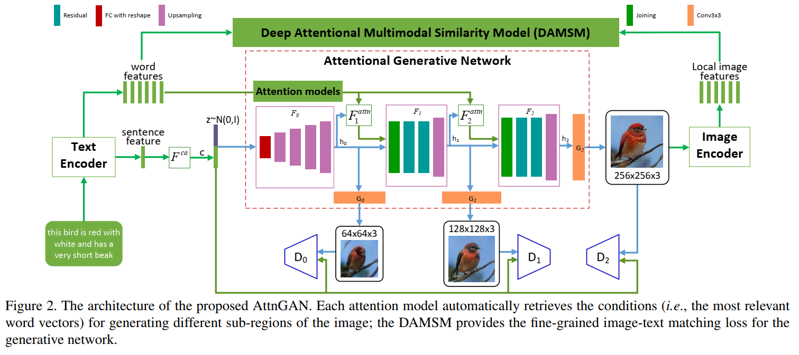

# GAN

## Contact me

* Blog -> <https://cugtyt.github.io/blog/index>
* Email -> <cugtyt@qq.com>
* GitHub -> [Cugtyt@GitHub](https://github.com/Cugtyt)

> **本系列博客主页及相关见**[**此处**](https://cugtyt.github.io/blog/intv/index)

<head>
    
    
</head>

---

## 基本公式

KL散度：

$$KL (p \Vert q) = \sum p \log \frac{p}{q}$$

GAN的损失函数

$$\min_G \max_D V(D, G) = \mathbb{E}_{x \sim p_{data}} [\log D(x)] 
    + \mathbb{E}_{x \sim p_{g}} [\log (1 - D(x))]$$

判别器取得最大值的条件是：

$$\frac{p_{data}}{p_{data} + p_g}$$

此时最大化D得到：

$$\max_D V(G, D) = \mathbb{E}_{x \sim p_{data}} [\log \frac{p_{data}}{p_{data} + p_g}]
+ \mathbb{E}_{x \sim p_g} [\log \frac{p_{data}}{p_{data} + p_g}]\\
= -\log4 + KL(p_{data} \Vert \frac{p_{data} + p_g}{2}) + KL(p_g \Vert \frac{p_{data} + p_g}{2})\\
= -\log4 + 2 JS(p_{data} \Vert p_g)$$

## Wasserstein距离

KL散度和JS散度衡量分布距离，在两个分布没有交叠区域的时候，无法衡量。

$$W[p_{data}, p_g] = \inf \int\int \gamma(x_{data}, x_g) \vert x_{data} - x_g \vert dx_{data} dx_g$$

## 评价指标

### IS

在给定图片后，输出标签的熵

$$H(y \vert x) = -\sum p(y \vert x) \log p(y \vert x)$$

标签的熵

$$H(y) = -\sum p(y) \log p(y)$$

因此将标签的熵减去给定输入后标签的熵为信息增益：

$$I(x;y) = H(y) - H(y \vert x)$$

因此

$$IS = \exp (\mathbb{E}_{KL}(p(y \vert x) \Vert p(y)))\\
= \exp (H(y) - H(y \vert x))$$

### AM分数

加入了分类熵。

### FID

FID衡量统计特征：

$$FID (x, g) = \Vert \mu_x - \mu_g \Vert_2^2 + Tr (\sum_x, \sum_g - 2(\sum_x\sum_g)^\frac{1}{2})$$

## 设计GAN卷积结构

### 生成器

两点原则：

1. 保证信息在逐层计算中逐渐增多
2. 不损失位置信息，不断产生更细节的位置信息

具体做法：

1. 去掉一切会丢掉位置信息的结构，如池化层。
2. 使用分数步进卷积层。提高分辨率的过程中，将输入填充0，卷积可以放大输入张量。
3. 去掉全连接层
4. 批量归一化和ReLU

### 判别器

基本就是普通的分类器

## 负样本感知

$$KL (p_{data} \Vert p_{G \vert neg}) = p_{data} \log p_{data} - p_{data} \log p_{G \vert neg}\\
\le  p_{data} \log p_{data} - p_{data} \log p_{G} = KL (p_{data} \Vert p_G)$$

## AttnGAN

多阶段逐步生成细节，文字有两个特征：全局语句特征和局部单词特征。
先通过全局特征生成阶段1粗糙的图像，然后阶段1的判别器判别，同时对生成的图像特征和局部单词特征进行注意力匹配。
多个阶段后生成最后的图像，编码生成局部图像特征，再和局部单词特征匹配相似性。