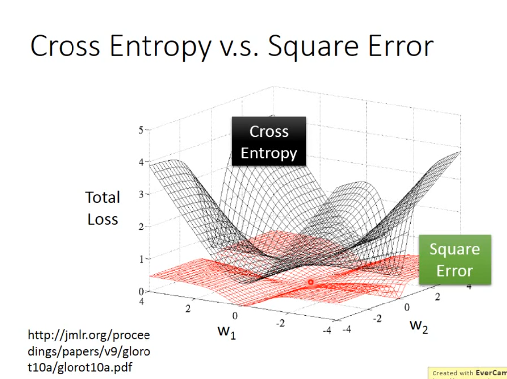

# 为什么不能逻辑回归+平方损失

## Contact me

* Blog -> <https://cugtyt.github.io/blog/index>
* Email -> <cugtyt@qq.com>
* GitHub -> [Cugtyt@GitHub](https://github.com/Cugtyt)

> **本系列博客主页及相关见**[**此处**](https://cugtyt.github.io/blog/intv/index)

<head>
    
    
</head>

---

## 吴恩达机器学习-课时6-4代价函数

由于sigmoid函数的引入，代价函数会是非凸函数，因此不能保证收敛。

## 李宏毅2020机器学习课程-逻辑回归

如果使用平方损失，求导发现在y=1的时候，模型输出0或1的导数都是0。

二者损失绘图得到：

