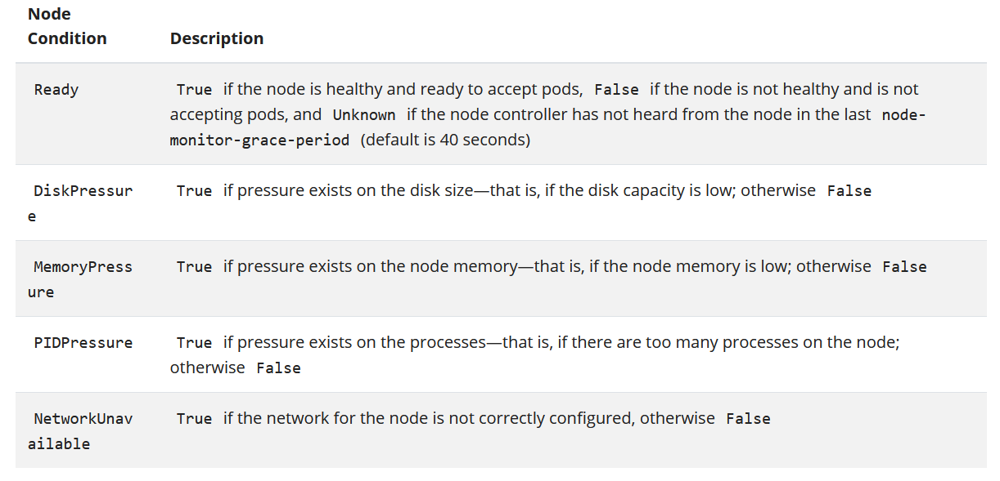

# Cluster Architecture

## Contact me

* Blog -> <https://cugtyt.github.io/blog/index>
* Email -> <cugtyt@qq.com>
* GitHub -> [Cugtyt@GitHub](https://github.com/Cugtyt)

> **本系列博客主页及相关见**[**此处**](https://cugtyt.github.io/blog/k8s/index)

---

来自[kubernetes.io文档](https://kubernetes.io/docs/concepts/architecture/)

## Nodes

k8s将应用通过容器放到Pods中运行在Nodes中。一个Node可以是一个虚拟或者实体的机器，这取决于集群。每个node通过控制面板管理，也包括运行在Pods中必要的服务。

一个Node中包括的部分有：kubelet，container runtime，和kube-proxy。

将Nodes加入API服务有两种主要方式：
* kubelet自己注册到控制面板中
* 手动加入到Node对象中。

在创建一个Node对象或者kubelet自己注册时，控制面板会检查新的对象是否可用。例如：

``` json
{
  "kind": "Node",
  "apiVersion": "v1",
  "metadata": {
    "name": "10.240.79.157",
    "labels": {
      "name": "my-first-k8s-node"
    }
  }
}
```

k8s会创建一个Node节点，检查kubelet注册到了API服务器，匹配了Node中的`metadata.name`字段。如果节点正常，那就可以运行Pod了。

节点的名字标识了一个节点。两个节点不能有相同的名字，k8s会认为相同的名字是相同的对象。

kubelet有一个参数`--register-node`（默认为true），当值为true的时候，kubelet会向API服务器注册自己。这也是推荐的做法。对于自注册，kubelet基于如下选项运行：

* --kubeconfig - Path to credentials to authenticate itself to the API server.

* --cloud-provider - How to talk to a cloud provider to read metadata about itself.

* --register-node - Automatically register with the API server.

* --register-with-taints - Register the node with the given list of taints (comma separated <key>=<value>:<effect>).

* No-op if register-node is false.

* --node-ip - IP address of the node.

* --node-labels - Labels to add when registering the node in the cluster (see label restrictions enforced by the NodeRestriction admission plugin).

* --node-status-update-frequency - Specifies how often kubelet posts node status to master.

手动节点管理：如果要手动创建节点对象，设置`--register-node=false`，可以无视`--register-node`修改对象，例如对已有的节点设置标签或者标记为不可调度。

你可以使用标签的节点选择器控制调度，例如让一个Pod只可以运行一些节点子集。

标记Node为不可调度不允许Node中放置新的Pods，但是不影响现有的Pods。对于节点重启或维护是很有用的。标记不可调度的命令是：

`kubectl cordon $NODENAME`

节点状态和其他信息可以通过命令查看：

`kubectl describe node <insert-node-name-here>`

状态包括这些部分：
* Addresses 这个取决于云提供商或配置
  * HostName， ExternalIp, InternalIP
* Conditions 描述了运行中节点的状态：
  
  
  在API中，节点的条件作为节点资源`.status`中的一部分：
  ``` json
  "conditions": [
    {
        "type": "Ready",
        "status": "True",
        "reason": "KubeletReady",
        "message": "kubelet is posting ready status",
        "lastHeartbeatTime": "2019-06-05T18:38:35Z",
        "lastTransitionTime": "2019-06-05T11:41:27Z"
    }
  ]
  ```

  