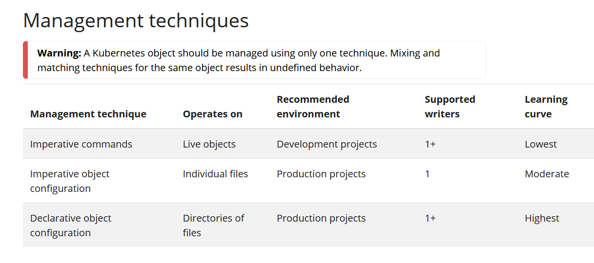

# Overview

## Contact me

* Blog -> <https://cugtyt.github.io/blog/index>
* Email -> <cugtyt@qq.com>
* GitHub -> [Cugtyt@GitHub](https://github.com/Cugtyt)

> **本系列博客主页及相关见**[**此处**](https://cugtyt.github.io/blog/k8s/index)

---

来自[kubernetes.io文档](https://kubernetes.io/docs/tutorials/kubernetes-basics/)


## 控制面板组件

控制面板的组件对集群做整体决策，也可以检测和响应集群事件。

### kube-apiserver

用于显示k8s的api，即k8s控制面板的前端。它是面向水平扩容设计的，也就是说用于部署更多的实例。

### etcd

持续高可用的键值存储，用于备份保存所有集群数据。

### kube-scheduler

监视新创建的没有node的Pods，然后给他们挑选需要运行的node。在做调度的时候需要考虑的因素有：单个或者共有的资源需求，硬件软件政策限制，结合和反结合的指定，数据位置，内部负载接口和截止日期。

### kube-controller-manager

运行控制进程，逻辑上每个控制器是一个独立的进程，但是为了避免复杂，他们都编译到一个二进制文件中，运行到单个进程中。

* 节点控制器：在节点不可用时提醒和响应
* 工作控制器：监察一次性的任务，创建Pods运行这些任务直到完成
* 端点控制器：填充在端点对象中
* 服务账户&符号（Token）控制器：为新的命名空间创建默认账户和API访问符

### cloud-control-manager

云控制管理器可以把集群连接到云端，隔离与云端平台交互和集群交互的组件。它只运行在云端，如果在本地运行，你的集群没有这个部分。

可能会有云控制依赖的是：

* 节点控制器：在节点不响应的时候检查节点是不是删掉了
* 路由控制器：在云基础设施中设置路由
* 服务控制器：创建、更新和删除云端负载平衡

## 节点组件

运行在所有节点中，维持pods的运行，为k8s提供运行环境

### kubelet

每个节点的代理，能确保容器运行在一个Pod中。通过一系列机制后，kubelet拿到一系列PodSpecs，确保这些PodSpecs描述的容器正确健康的运行。对于不是k8s创建的容器不负责。

### kube-proxy

网络代理，是服务的一部分。维护节点的网络规则，让Pods可以在集群内外通信。

### 容器运行时

用于负责运行容器。

## 插件

### DNS

所有的集群应该有集群的DNS，他是一个DNS服务器，用于对k8s服务提供记录。由k8s启动的容器自动包括了DNS服务器。

### Web UI

提供了图形界面

### 容器资源监控

记录通用的时序指标，提供UI来查看

### 集群级别的日志

用于保存容器日志到一个中心化的日子存储，提供了搜索和查看的接口。

## k8s对象

k8s对象是k8s系统的持久化实体，用于表示集群的状态。一个k8s对象是一个意图的记录，一旦创建了这个对象，k8s系统就会持续工作保证这个对象存活。创建对象，也就是告诉k8s系统你期望的集群状态。

#### 对象Spec和状态

基本上每个对象包括两个内嵌字段，用于管理对象的配置：Spec和Status。在创建对象时，需要设置spec，它用于描述这个资源应该的状态。Status描述了对象的当前状态，由k8s系统和组件提供和更新。控制面板会持续管理每个对象的当前状态，用于确保满足我们所期望的状态。

例如：在k8s中，Deployment是一个对象用于描述集群中运行一个应用。创建Deployment的时候，就需要设置spec来指定你希望应用运行三个副本。k8s系统读取这个spec，创建三个实例，并更新当前状态来匹配spec。如果其中实例挂掉，会导致当前状态更改，k8s会对这个变化响应，做出更正。

#### 描述k8s对象

通常将配置信息写入yaml文件，并传入kubectl命令，kubectl会将文件转成json来请求API。例子：

``` yaml
apiVersion: apps/v1
kind: Deployment
metadata:
  name: nginx-deployment
spec:
  selector:
    matchLabels:
      app: nginx
  replicas: 2 # tells deployment to run 2 pods matching the template
  template:
    metadata:
      labels:
        app: nginx
    spec:
      containers:
      - name: nginx
        image: nginx:1.14.2
        ports:
        - containerPort: 80
```

使用kubectl apply命令：

`kubectl apply -f https://k8s.io/examples/application/deployment.yaml --record`

#### 必须字段

* `apiVersion` 指定使用的api版本
* `kind` 创建对象的类型
* `metadata` 用于唯一标识对象的数据，包括name, UID, 和可选的namespace
* `spec` 需要的状态

### 对象管理



#### 命令式指令

在使用命令式指令的时候，用户直接在集群的对象上进行操作。把所需要的操作以参数形式传给kubectl。对于初始或者一次性任务是推荐的方法，因为它直接对对象进行操作，也不需要提供任何之前的配置。

`kubectl apply -f https://k8s.io/examples/application/deployment.yaml --record`

优势：
* 指令使用简单的动作词汇
* 指令只需要指定一个改变步骤

劣势：
* 指令不能和代码更改评审过程集成在一起
* 指令不能提供审计追踪
* 指令不能提供记录源
* 指令不能创建新对象的模板template

#### 命令式对象配置

在命令式对象配置中，kubectl命令指定操作，可选参数和至少一个文件。文件必须包含对象的完整定义，形式包括YAML或JSON格式。

`kubectl create -f nginx.yaml` 创建
`kubectl delete -f nginx.yaml -f redis.yaml` 删除两个配置
`kubectl replace -f nginx.yaml` 更新

与命令式指令优势：
* 对象配置可以保存在版本控制中
* 可以集成在评审过程中，支持审计追踪
* 提供模板用于创建新的对象

劣势：
* 对象配置需要对对象模式由基本的理解
* 需要编写专门的YAML文件

与声明式对象配置相比优势：
* 简单容易理解
* 在1.5版中更加成熟

劣势：
* 在文件中工作的很好，目录中不是很好
* 更新现有的对象必须反映在配置文件中，不然在下次替换中会丢失

#### 声明式对象配置

使用声明式对象配置，用户对在本地的对象配置文件操作，不需要定义具体操作。创建更新和删除都由kubectl自动从配置中检测。这样可以在目录中完成，不同的运算用于不同的对象。

先查看更改，再执行：

```
kubectl diff -f configs/
kubectl apply -f configs/
```

递归执行：
```
kubectl diff -R -f configs/
kubectl apply -R -f configs/
```

相比于命令式对象配置的优势：
* 对于对象的更改可以留存
* 对于目录的支持很好，可以对每个对象自动检测操作类型

劣势：
* 声明式更难理解和debug
* 使用diff的部分更新会生成复杂的合并和碎片操作

### 对象名字和ID

每个集群的对象都有一个名字，对于资源类型来说是唯一的。也有一个UID，对于整个集群来说是唯一的。

例如，在一个名字空间中只能有一个Pod名为myapp-1234，但是可以有一个Pod和一个Deployment都为myapp-1234。

对于非唯一的属性，k8s提供了标签label和标记annotation。

#### 名字

名字会对应一个资源URL，例如/api/v1/pods/some-name。

#### UID

k8s系统会生成唯一的UID字符串。

### 名字空间

名字空间用于区分不同环境下不同组/项目的不同用户。

`kubectl get namespace`

```
NAME              STATUS   AGE
default           Active   1d
kube-node-lease   Active   1d
kube-public       Active   1d
kube-system       Active   1d
```

k8s有4个初始名字空间：
* default 默认
* kube-system 由k8s系统创建的
* kube-public 自动创建，所有用户都可以读，主要集群使用，用于被整个集群可见
* kube-node-lease 和每个节点关联的租用对象

#### 