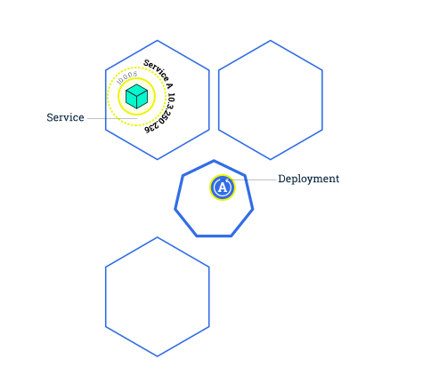

# Fluent Python - Python数据模型

## Contact me

* Blog -> <https://cugtyt.github.io/blog/index>
* Email -> <cugtyt@qq.com>
* GitHub -> [Cugtyt@GitHub](https://github.com/Cugtyt)

> **本系列博客主页及相关见**[**此处**](https://cugtyt.github.io/blog/k8s/index)

---

来自[kubernetes.io文档](https://kubernetes.io/docs/tutorials/kubernetes-basics/)

## k8s可以做什么？

容器化技术可以对软件服务进行打包，让应用的发布和更新在不中断服务的情况下完成。k8s可以确保这些容器化的服务以我们希望的时间和位置运行，以及配套了一些管理和配置工具。

### 1. 创建一个k8s的集群Cluster

k8s可以让一个由许多机器组成的高可用集群协同工作，形成一个整体。k8s可以不用为单个服务指定它运行的机器，而是直接对集群进行操作。为了实现这个新的部署模式，应用需要完成容器化，与单独配置进行解耦。k8s可以高效的对容器化应用完成自动化分发和调度。

k8s包括两类资源：
* 控制面板（Control Plane）协调集群
* 节点（Nodes）运行应用（容器）


控制面板用于管理集群，包括调度应用，管理应用状态，扩容应用和更新应用。

节点是一个VM或物理机，作为集群中的工作机。每个节点有一个Kubelet，用于管理这个节点以及和控制面板通信。节点也有对容器进行管理的工具。处理生产流量的k8s集群应该至少有三个节点。

在部署应用到k8s时，要告诉控制面板启动应用容器。控制面板会把容器运行到集群的节点上。节点会通过K8S的API和控制面板进行通信，用户也可以直接使用这些API和集群进行通信。

`minikube start` 会启动一个集群。

`kubectl`是管理集群的命令工具。运行`kubectl version`可以看到客户端和服务端的版本，客户端的是`kubectl`的版本，服务端的是k8s的版本。

`kubectl cluster-info`可以查看集群信息。

`kubectl get nodes`显示所有节点。

### 2. 创建部署配置Deploy

部署配置可以让k8s生成和更新我们所需要的应用。一旦创建好一个部署配置，控制面板就可以调度应用的实例，让他们运行在集群的节点中。

在应用实例创建好后，控制面板会持续监控它们，如果一个节点挂掉了或者删除了，部署配置的控制器会用一个新的实例或者节点来替换掉它。这为失败和维护提供了自愈机制。

在这种编排机制之前，启动一个应用通常使用安装脚本，在失败后也不能恢复。k8s的部署配置可以提供一个完全不同的方法来对应用进行管理，让应用得以创建和持续运行。

**部署配置负责的是创建和更新应用实例**


通过k8s的命令行kubectl来创建和管理部署配置。在创建部署配置的时候，需要指定容器镜像，以及需要运行的副本数量，这些信息也可以在创建后更新。

**为了在k8s上进行部署，应用需要打包成受支持的容器类型。**

创建一个部署配置的示例：

`kubectl create deployment kubernetes-bootcamp --image=gcr.io/google-samples/kubernetes-bootcamp:v1`

查看部署配置：

`kubectl get deployments`

由于Pods运行在一个隔离的私有网络中，所以需要代理来让我们进行debug和交互。
`kubectl proxy`可以连接控制台和cluster，通过`curl http://localhost:8001/version`可以查询版本

### Pods和Nodes（节点）

在创建部署配置后，k8s会创建一个Pod来持有应用实例。一个Pod表示一个或多个应用容器组，以及一些共享资源。这些资源包括：
* 共享存储，即Volumes
* 网络，即一个唯一的集群ip
* 运行每个容器的信息，例如容器的镜像版本和使用的端口


一个Pod会运行在一个Node上，一个Node是一个工作机，每个Node受控制面板管理。一个Node可以有多个Pod，控制面板会自动化协调每个节点的资源。

每个Node至少有：
* `kubelet`，用于控制面板和Node之间的通信，管理一个机器上运行的Pods和容器。
* 容器运行时负责容器的pull，解包和运行。


```
kubectl get - list resources
kubectl describe - show detailed information about a resource
kubectl logs - print the logs from a container in a pod
kubectl exec - execute a command on a container in a pod
```

`kubectl logs $POD_NAME`可以查看日志。

`kubectl exec $POD_NAME -- env`执行命令

`kubectl exec -ti $POD_NAME -- bash`执行bash

### 使用服务配置Service来展露应用

Pods终有一死，一个工作节点死掉后，它包含的Pods也丢失了。ReplicaSet可以通过创建新的Pods动态把集群恢复到原来的状态，进而保证应用的运行。

服务配置定义了一系列的Pods逻辑状态和政策，让Pods之间松耦合。服务配置用YAML或json文件来定义，服务配置所指定的Pods是由LabelSelector来确定的。

虽然每个Pod有唯一的IP，但是没有服务配置，这些IP是不会暴露到集群之外的。服务配置可以让应用接受网络流量，可以通过`Type`来指定不同的暴露方式：
* ClusterIP (默认) 通过内部IP在集群内暴露，这种方式只能在集群内可访问。
* NodePort 使用NAT让集群内所选的Node暴露相同的端口，服务可以从集群外通过`<NodeIP>:<NodePort>`来访问，是ClusterIP的超集。
* LoadBalancer 创建一个外部的负载均衡器，给服务赋予一个固定的外部ip，是NodePort的超集。
* ExternalName 将服务映射到`externelName`域名，例如`foo.bar.example.com`，返回一个`CNAME`记录对应的值。

**服务配置是定义了Pods逻辑状态的层，提供外部流量暴露，负载均衡和服务恢复。**

服务配置通过匹配标签来配置对应的节点：


`kubectl expose deployment/kubernetes-bootcamp --type="NodePort" --port 8080`可以暴露节点端口，这会生成一个服务配置。

`kubectl get pods -l app=kubernetes-bootcamp`通过标签筛选

`kubectl label pods $POD_NAME version=v1`指定标签

`kubectl delete service -l app=kubernetes-bootcamp`筛选标签删除服务，外部无法访问，但是依旧运行在内部。

### 扩容




**在创建部署配置的时候就可以指定实例的数量`--replicas`**

**扩容是通过更改部署配置的`replicas`完成的**

`kubectl scale deployments/kubernetes-bootcamp --replicas=4`可以做到扩容。

查看流量是否做到负载均衡，
```
kubectl describe services/kubernetes-bootcamp
export NODE_PORT=$(kubectl get services/kubernetes-bootcamp -o go-template='{{(index .spec.ports 0).nodePort}}')
echo NODE_PORT=$NODE_PORT
curl $(minikube ip):$NODE_PORT
```

每次命中不同的地址说明做了负载均衡。

### 滚动更新

滚动更新可以在0停机的情况下逐步更新Pods实例。


`kubectl set image deployments/kubernetes-bootcamp kubernetes-bootcamp=jocatalin/kubernetes-bootcamp:v2`更新镜像
