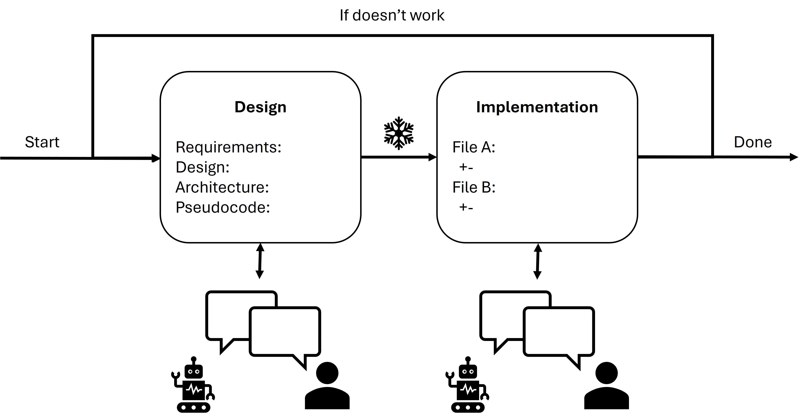

# Process Supervision Is All You Need for AI Coding

## Contact Me

- Blog: <https://cugtyt.github.io/blog/llm-application/index>
- Email: <cugtyt@qq.com>
- GitHub: [Cugtyt@GitHub](https://github.com/Cugtyt)

---

Agent-based coding is increasingly popular in AI development, but it often veers off course. To achieve better results and minimize risks, active supervision of the process is essential.

### The Typical Workflow

1. The user provides a prompt.
2. The agent thinks and generates code.
3. The user reviews and accepts the code.
   - For simple tasks, this may work well—**good**.
   - For complex tasks, the agent may go off track, requiring the user to spend significant time debugging and correcting—**bad**.

**Why is the typical workflow problematic?**

The core issue is that the agent is rarely fully aligned with the user's true requirements based on a single prompt (talk is cheap! 🙂). The agent often generates code in a "freestyle" manner, making assumptions or filling in gaps without sufficient clarification. This lack of alignment leads to misunderstandings, off-target solutions, and extra work for the user to correct or re-explain their needs.

Worse, when the agent goes off track, the user must invest even more effort to correct the code. These corrections often fail because the agent has already made too many misguided changes, making it difficult to steer the solution back on course. The agent may also struggle to adapt, as it is now entangled in its previous, misaligned work.

## The Supervised Approach

To reduce risk and foster effective collaboration, the workflow should be divided into two supervised steps:

1. **Design Discussion**
2. **Implementation**

Each step is actively supervised by the user. The agent generates code only after the user confirms the design.

### 1. Design Discussion

In this step, the user and agent engage in an interactive discussion to clarify requirements and design. Users may not always describe requirements clearly, so this back-and-forth is crucial to confirm the design.

The design becomes a shared context, updated throughout the discussion. The agent asks clarifying questions, and the user provides feedback to refine the design.

A good design should be complete and clear, including pseudocode, architecture, and any other relevant details. Once confirmed, the process moves to implementation.

### 2. Implementation

Here, the agent generates code based on the agreed-upon design. Thanks to the clear design, the agent can generate code efficiently, and the user can review and accept it with confidence.

If small changes are needed, the user can prompt for them, and the agent will update the code according to the design. The agent should always respect the design and avoid generating code outside its scope.