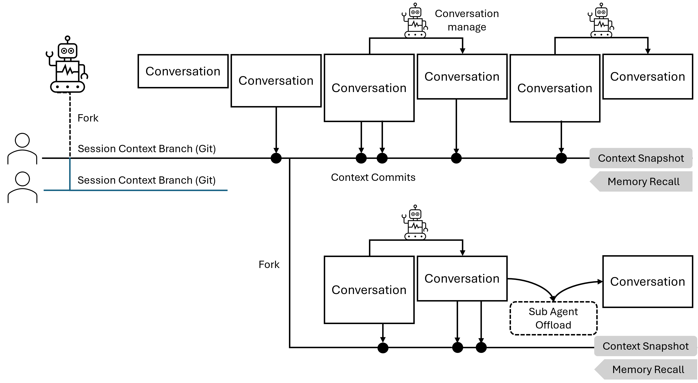

# Context Management for LLM Agent Systems

## Contact Me

- Blog: <https://cugtyt.github.io/blog/llm-application/index>
- Email: <cugtyt@qq.com>
- GitHub: [Cugtyt@GitHub](https://github.com/Cugtyt)

---



Building on the concepts from [Standardize the Agent Lifecycle](./agent-gen.md), [Agentic Conversation Management](./conversation-manage.md), [Context Offload via Sub-Agent](./context-offload-via-subagent.md), and [Git Context Memory](./git-context-memory.md).

In complex LLM applications, effective context management is critical for maintaining performance, coherence, and scalability. This post presents an integrated approach that combines three complementary strategies: **conversation management**, **sub-agent offloading**, and **Git-based context storage**—creating a comprehensive solution for handling context at multiple levels.

## The Context Management Challenge

As LLM agents work on complex tasks, they face several context-related challenges:

1. **Context Window Limits**: Conversations can exceed the model's context window
2. **Performance Degradation**: Long conversations increase latency and reduce response quality
3. **Cost Issues**: Longer contexts mean higher API costs per call
4. **Information Loss**: Important information gets lost when context is truncated
5. **Task Complexity**: Complex tasks require maintaining multiple parallel contexts
6. **Persistence Needs**: Context needs to be saved and retrieved across sessions

Traditional approaches like simple truncation or basic summarization are insufficient. We need a multi-faceted strategy.

## Three Complementary Strategies

### 1. Conversation Management: Real-Time Optimization

**What It Does**: Cleans up and optimizes the current conversation to fit within the LLM's context window

**Scope**: Works on the active conversation only, affecting what's currently being processed by the LLM

**How It's Triggered**: 
- **LLM-triggered**: LLM can call conversation management tools when it decides optimization is needed, or when system provides token pressure information in messages (e.g., "Current token usage: 7500/8000"), allowing the LLM to proactively manage the conversation
- **System-forced**: System must force conversation management when token limits are exceeded, as the conversation cannot continue without cleanup

**Available Tools**:

* **edit_message(message_id, new_content)**: Modify a specific message in the conversation to condense or clarify its content. Useful for rephrasing verbose messages while preserving key information.

* **delete_message(message_id)**: Remove a specific message from the conversation history. Use this to eliminate outdated, redundant, or irrelevant messages that no longer contribute to the current context.

* **summarize_messages(start_id, end_id)**: Condense a range of consecutive messages into a single concise summary message. This is particularly effective for compressing lengthy back-and-forth exchanges or tool call sequences into their essential outcomes.

**Example**:
```python
def conversation_management_agent(conversation, management_goal, llm_call):
    management_tools = [edit_message, delete_message, summarize_messages]
    while not is_goal_achieved(conversation, management_goal):
        llm_output = llm_call(conversation, management_goal, management_tools)
        for tool_call in llm_output.tool_calls:
            tool_result = execute_tool(tool_call, management_tools)
            conversation = update_conversation(conversation, tool_result)
    return conversation
```

### 2. Sub-Agent Offloading: Task Distribution

**What It Does**: Delegates simple, independent tasks to separate, isolated agent instances

**Scope**: Offloads straightforward work to temporary agents with their own conversations

**How It's Triggered**: 
- **LLM-triggered**: LLM decides when to delegate a task to a sub-agent

**Key Benefits**:
- Each sub-agent starts with a clean context slate
- Sub-agent's entire conversation (potentially many messages) compresses to a single result message
- Multiple sub-agents can work in parallel on independent tasks
- Sub-agent context is completely isolated and doesn't affect main agent's context

**Lifecycle**:
1. **Create**: Main agent dynamically generates task-specific instructions
2. **Launch**: Sub-agent runs its complete lifecycle with isolated conversation
3. **Delete**: Sub-agent conversation is discarded, only the condensed result is returned

**Example**:
```python
def launch_subagent(task_instructions, tools):
    # Sub-agent runs with completely isolated context
    subagent_conversation = [system_message, task_instructions]
    
    # Sub-agent executes its full lifecycle independently
    result = agent_lifecycle(subagent_conversation, tools, llm_call, tool_call)
    
    # Extract only the essential result
    condensed_result = extract_final_result(result)
    
    # Sub-agent conversation is discarded here
    # Only condensed_result goes back to main agent
    return condensed_result
```

### 3. Git Context Memory: Persistent Memory Storage

**What It Does**: Saves context to Git for persistent memory, enabling long-term storage, history tracking, and cross-session sharing

**Scope**: Manages persistent memory across multiple sessions and over time, beyond the current conversation

**How It's Triggered**: 
- **LLM-triggered**: LLM decides when to save, retrieve, or manage Git context by calling Git tools

**Key Advantages**:
- Version control tracks how memory evolved over time
- Branching enables parallel exploration paths
- Commit history provides structured, persistent memory
- Distributed nature enables multi-agent memory sharing

**Available Tools**:

* **read_context()**: Read the current context from the context file stored in Git. Returns the latest state of the context on the current branch.

* **update_context(new_context, commit_message)**: Update the context file with new content and commit the changes with a descriptive message. This creates a checkpoint in the context history that can be recalled later.

* **get_context_history()**: Retrieve the commit history showing how context evolved over time. Returns a log of all context updates with their commit messages and timestamps.

* **get_snapshot(version)**: Retrieve a specific historical version of the context by checking out a previous commit. Useful for recalling what the context looked like at a particular point in time.

* **create_branch(branch_name)**: Create a new Git branch for exploring an alternative context path. Enables parallel exploration without affecting the main context.

* **merge_branch(branch_name)**: Merge changes from another branch back into the current branch. Used to integrate discoveries from exploratory branches into the main context.


## Unified Implementation

Here's how to integrate all three strategies into a cohesive agent system:

```python
def integrated_agent_lifecycle(system_message, user_message, llm_call, tool_call):
    # Note: system_message should instruct the LLM about:
    # - When to use Git context tools (e.g., checkpoint important progress, recall past context)
    # - When to delegate tasks to sub-agents (e.g., simple independent tasks)
    # - How to respond to token pressure information
    
    conversation = [system_message, user_message]
    
    # Git context tools available to LLM
    git_context = GitContextManager('context.txt')
    
    # Load persisted context from Git if exists
    persisted_context = git_context.read_context()
    if persisted_context:
        conversation.append(persisted_context)
    
    # All tools available to LLM
    tool_set = [
        # Conversation management tools
        edit_message, delete_message, summarize_messages,
        # Sub-agent offload tool
        launch_subagent,
        # Git context memory tools
        read_context, update_context, get_context_history, 
        get_snapshot, create_branch, merge_branch,
        # Other domain tools
        ...
    ]
    
    while True:
        # System forces conversation management if critical limit exceeded
        if must_reduce_conversation(conversation):
            conversation = conversation_management_agent(
                conversation,
                management_goal="reduce_to_safe_length",
                llm_call=llm_call
            )
        
        # System can add token pressure info for LLM awareness
        current_tokens = estimate_tokens(conversation)
        if approaching_token_limit(current_tokens):
            conversation.append(create_message(
                role="system",
                content=f"Token pressure: {current_tokens}/{max_tokens}"
            ))
        
        # LLM processes conversation and decides which tools to call
        # LLM can see token pressure info and call conversation management tools
        llm_output_messages = llm_call(conversation, tool_set)
        conversation.extend(llm_output_messages)
        
        # Execute any tool calls made by LLM
        if tool_call_message in llm_output_messages:
            tool_result_message = tool_call(tool_call_message, tool_set)
            conversation.append(tool_result_message)
            # Tool could be: conversation management, sub-agent, Git context, or domain tools
        else:
            break
    
    return conversation
```

## How the Strategies Work Together

All three strategies are invoked by the LLM calling the appropriate tools. Conversation Management has two triggering modes:

```
Agent Session
├── Conversation Management
│   ├── LLM calls tools (aware of token pressure from system messages)
│   └── System forces when critical token limit exceeded
├── Sub-Agent Offload
│   └── LLM calls tool to delegate tasks
└── Git Context Memory
    └── LLM calls tools to checkpoint/recall context
```

**Example Flow**:
1. Main agent works on a task, conversation grows
2. **System adds** token pressure message → **LLM sees it** and calls conversation management tools
3. **LLM calls** sub-agent tool to delegate a simple independent subtask
4. If conversation exceeds critical limit → **System forces** conversation management
5. **LLM calls** Git tools to checkpoint important progress
6. Later session: **LLM calls** Git tools to recall previous context

## Example: Coding Agent

A natural application of Git context memory is in coding agents, where the codebase itself serves as persistent memory:

**Code as Context Memory**: Each code update is like a context commit. When the agent writes code to a file and commits it with `git_commit(files=["main.py"], message="Fixed authentication bug")`, it's checkpointing both the work and the reasoning.

**Recalling Past Work**: The agent can use Git tools to learn from history:
- `git_log()` shows what was attempted before
- `git_show(commit)` retrieves past implementations
- `git_diff()` reveals what changed and why

**Example Flow**: Agent receives task "Add authentication" → Calls `git_log()` to check if it was tried before → Finds commit "Attempted authentication, failed due to X" → Reads that code with `git_show()` → Learns from the mistake → Implements better solution → Commits with message for future recall.

This makes Git context memory especially natural for coding agents, where code files are both the work product and the persistent memory.

## Conclusion

The integrated context management approach presented here combines three powerful strategies into a cohesive system:

- **Conversation Management**: Optimizes active conversation to fit within LLM context window
- **Sub-Agent Offloading**: Delegates simple independent tasks to isolated agent instances
- **Git Context Memory**: Provides persistent memory with history and version control

Together, these strategies create a robust, scalable solution for managing context in sophisticated LLM agent systems. The approach adapts to varying needs, supports multi-user collaboration, preserves important information, and enables agents to work effectively even on long-running tasks.

By addressing context management with three complementary strategies—context window optimization, task delegation, and persistent memory storage—we build agent systems that are both powerful and maintainable, capable of handling the demanding requirements of real-world applications while remaining comprehensible and debuggable.
