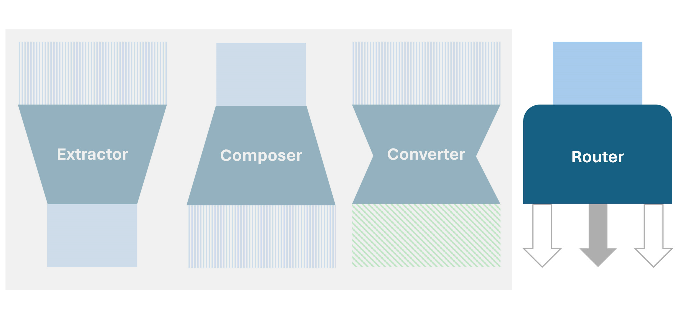

# LLM Patterns

## Contact me

* Blog -> <https://cugtyt.github.io/blog/llm-application/index>
* Email -> <cugtyt@qq.com>
* GitHub -> [Cugtyt@GitHub](https://github.com/Cugtyt)

---

## Extracter 模式

* 提取关键内容
* 压缩信息量
* 可以用于分类
* 幻觉出现的概率低

使用场景：

* 垃圾邮件检测
* 关键词提取，内容总结
* 拼写检查
* 意图理解和抽取

## Composer 模式

* 生成新东西
* 扩充信息量
* 大语言模型就是造梦机
* 幻觉出现的可能更大

使用场景：

* 写诗，写邮件，写代码
* 生成审阅内容

## Convertor 模式

* 提取+生成
* 相似的信息在不同域进行转换

使用场景:

* 翻译
* 模仿
* 重写，重构

## Router 模式

* 基于选项做选择
* 连接自然语言和机器逻辑

使用场景:

* 工具使用
* 函数调用 API
* 方案推荐

## 示例

