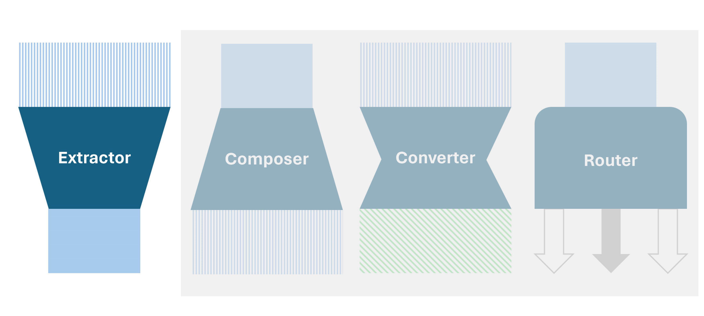

# LLM Patterns

## Contact me

* Blog -> <https://cugtyt.github.io/blog/llm-application/index>
* Email -> <cugtyt@qq.com>
* GitHub -> [Cugtyt@GitHub](https://github.com/Cugtyt)

---

## Extracter Pattern

* Extract key points
* Compress the information
* Classifier
* No much hallucination expected

Use cases:

* Spam detection
* Key words extraction, summary
* Spelling check
* Intent understanding and extraction

## Composer Pattern

* Generate new things
* Extend the information
* Dream machine
* Hallucination expected

Use cases:

* Write poem, email, code …
* Reviewer

## Convertor Pattern

* Extract and compose
* Similar information in different domain

Use cases:

* Translate
* Mimic
* Rewrite, refactor

## Router Pattern

* Select from the choices
* Connect the natural language to the machine logic

Use cases:

* Tool using
* Function calling API
* Recommend solutions

## Examples

> Buy me a coffee

