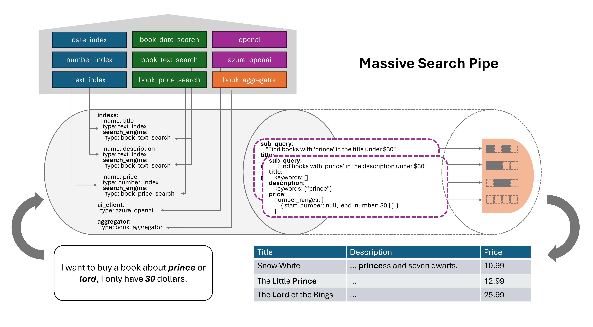

# Massive Search: LLM Structured Outputs is All You Need

## Contact me

* Blog -> <https://cugtyt.github.io/blog/llm-application/index>
* Email -> <cugtyt@qq.com>
* GitHub -> [Cugtyt@GitHub](https://github.com/Cugtyt)

---




Executing complex searches across entities with diverse attributes
—such as text, numbers, booleans, and images—can be challenging.
These searches often require intricate queries,
potentially involving joins across multiple data sources.
For example, searching for a book might involve filtering by its title,
description, price, user comments, and cover image simultaneously.

Massive Search provides a method for querying such complex
but logically grouped data by leveraging LLM Structured Outputs.
"Logically grouped" means all the data pertains to the same core entity,
like a specific book product.
Here is an example of book searching:

1. Book data, full data in [examples/book/books.csv](examples/book/books.csv):

``` csv
title,description,author,price
"Snow White and the Seven Dwarfs","A fairy tale about a princess and seven dwarfs.","Grimm Brothers",10.99
"The Little Prince","A story about a young prince who travels to different planets.","Antoine de Saint-Exupéry",12.99
...
```

2. Define the search spec, example in [examples/book/book_spec.yaml](examples/book/book_spec.yaml):

``` yaml
indexs:
  - name: title
    type: text_index
    ...
    search_engine:
      type: book_text_search
      ...
  - name: description
    type: text_index
    ...
    search_engine:
      type: book_text_search
      ...
  - name: price
    type: number_index
    ...
    search_engine:
      type: book_price_search
      ...
aggregator:
  type: book_aggregator
  ...
ai_client:
  type: azure_openai
  ...
```

3. Use SpecBuilder to register related index, search engine, and aggregator, example in [examples/book/main.py](examples/book/main.py):

``` python
book_msp = MassiveSearchPipe()

book_msp.register_index_type("text_index", BasicTextIndex)
book_msp.register_index_type("number_index", BasicNumberIndex)
book_msp.register_search_engine_type("book_text_search", PandasTextSearchEngine)
book_msp.register_search_engine_type("book_price_search", PandasNumberSearchEngine)

book_msp.register_aggregator_type("book_aggregator", PandasAggregator)
book_msp.register_ai_client_type("azure_openai", AzureOpenAIClient)
```

4. Load data, ai model and use Worker to search, example in [examples/book/main.py](examples/book/main.py):

``` python
book_msp.build_from_file("./examples/book/book_spec.yaml")
result = await book_msp.run(
    "I want to buy a book about prince or lord, I only have 30 dollars.",
)
```

5. Check the result, example in [examples/book/main.py](examples/book/main.py):

``` python
print("Search query:")
for q in book_msp.serach_query:
    print(q)

print("Books:")
print(result)
```

The queries is a list of dictionaries, each dictionary is a search query for each index.
The relationship between the queries is OR, results from each query will be merged together.
The relationship between the dictionary indexs is AND, all indexs must be satisfied.


``` json
[
  {
    "sub_query": "Find books with 'prince' in the title under $30",
    "title": {
      "keywords": ["prince"]
    },
    "description": {
      "keywords": []
    },
    "price": {
      "number_ranges": [
        {
          "start_number": null,
          "end_number": 30
        }
      ]
    }
  },
  {
    "sub_query": "Find books with 'prince' in the description under $30",
    "title": {
      "keywords": []
    },
    "description": {
      "keywords": ["prince"]
    },
    "price": {
      "number_ranges": [
        {
          "start_number": null,
          "end_number": 30
        }
      ]
    }
  },
  {
    "sub_query": "Find books with 'lord' in the title under $30",
    "title": {
      "keywords": ["lord"]
    },
    "description": {
      "keywords": []
    },
    "price": {
      "number_ranges": [
        {
          "start_number": null,
          "end_number": 30
        }
      ]
    }
  },
  {
    "sub_query": "Find books with 'lord' in the description under $30",
    "title": {
      "keywords": []
    },
    "description": {
      "keywords": ["lord"]
    },
    "price": {
      "number_ranges": [
        {
          "start_number": null,
          "end_number": 30
        }
      ]
    }
  }
]
```