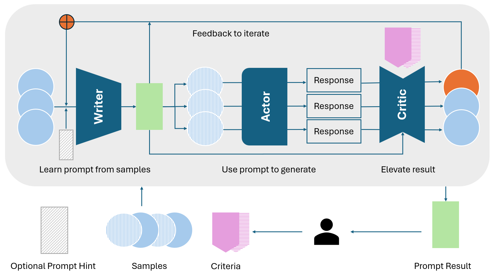

# Prompt Factory - Writer Actor Critic

## Contact me

* Blog -> <https://cugtyt.github.io/blog/llm-application/index>
* Email -> <cugtyt@qq.com>
* GitHub -> [Cugtyt@GitHub](https://github.com/Cugtyt)

---

Prompt is always needed to instruct LLM do what you want it to do,
but describe a task - write your thought down concretely - in a prompt is not trivial, 
it requires time to thought and iterate. But we can leverage LLM to speed and automate this process.

Prompt Factory is for this process, it divides the iterate process to three
steps pipeline and delegates the job to three types of agents, Writer, Actor, Critic.

## Prompt Factory Pipeline

This pipeline mimics the prompt writing iteration: write prompt, run the prompt, evaluate it with criteria.
Then iterate the process to generate better prompt based on the evaluation result.

User needs to prepare the task samples for prompt generation and the criteria for the evaluation, 
this should be the only required inputs ideally. Optionally user can give prompt hint so that
pipeline can follow user intention.

The pipeline starts from Writer agent, it is responsible for writing prompt based on the provide data samples 
and generate the draft prompt. Apart from the data samples, Writer can also see the last iteration prompt
and failed samples.

Next the draft prompt will be used by Actor agent to generate responses for each sample data 
for later evaluation.

Then the Critic will evaluate each response based on the criteria provide by user. Critic should at least to
output pass or fail to indicate the result, and other optional messages. 

All the failed samples will be added to next iteration of Writer data samples then repeat the process 
for better prompt.

## Agents

### Writer

As the first step of pipeline, Writer generates prompt based on these:

- Data samples, it can be full or partial of the full user provided data. 
Logically, the data should be list of basic X -> Y format. 
Here X is the input of the final prompt consumer and Y is the expected output. 
For example you want classify if a sentence talked about animal, 
you need to prepare [ ("I like cat", "YES"), ("I play football", "No"), ... ]. 
The real format can be extended based on that.

- Prompt in previous iteration, as the pipeline may iterate many times to improve the final prompt, 
Writer needs to see the previous prompt to optimize.

- Bad cases in previous iteration and comments from critic, 
the Critic evaluates the response of Actor and determines if the
result meets the criteria, the failed ones should be feed to Writer to improve next prompt.

- Optional user hint. User can optionally give basic hint for Write to get well beginning.

Writer will generate the prompt and feed to Actor, Actor will actually act these prompt to 
generate the result for data input.

Writer is not need to be target prompt consumer model but intuitively is more powerful than 
the target prompt consumer or prompt optimized model.

### Actor - Target prompt consumer

Actor will take prompt as input, it will be like the system prompt to define the role and describe the task.
Then it takes the sample list as X, and uses the prompt to map X to Y. Y is the Actor result and this process
can be done in parallel.

Actor is the target prompt consumer means it should be configured just what you want to use in the production.

### Critic

Critic is responsible for evaluating the Actor response based on the criteria, ideally criteria is defined by
user, but somehow this can be inferred by Critic or some other agent but need to be supervised by user.

Critic takes these as input:

- Actor response, this is the criteria will evaluate on.

- Actor prompt - from Writer, at some point Critic can give direct feedback for prompt apart from the response itself.

- Criteria, this is the core of Critic and need to be carefully supervised in the pipeline.

Ideally Critic model is more powerful than target prompt consumer so that it can gives high quality
evaluation result and comments feedback.