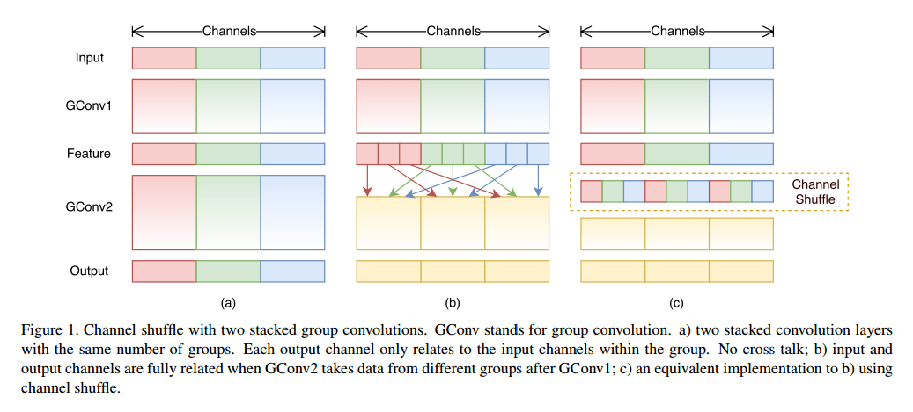
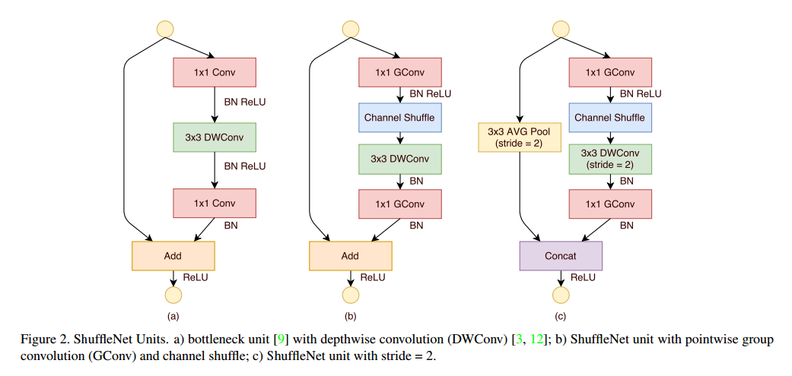
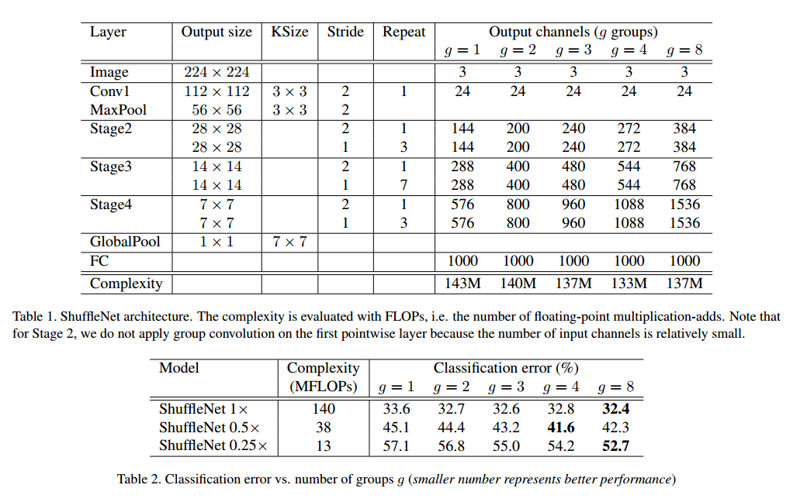
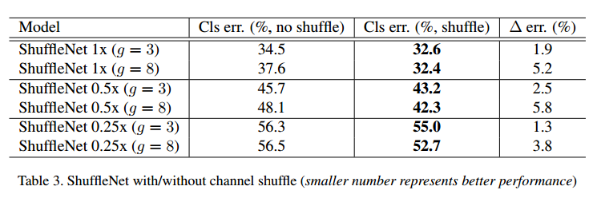
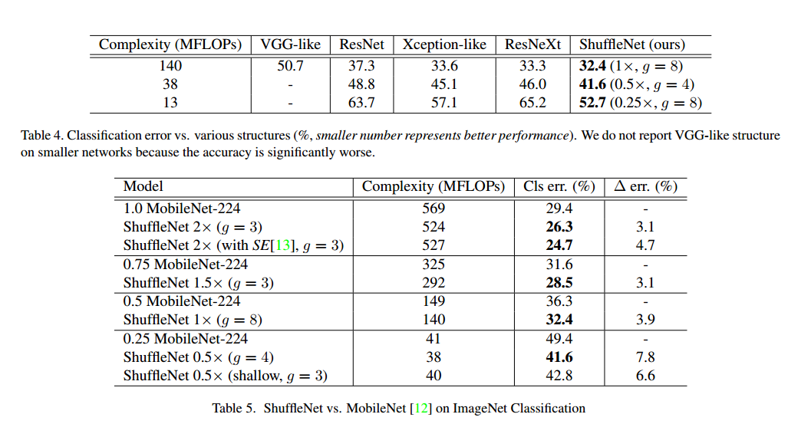
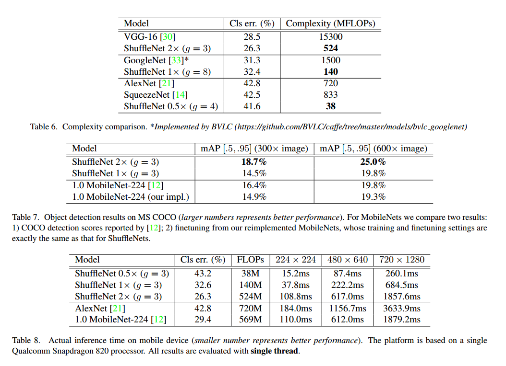

# ShuffleNet: An Extremely Efficient Convolutional Neural Network for Mobile

## Contact me

* Blog -> <https://cugtyt.github.io/blog/index>
* Email -> <cugtyt@qq.com>
* GitHub -> [Cugtyt@GitHub](https://github.com/Cugtyt)

> **本系列博客主页及相关见**[**此处**](https://cugtyt.github.io/blog/papers/index)

---

<head>
    
    
</head>

## Abstract

ShuffleNet是专门为计算力受限下的移动设备设计的。两个运算：点级别的组卷积和通道重排，保持准确率的同时极大的减少了计算量，在ImageNet和COCO上的实验证明它的优越性。

## Introduction

现在的网络很大，计算量很高。我们朝着相反的方向：在计算负荷受限的情况下获取最好的准确率，集中关注通用的移动设备。现在一些工作关注在基本网络结构上修剪，压缩和更低比特的表示，我们探索高效的基础结构，专门为一定计算能力的设备。

我们注意到目前的结构如Xception和ResNeXt在非常小的网络上变得不那么高效了，这是因为大量的1\*1卷积。我们提出了使用点级别的组卷积来减少计算复杂度。为了克服组卷积的副作用，我们提出了新的通道重排让信息在特征通道间流动。

和目前最好的MobileNet相比，ShuffleNet达到了更好的性能，在40MFLOP级别达到了最低的top1错误率。

## Related Work

**Efficient Model Designs**GoogLeNet提高了网络的深度，但是比监督堆叠卷积层有更低的计算复杂度。SqueezeNet在保持准确率的情况下减少了网络参数，提升了计算效率。ResNet利用高效的瓶颈结构达到了更好的性能。SENet提出了一种结构单元在微量计算损失下提升了性能。最近的工作使用强化学习和模型搜索探索更高效的模型设计，NASNet模型达到了我们模型相似的性能。但是没有没有说在微小模型上的结果和移动设备的真实时间。

**Group Convolution**这个方法首先是AlexNet提出，然后ResNeXt证明了它的高效。Xception的深度可分卷积推广了这个点子，最近的MobileNet采用这个方法到达了不错的性能。我们的工作把组卷积和深度可分卷积推广到新的形式。

**Channel Shuffle Operation**就我们所知，通道冲洗的操作很少被提及，即使CNN库cuda-convnet支持随机稀疏卷积层，这和随机通道重洗再组卷积等价。这个随机重洗操作有不同的意义，后续也很少探索。

**Model Acceleration**这是为了在保持预训练模型准确率的情况下加速推断。修剪网络连接，或通道减少冗余连接。

## Approach

### Channel Shuffle for Group Convolutions

现代的卷积网络通常包含重复的同样结构的块，最好的网络如Xception和ResNeXt提出了高效的深度可分卷积或组卷积，把他们构建到块里达到了很好的效果。但是我们注意到这些设计都没有完全把1\*1卷积当回事，因为它需要计算量很大。例如在ResNeXt里面只有3\*3的卷积用了组卷积。因此对于ResNeXt每个残差单元点卷积占据了93.4%的加法乘法运算。在小的网络中，昂贵的点卷积导致在复杂度约束的情况下通道数受限，进而准确率不高。

为了解决这个问题，一个直接的做法是用应用通道稀疏连接，例如组卷积，同样用在1\*1的层上。通过确保每个卷积操作只作用在相应的输入通道组上，组卷积极大的减少了计算量。但是如果多个组卷积堆叠在一起，有一个副作用是一个确定通道的输出只来源于输入通道的一小部分。图1a描绘了两个堆叠的组卷积值和组内输入有关。这个特性阻碍了通道组的信息流动，表示性更弱。

如果我们允许组卷积获取不同组的输入数据，如图1b所示，输入和输出通道就全部联系在一起。特别的，对于前一个组生成的特征图，我们可以先每一组的通道细分为不同的小组，然后把给下一个组层输入不同的小组。这个可以高效而优雅的用通道重洗操作完成，如图1c。 假设一个卷积层有g组，输出是g\*n个通道，我们先把输出通道的维数变成(g,n)，转置然后扁平化，作为下一层的输入。注意到即使两个卷积有不同数量的组，这个操作依旧可以做，另外通道重洗是可微的，这意味着可以嵌入网络进行端到端的训练。

通道重洗操作使得多组卷积层来搭建更强大的网络变成可能。

### ShuffleNet Unit

借用通道重洗的优势，我们提出了专门为小网络设计的新型ShuffleNet单元。我们先从瓶颈单元开始，如图2a。它是一个残差块，在残差分支中，对于3\*3的层，我们对瓶颈特征图采用了计算经济的3\*3深度向的卷积。然后我们把第一个1\*1的卷积替换为点级别的组卷积，接着是一个通道重洗操作，这组成了ShuffleNet单元，如图2b所示。第二个点卷积是为了恢复通道维数以匹配跨越连接。为了简单，我们在第二个点级别层后没有用额外的通道重洗操作。BN和非线性的使用和残差网络原始论文一致，除了我们没有在点卷积后使用ReLU。在使用步长的时候，我们简单的做了两个修改，如图2c，（1）在跨越路线上加入了3\*3均值池化，（2）替换点级别的加法为通道堆叠，可以让通道维度提升更加容易，额外的计算损耗很小。

点级别的组卷积和通道重洗的结合，ShuffleNet单元的所有成分可以高效的计算，和ResNet与ResNeXt相比我们的结构在相同的设置下复杂度更低。例如给定输入c\*h\*w，瓶颈通道m，ResNet需要$hw(2cm+9m^2)$FLOPs，ResNeXt需要$hw(2cm+9m^2/g)$FLOPs，我们需要$hw(2cm/g+9m)$FLOPs，其中g是卷积组的个数。换句话说，给定的计算负荷下，ShuffleNet可以使用更广的特征图。我们发现这对于小网络来说是很重要的，因为它们经常使用不足够的通道来处理信息。

另外，在ShuffleNet深度卷积只用在瓶颈特征图上。即使深度卷积通常有很低的理论复杂度，但是我们发现和其他密集操作相比，计算/内存比率导致在低功耗的移动设备上进行高效实现是很困难的。在ShuffleNet单元上我们只在瓶颈部分使用来避免这个问题。

### Network Architecture

在表1中我们展示了整个ShuffleNet的网络结构。这个网络主要就是把ShuffleNet单元组合成三个部分。每个部分的第一个块用步长2，每个部分其他的超参数保持一致，对于下一个部分的输出通道加倍。我们设置每个单元的瓶颈通道为输出通道的1/4。我们的目的是提供一个尽可能简单的参考，即使我们发现微调参数可以生成更好的结果。

在ShuffleNet单元内，组数g控制点卷积的连接密度。表1探索了不同的组数，我们保持了输出通道以控制整个计算损失基本不变。显然组数越多导致越多的输出通道，可以编码更多的信息，这也可能导致单个卷积滤波器因为输入通道受限而退化。

为了自定义网络的复杂度，我们可以简单的用一个尺度因子s。例如对于表1中的网络我们记作ShuffleNet 1X，那ShuffleNet sX就是把1X中的滤波器数扩展到s倍，这样所有的复杂度是1X的$s^2$倍。

## Experiments

我们主要是在ImageNet2012上衡量模型，我们基本使用了ResNeXt的超参数，除了两点：（1）我们使用4e-5的权重退化而不是1e-4，使用线性衰减的学习率策略，从0.5到0，（2）数据预处理，我们更少集成扩展增强。

### Ablation Study

核心是点基本的组卷积和通道重洗，我们分别研究。

#### Pointwise Group Convolutions

为了比较它的重要性，我们比较了ShuffleNet模型在相同复杂度下。组数从1到8的情况，如果组数为1，ShuffleNet没有使用点级别的组卷积，变成了Xception类似的结构。我们也比较了扩展网络宽度到3中不同复杂度，比较它们的分类性能。见表2。

根据这个结果，我们发现组卷积(g>1)，都好于没有用点卷积的(g=1)。小的模型更能从组卷积受益。注意到组卷积可以在复杂度约束下有更多的特征图通道，所以我们认为性能的增益来自于更宽的特征图，这编码了更多的信息。另外，小的网络通过扩大特征图收益更多。

表2显示了在组数足够大的时候，一些模型的分类分数饱和，甚至一些下降了。组数量增加，输入通道更少，也许损害了表示的能力。有趣的是我们发现更小的模型更大的组数倾向于更好的结果，这说明更宽的特征图带来更多的好处。

#### Channel Shuffle vs. No Shuffle

重洗操作的用意是在多个组卷积之间交叉组间信息。表3比较了有没有重洗的结果。结果表明，通道重洗在不同设置下都要好，尤其是，在组数较大的时候，通道重洗好更多。

### Comparison with Other Structure Units

现在一些提出的模型只是比较结果，没有注重复杂度，我们做了比较，为了公平我们使用了表1中的网络结构，把2-4部分的ShuffleNet单元替换成其他结构，然后改变通道数量保证复杂度没有改变，我们探索的结构包括：

* VGG类。我们使用了两层3\*3卷积，不同的是我们加入了BN。
* ResNet。我们使用了瓶颈的设计，这已经被证明很有效。
* Xception类。原本的设计对于不同的情况有一些奇技淫巧，我们发现在一些小的模型上不公平，所以我们移除了ShuffleNet的点级别的组卷积和通道重洗。
* ResNeXt。我们使用的设置是cardinality=16，瓶颈率为1:2。

我们使用了相同的设置来训练这些模型，结果见表4。在不同的复杂度下，我们的模型比其他都好。有趣的是，我们发现特征图通道和分类准确率之间的一个关系，例如在38MPLOPs的复杂度下，第4部分的输出通道对于VGG类,
ResNet, ResNeXt, Xception类, ShuffleNet分别是50, 192, 192, 288, 576，这和准确率的增长一致。由于模型设计的高效，计算负荷固定的情况下通道越多结果越好。

注意到上面的比较不包括GoogleNet和Inception。我们发现把这些结构生成一个小的模型不容易，因为原始的设计有太多的超参数。

### Comparison with MobileNets and Other Frameworks

最近高效网络MobileNet主要注重移动端，它吸取了深度可分卷积的思想。表5比较了一系列复杂度的分类分数，很明显我们的网络比MobileNet网络更好，虽然我们的网络是对小模型（<150 MFLOPs）设计的，但是在个更高的计算负担下还是比MobileNet更好。而且我们的网络有50层，而MobileNet只有28层。我们也尝试了26层，见表5中0.5X，结果显示依旧更好，这说明我们模型的高效性是网络本身的原因，而不是深度。

表6比较了我们的模型和其他的模型。结果显示更小的准确率比其他更高效。值得注意的是，这个简单的网络设计让ShuffleNet可以装配最新的研究。例如Squeeze-and-Excitation(SE)达到了更好的结果，我们发现SE可以和ShuffleNet结合，这让2X的top1错误降到24.7%，但是不容忽视的是它在移动设备上比原来的结构更慢。

### Generalization Ability

我们在MS COCO上进行了实验，我们采用了Faster R-CNN作为检测框架，表7是结果比较。2X和MobileNet的复杂度差不多，但是好很多。我们的1X达到了MobileNet的600X分辨率的结果，复杂度少4倍。

### Actual Speedup Evaluation

最后我们比较了在ARM平台的真实速度，虽然ShuffleNet组数越多性能越好，但是我们发现现在的实现还不够高效。实践中g=3是个合适的取舍。如表8三个输入分辨率进行了测试。我们发现4倍的复杂度减少通常有大约2.6倍的真实速度。于AlexNet相比，我们的0.5X有13倍的真实速度差距。