# ShuffleNet V2: Practical Guidelines for Efficient CNN Architecture Design

## Contact me

* Blog -> <https://cugtyt.github.io/blog/index>
* Email -> <cugtyt@qq.com>
* GitHub -> [Cugtyt@GitHub](https://github.com/Cugtyt)

> **本系列博客主页及相关见**[**此处**](https://cugtyt.github.io/blog/papers/index)

---

<head>
    
    
</head>

## Abstract

当前，神经网络结构的设计基本由间接的计算复杂度主导，例如FLOPs，但是直接的度量如速度，还取决于其他因素，例如内存的获取损耗和平台特性。因此，我们将使用直接的标准衡量，而不仅仅是FLOPs。基于一系列的实验，我们产生了几个高效网络结构设计中的指导意见，相应的，提出了一个新的结构，ShuffleNet V2。综合的剥离实验证明了我们的模型在速度和准确率上最好的折中。

## Introduction

除了准确率，计算复杂度是另一个重要的考量。现在又一系列的设计被提出，组卷积和深度级别的卷积在这些网络中是重要的。

为了衡量计算复杂度，使用最多的是浮点运算FLOPs。但是FLOPs是一个间接衡量，但是通常和我们关心的直接衡量标准不等。例如MobileNet V2比NASNET-A更快，但是FLOPs相似，如图1。因此，只使用FLOPs来衡量计算复杂度是不够的，这可能导致次优的设计。

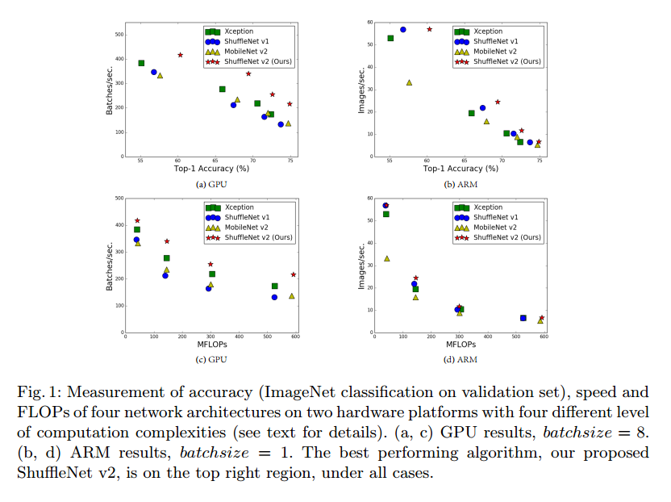

直接（速度）和间接（FLOPs）之间的矛盾有两个原因，第一，几个关于速度的重要因素没有在FLOPs体现出来。一个就是内存获取损耗（MAC），这个组卷积很大的组成部分，这在计算里强的设备上可能是瓶颈，例如GPU，这个损耗不应该被忽视，另一个是并行度，相同FLOPs的时候高的并行度更快。

第二，相同的FLOPs有不同的运行时间，这取决于平台。例如张量分解被广泛运用于加速矩阵计算，但是最近的一些发现在GPU上解耦很慢，即使减少了75%的FLOPs，我们研究了这个问题，发现最新的CUDNN对于3\*3的卷积进行了优化，因此不能确切的相信3\*3的卷积比1\*1慢9倍。

基于这个观察，我们提出了两个网络结构设计需要考虑的原则。第一，使用直接标准（如速度）而不是间接标准（如FLOPs），其次，这个标准应该在目标平台上做衡量。

## Practical Guidelines for Efficient Network Design

我们在两个广泛使用带工业级优化的CNN库的硬件上做了实验，注意我们的CNN库比基本所有的开源库都高效。因此我们的观察和结论是可靠的，在工业实践中极其重要的。

* GPU，1080Ti，CUDNN是7.0。
* ARM，高通骁龙810。单线程。

其他的设置包括：完整的优化选项（包括张量融合等）。输入图像时224\*224，每个网络随机初始化和评估100次，使用平均值。

我们分析了ShuffleNet V1和MobileNet V2两个网络，它们在ImageNet上有很高的效率和准确率，它们在低端设备有广泛的运用。它们的核心是组卷积和深度可分卷积。总的运行时间根据不同的运算分解，如图2。我们注意到FLOPs只是计算了卷积部分。虽然这个部分包括了大部分时间，但是其他的部分也是需要考虑的。

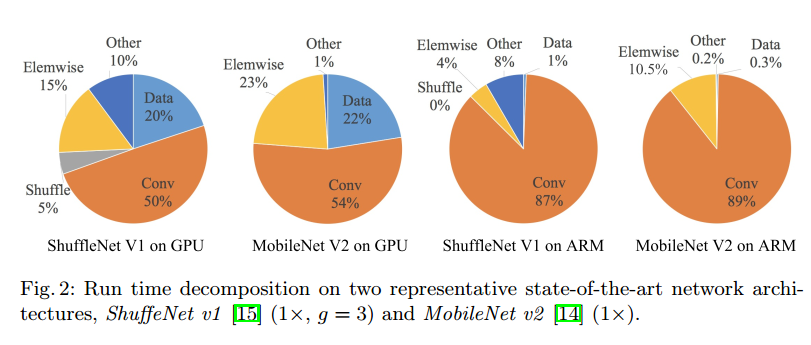

基于这些观察，我们对于不同的部分做了更细致分析。

**G1) Equal channel width minimizes memory access cost (MAC)**现代的网络通常使用了深度可分卷积，其中点卷积占据了最大的复杂度。我们研究了1\*1卷积的核形状，形状由两个参数指定，输入的通道数c1核输出通道数c2，h和w作为特征图的空间大小，那1\*1卷积的FLOPs时B=hwc1c2。

为了简化，我们假设设备的缓存足够容纳整个特征图和参数。因此，内存获取损耗MAC=hw(c1+c2)+c1c2。

对于均值不等，有：

因此，MAC有FLOP给定的下界。当输入通道和输出通道数量相等时到达下界。

结论时理论上的，实践中缓存有时候是不足的，同时现在一些库使用复杂的块策略来尽量的使用缓存机制。因此，实际的MAC和理论值有出入。为了验证这个结论，我们做了实验，通过堆叠10个块搭建一个基准网络，每个快包括两个卷积层，第一个包括c1的输入通道，c2个输出通道，第二个不然。

表1是结果。

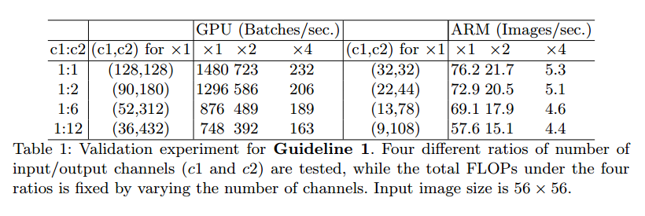

**G2) Excessive group convolution increases MAC**组卷积是很多网络的核心，它通过让卷积变稀疏减少了FLOPs的计算复杂度，一方面，它允许在FLOPs固定的情况下提升网络的容量，另一方面，通道数量增加导致更大的MAC。

严格来说，1\*1卷积的MAC和FLOPs的关系是：

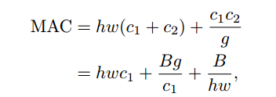

g是组数，B是FLOPs，容易看到，固定输入形状c1\*h\*w和计算量B，MAC随着g增加而增加。

实验中，堆叠了10层点级别的组卷积作为基准网络，表2是结果。容易看出，使用更大的组数极大地降低了运行速度。因此我们建议组数应该根据目标平台和任务谨慎选取，简单地因为大的组数可以使用更低的通道就使用大组数是不明智的，因为获得的准确率提升很容易被计算损耗淹没。

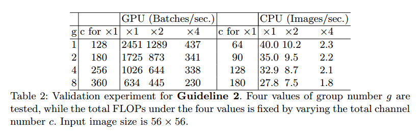

**G3) Network fragmentation reduces degree of parallelism**虽然像GoogleNet类似的分裂结构可以提升准确率，但是可能会影响效率，因为它对强并行计算设备，如GPU不友好。还有额外的例如核启动核同步。

为了量化，我们做了一系列实验，实验设计见附录，表3显示了分裂的结构降低了GPU的速度。

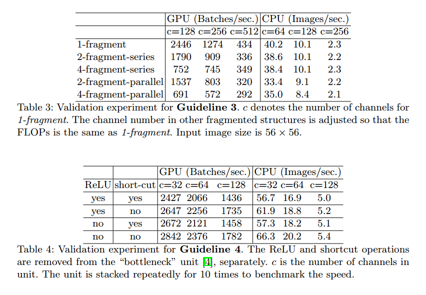

**G4) Element-wise operations are non-negligible**正如图2中显示的轻量级模型，元素级别的运算占据大量的时间，这里元素级别的运算包括ReLU，AddTensor, AddBias等。它们的FLOPs小，但是MAC大。尤其是，我们把深度卷积考虑为点级别的运算，因为它们也有很高的MAC/FLOPs的比例。

为了验证，我们实验了瓶颈单元（1\*1后3\*3后1\*1），带ReLU和跨越连接。ReLU和跨越连接分别移除，结果见表4，我们发现在ReLU和跨越连接移除后提高了大约20%的速度。

**Conclusion and Discussions** 扩是以上，我们总结了一个高效的网络结构应该 1) 使用平衡的卷积（通道宽度相等） 2）注意组卷积的损失， 3）减少分裂的程度， 4）减少元素级别的运算。这些特性依赖于平台，在实际中应该考虑。

## ShuffleNet V2: an Efficient Architecture

**Review of ShuffleNet v1**轻量级网络的一个挑战是在给定计算负荷（FLOPs）的情况下，只能计算有限数量的通道。为了在不极大增加FLOPs的情况下增加通道数，有两个方法：点级别的组卷积和瓶颈类似的结构。通道重洗操作的引入让通道的不同组可以进行信息交流，提升准确率，这个模块如图3。

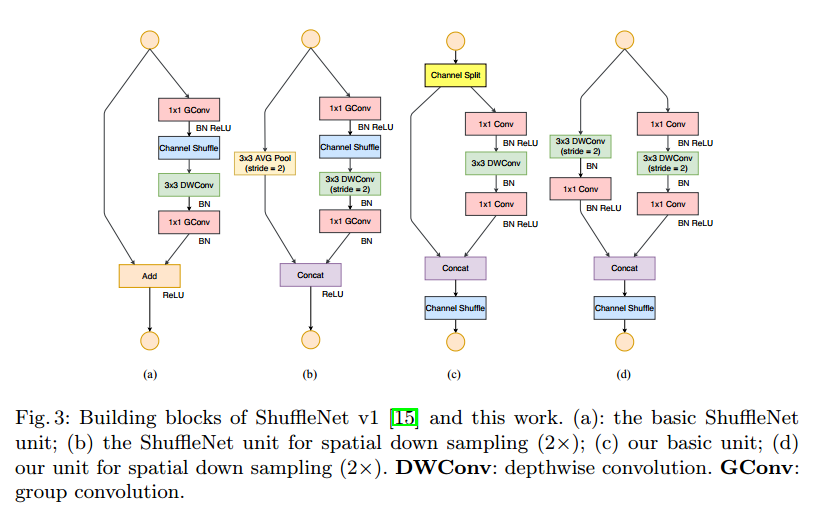

正如前面讨论的，点级别的组卷积和瓶颈结构提升了MAC（G1,G2），这个消耗是不可忽视的，尤其是轻量型的模型。同时，使用太多的组违反了G3。跨越连接中元素级别的加操作是不理想的（G4）。因此，为了获得搞得模型容量和效率，关键问题是如何在既不要密集的卷积也不要太多的组的前提下保持数量多且等宽的通道。

**Channel Split and ShuffleNet V2**我们引入了一个简单的操作叫做通道分割，如图3c。在每个单元的起初，c特征通道的输入分割为两个分支，c-c'和c'，根据G3，一个分支保持等价，为了满足G1，另一个分支包含3个卷积，输入和输出相同。两个1\*1的卷积不再是组级别的了，这样一方面满足了G2，一方面这个分割操作总是会产生两个组。

在卷积后，两个分支拼接，所以通道数量保持一致（G1）。同样的通道重洗也让两个分支信息交流。

在重洗后，下一个单元开始，注意到在V1中的加操作不存在，元素级别的操作如ReLU和深度卷积只在一个分支上存在，同样的，三个元素级别的运算，拼接，通道重洗，通道分割合并到一个单一的元素级别操作，服从G4。

对于空间降采样，单元稍微做了修改，如图3d。通道的分割移除了，因此输出通道的数量加倍了。

这种模块堆叠构成了整个网络。为了简化，我们设置c'=c/2，这个网络结构与V1相似，见表5。但是有一点不同，额外的1\*1卷积加入到全局均值池化前面用于混合特征。和V1相似，每个块的通道数量可以扩展到不同复杂度的网络。

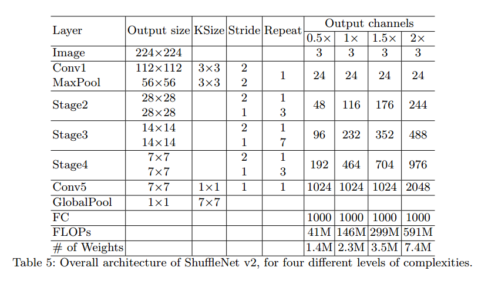

**Analysis of Network Accuracy**V2不仅仅高效，准确率也很高。原因有两点：每个模块的高效可以使用更多的特征通道和更大的网络容量。第二，一半的特征通道（c'=c/2）直接和下一个块连接，这个可以看作是特征再使用，和DenseNet、CondenseNet相似。

在DenseNet中，为了分析特征重用模式，画出了层间的l1标准化图，如图4a，容易看到层间的连接比其他的更强。这说明密集连接引入了冗余。

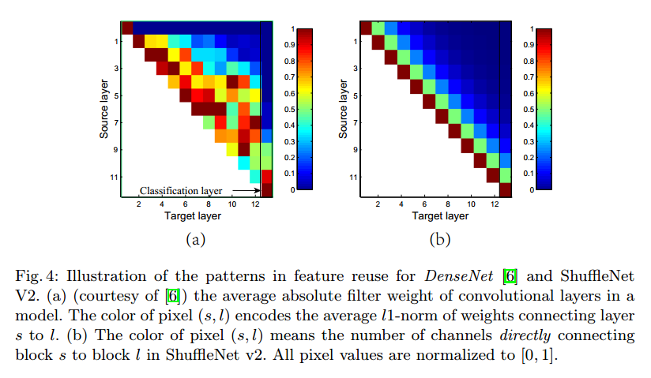

## Experiment

我们在ImageNet上做了剥离实验，我们比较了以下的结构：
* Shuffle Net V1 我们使用了g=3
* Mobile Net V2 
* Xception 我们使用了最近提出的一个轻量型的修改
* DenseNet

表8是结果。

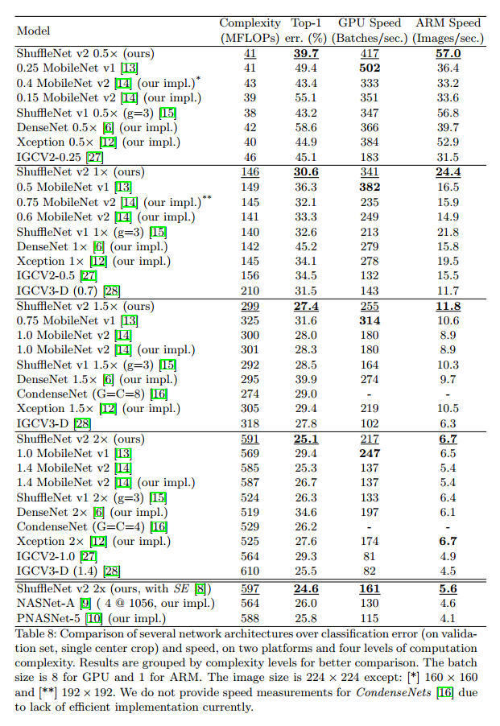

**Accuracy vs. FLOPs**容易看到V2比其他的好。尤其是在计算负荷小的时候，我们也看到MobileNet V2在40 MFLOPs级别对224的图像表现较差。这可能是因为通道太少，我们的网络没有这个问题。我们的网络和DenseNet都重用了特征，但是我们的更高效。

**Inference Speed vs. FLOPs/Accuracy**图1cd是画出的结果。V2比其他的要快，尤其是在GPU上。MobileNet V2在ARM上很慢，我们认为这是由于它有高MAC。

比较MobileNet V1和IGCV2 3可以看到虽然准确率不高，但是在GPU的速度比其他都快。我们认为这是因为网络符合了很多指导要求。其次，IGCV很慢，我们认为这是因为太多的卷积组。

我们也探索了一些自动生成的模型，它们的速度相对较慢。

**Compatibility with other methods**V2可以和其他的方法进行结合提高性能。

**Generalization to Large Models**我们的模型也可以用到大的网络上，表6是50层的V2和V1与ResNet50的比较，V2依旧运算更少。

**Object Detection**为了衡量泛化能力，我们测试了COCO，和Xception，ShuffleNet V1，MobileNet V2做了比较，结果在表7。

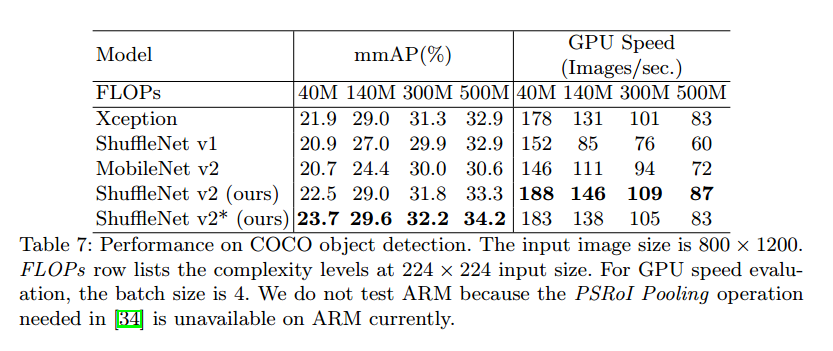

## Conclusion

我们提出了网络结构设计可以考虑直接直接标准，如速度，而不是间接标准FLOPs。我们提出了实践上的指导和新的模型ShuffleNet V2，综合的实验证明了模型的有效性。