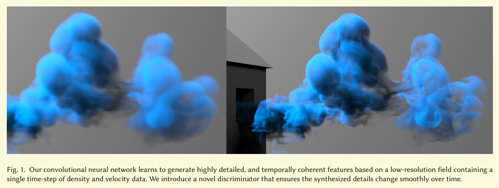
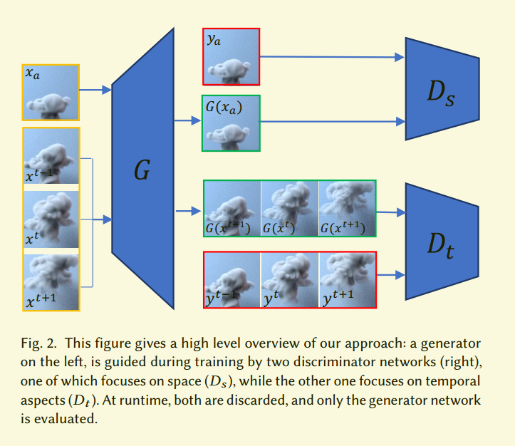
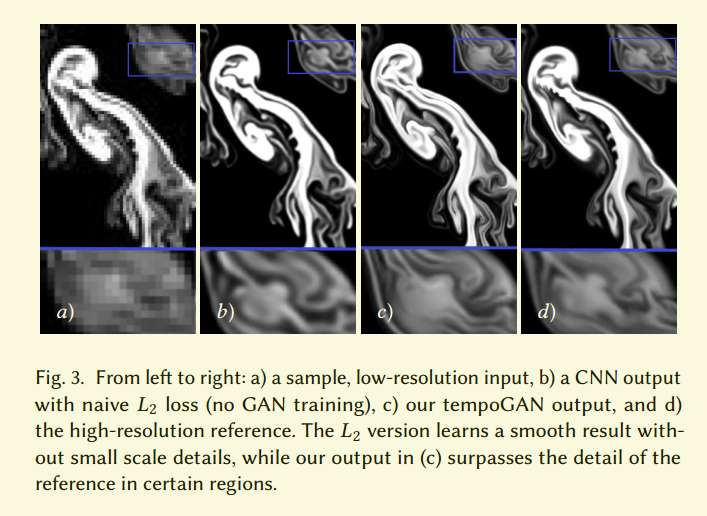
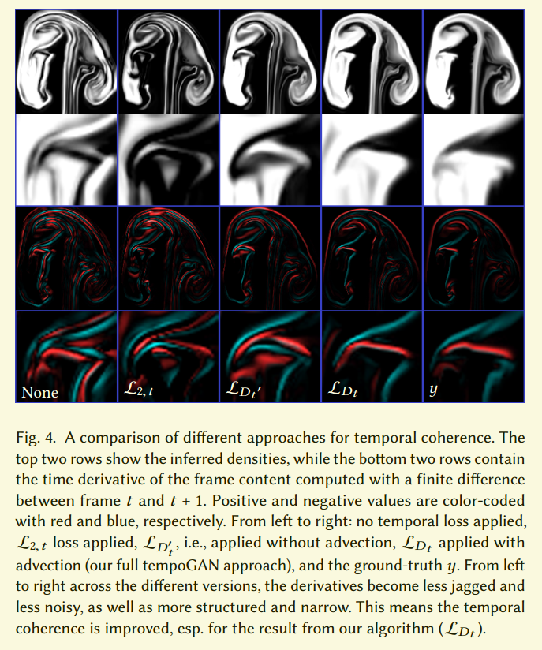
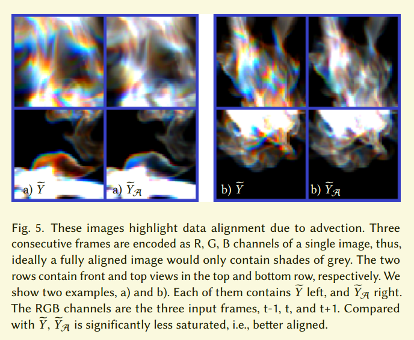
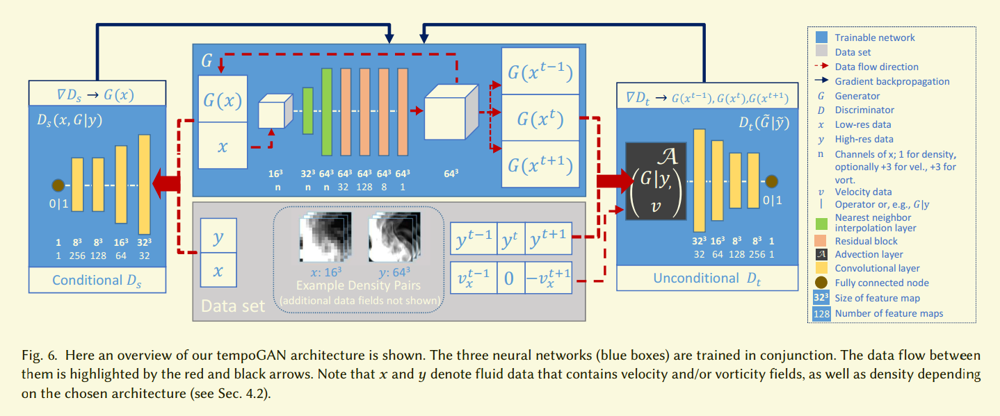
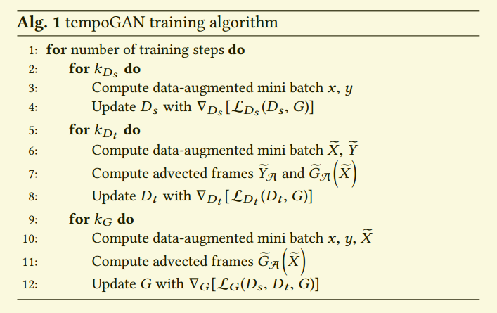
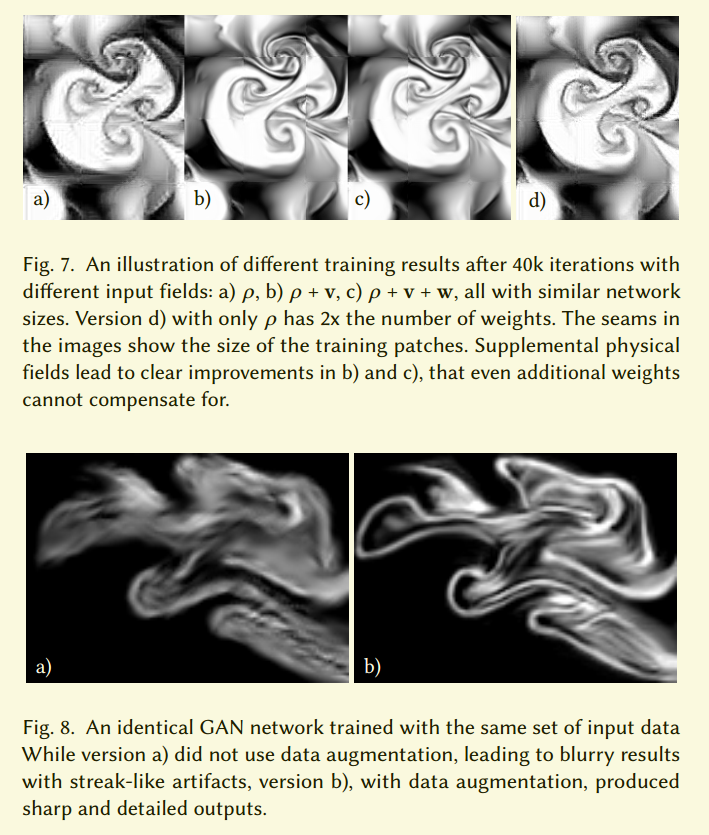
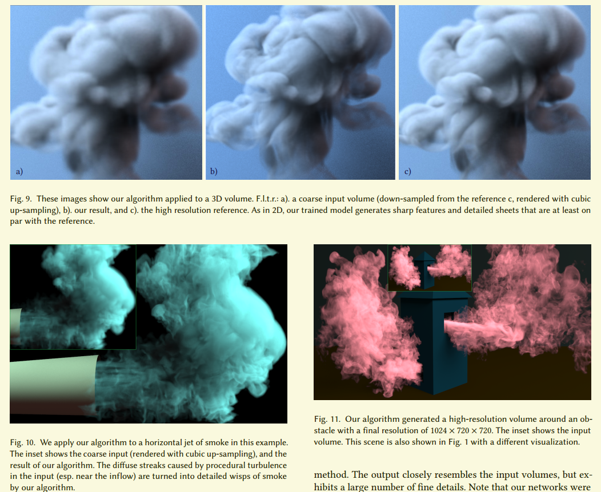

# tempoGAN: A Temporally Coherent, Volumetric GAN for Super-resolution Fluid Flow

## Contact me

* Blog -> <https://cugtyt.github.io/blog/index>
* Email -> <cugtyt@qq.com>
* GitHub -> [Cugtyt@GitHub](https://github.com/Cugtyt)

> **本系列博客主页及相关见**[**此处**](https://cugtyt.github.io/blog/papers/index)

---

<head>
    
    
</head>

## ABSTRACT

提出了一个具有短暂相关性的生成模型，解决了液体流动的超分辨率问题。我们第一次提出了用神经网络综合四维物理域的方法。条件GAN的设计用于推理三维数据，基于该模型，我们通过使用新的短暂判别器，结合常用的空间判别器来生成一致、精细的结果。实验结果说明通过加入物理量，如低分辨率的速度和旋涡，生成器能够推测更加真实的高分辨率的细节。除了提升训练过程和生成的结果，输入也可以提供更加艺术性的控制。我们也加入了物理感知的数据增强步骤，这对于预防过拟合至关重要，也减少了内存的要求。通过这种方法，我们的网络学习了生成很精细，真实和短暂相关的的流形体。我们的方法只需要一个时间步长的低分辨率流形数据就可以立即工作。我们使用在二维和三维的复杂输入和应用证明了模型的能力。

## INTRODUCTION

现在的生成模型没有考虑短暂演变的数据，这在真实的物理系统是非常关键的。我们把这些方法扩展到了生成高分辨率的平滑流动的数据，一个需要关注的点是保证短暂相关性。

数字模拟中的一个很大困难是捕获复杂混乱的流动情况，他需要消耗很大的计算力。我们发现高分辨率液体流数据推理受益于流动信息,额外的物理变量例如速度和旋涡作为输入可以反过来作为艺术效果的控制。在高分辨率流领域一个很大的困难是如何衡量生成输出的质量。对于混乱的运动，一个简单的近似都需要有大量不同的版本。只要输出符合参考数据相关的空间和短暂分布，我们就认为他是正确的。未了把这个要求编码到网络的训练过程，我们用了GAN。我们训练了一个特殊的，数据驱动的损失函数，使它可微，能够正常训练。

我们也展示了设置基于物理GAN的训练管道最佳实践，也就是说，我们发现它对于物理感知数据增强功能特别有用。大量的时空数据很快导致普通方法的硬件环境达到限制。同时，我们发现数据增强对于防止过拟合非常有用。我们也探索了其他的一些设置。

我们工作的主要贡献在于：
* 一个新的短暂判别器，去生成一致的精细的结果
* 可以控制输出，用额外的损失项和物理量的引入
* 物理感知的数据增强方法
* 物理功能的对抗训练过程的衡量
  
整体结构如图2。

## RELEATED WORK

略

## ADVERSARIAL LOSS FUNCTIONS

### Generative Adversarial Networks

略去基本原理。

我们的目标是高分辨率的问题，不是生成任意输出，而是需要对应于低分辨率输入的高分辨率输出，因此我们使用了条件GAN。对应于上面的优化问题，低分辨率的数据对应于x，判别器用于保证输入和输出的正确关系。先前有工作显示了一个额外的小权重的$L_1$损失项可以加到生成器上，保证输出和真实y接近。也就是。

### Loss in Feature Spaces

为了更好的控制成对的非线性的优化过程，CNN的特征可以进行约束。为了达到这个目标，在生成器中引入了神经网络的部分或全部特征的$L_2$损失,也就是生成器的中间结果引入了约束。先前的手工选择了预训练网络的一些层，而我们使用了判别器的特征作为约束。

我们用了一个新的损失项：

其中j是判别器网络的一层，$F^j$是对应层的激活。这是非常重要的，因为在四维流问题上我们没有合适的预训练的网络可用。

有趣的是，权重导致了不同的结果。对于$\lambda_f > 0$，损失项鼓励最小化真实和生成数据特征的距离，所以生成的特征类似于目标的特征。令人惊讶的是，我们发现在$\lambda_f < 0$训练也有很好的结果，甚至比前面的更好。由于我们使用的是条件GAN，所以我们的网络高度受限于输入。我们对这种情况的解释是负特征损失鼓励了生成不同于特征的优化结果，但是依旧很像目标特征。有可能我们不是针对一个单一的真实结果，而是给生成器自由的空间去生成适合于输入的任意结果。

### Temporal Coherence

GAN在处理短暂相关性上还是有很大困难。由于生成每一帧都是独立的，输入的微小改变都可能导致极为不同的细节。

当真实数据y来自传输过程，例如流动的情况，就表现出很高的短暂相关性，速度$v_y$存在于。这里我们把对流算子记作$A$，我们不失一般性假设帧t和t-1的时间步长为1。例如表示在时间t上的样本。相似的，为了解决短暂相关性问题，应当保持的相关关系，这里假设我们可以基于生成器输入x计算移动$v_{G(x)}$。我们把真实数据作为条件GAN的y，我们使用与目标y对应的$v_y$，做空间降采用来计算输入x的速度$v_x$。

结合$v_x$，一个提升短暂相关的可能是加入$L_2$损失项：

我们发现通过反向对流差扩展了前向对流差，进一步提升了结果，下面这个损失更好些：

虽然这个损失提升了短暂相关性，我们的测试表明它的效果很小。这个损失的一个副作用是它很容易被简单的减小$G(x)$而减小，这个可以在图4看出来。

我们不去手工编码的短暂改变，而是提出了使用另一个判别器$D_t$，从输入数据中学习哪些变化是可以接受的。这个情况下，原始的空间判别器，我们记作$D_s(x, G(x))$，保证了我们的生成器学习生成更真实的细节，新的短暂判别器$D_t$主要关注于驱动$G(x)$向着符合真实数据的短暂演化前进。

具体而言，$D_t$获取了3帧作为输入，我们用波浪来标记。真实数据记为：，生成的数据为：。

与我们的空间判别器$D_s$相似，短暂判别器$D_t$作为2分类分类器：

注意，与空间判别器不同，$D_t$不是一个条件判别器。它不看条件输入x，因此只是基于给定的序列来判别。

在图4中，我们展示了不同损失对于提升短暂相关的比较。第一列是只在空间判别器下的生成，作为基线。第二列是使用公式5中的短暂损失$L_{2,t}$，第四列是使用公式6中的$D_t$的结果。最后一列是真实数据y。前两行是生成的密度域，虽然$L_{2,t}$减少了整体的密度容量，但是$D_t$的结果非常接近与真实值。下面两行展示了帧t和t+1的密度对时间的导数。再一次，$D_t$的结果和真实值十分接近。前两行大的波动是普通GAN和$L_{2,t}$损失在非理想情况下短暂改变的结果。

在第三列，我们展示了一个短暂判别器的变种。这里我们的判别器不适用输入和对流操作：

这个版本相比$L_{2,t}$提升了结果，但是没有到达$L_{D_t}$的质量。另外我们发现$L_{D_t}$通常有很快的收敛性。这说明，神经网络使用$L_{D'_t}$在校准和比较数据方面有困难。这个直觉见图5，我们可以看到普通数据集$\tilde{Y}$和对流版本$\tilde{Y}_A$。三个时间帧用红绿蓝表示，所以灰色表示完美对应,其他颜色表示不对应。图5表示虽然不完美，但是对流的模型有明显的提升。我们的实验证明了校准成功的提升了反向传播梯度，使得生成器学到了产出更相关的输出。但是，当没有流域可用时，$L_{D'_t}$依然表现出更好的结果。我们把这个看作是对抗模型能力的一个标志。看起来让网络学习和判断数据集的细节，而不是手工指定标准更好些。

值得指出的是，公式6表示对流步骤是生成器训练的固有步骤。虽然$v_x$可以被预计算，但是需要在训练时应用到生成器的输出上。这反过来说明对流需要紧密的和训练迭代集成在一起。前面的讨论说明如果这个做的很成功，短暂判别器的损失梯度很好的传到对流步骤上，给生成器以反馈以便提升结果。通常情况下，对流是非线性函数，对它的离散近似我们简写为$F(y^t, v_y^t)$。【略】

### Full Algorithm

我们把整个算法叫做tempoGAN，有三个优化问题：生成器，条件空间判别器，非条件短暂判别器。整个损失是：

在所有生成器的损失项中，$L_1$项在稳定训练中的重要性小。但是由于优化问题的复杂性，它对于训练的成功还是有帮助的。特征空间的损失，直接影响到了生成的特征。在对抗的设定中，判别器最可能学到不同的特征。因此在训练中，生成器获得梯度来产出更多来自目标$F(y)$的特征，而来自$F(G(x))$的梯度会惩罚那些属于生成的特征。

$\lambda_f$强化了这个行为，但是为何某些类中负值可以导致更好的结果依旧不是很清楚。

## ARCHITECTURE AND TRAINING DATA

我们关注于生成器的全卷积网络，全卷积网络的优势是网络可以用到任意的输入大小上。

我们发现判别器的结构不是那么重要了，只要有足够的非线性，所以我们只用四层卷积，加上leaky ReLU激活，再加上一个全连接，输出最后的分数。我们模型的总览是图6。

### Data Generation and Training

我们使用了随机化的烟雾仿真来生成需要的训练样本。我们生成了大概20个仿真，每个仿真有120帧的输出。对于输入x，我们使用了下采样版本的数据，因子是4，全分辨率作为目标。注意这个步骤有内在的多模态：对于一个单一的低分辨率设置，有无数的正确高分辨率存在。我们不去显式的采样高分辨率空间，而是下采样同时做数据增强产生任意的数据对。【略】

训练参数和细节见原文。【略】训练过程见Alg.1。

虽然相同的参数也会导致不同的结果，但是我们发现结果的质量还是比较稳定的。【略】

### Input Fields

虽然看起来输入速度，旋涡以及密度是冗余的，但是我们注意到给网络额外的信息极大的提升了收敛和结果的质量。图7是个例子。

### Augmenting Physical Data

数据增强是非常重要的，因为数据维度很高。没有足够的训练数据，对抗训练由于过拟合会出现不理想的结果。

为了得知在不影响结果质量的前提下的最小尺寸，我们在训练的时候生成数据。我们关注于空间转换，形式是$\tilde{x}(p)=x(Ap)$，其中p是空间位置，A表示一个4\*4的矩阵。为了应用数据增强，我们把数据集区分了三个部分：

* passive: 这部分可以直接转换，一个例子是对流烟雾域$\rho$，我们的很多例子都有显示。
* directional： 这部分可以在和增强同时做。一个好的例子是速度，它的方向需要和旋转、翻转一起做，$\tilde{v}_p=A_{3\times 3}v(Ap)$。
* derived: 这个部分在增强后就不可用了，因此需要被重新计算。一个好的例子是物理量，如速度，它混合了很多成分，不能轻易地转换。但是这些部分可以在增强后重新计算得到。

如果数据包括的量不能在增强后计算获得，这意味着数据增强就不能轻易使用。

对于矩阵A，我们考虑仿射变换矩阵，包含随机转换，均匀缩放，反射，旋转等。只有那些不影响数据集物理模型的转换才能使用。【略】

输出的大小比输入要大很多，这里我们有很多的方法来选择补偿以使网络具有平移不变性。这和我们的目的-训练网络生成任意大小的输入一致。我们发现对于空间拼接的边界应当特别关注。虽然数据可以通过Dirichlet或周期边界条件扩展，但是在数据集增强后不能跑出原始数据的范围。我们在其他转换后通过选择合适的转换来强化它。这保证了所有的数据不只包括有效的内容，而且网络不需要从边界附近学习非物理化的，不能表示的数据。我们发现在速度域上的空间转换对于短暂改变已经有足够的多样性。图8是数据增强中的一个变化大的例子。【略】

## RESULTS AND APPLICATIONS

### 3D Results

我们前面使用的是2D的样例，图9中我们证明了这些结果可以直接扩展到3D中。

【略】细节设置和结果见原文。

### Training Progress

图19是判别器的损失图，从公式1到公式6。在图19a中，短暂判别器引入后，空间判别器损失在下降。这里的图显示了只显示了空间判别器的损失，在第二个判别器引入的时候，这个判别器是不变的。绿线是只有空间判别器的训练，橘色线是同时存在空间和短暂判别器。我们对空间判别器更低损失的解释是短暂判别器的存在阻止生成器利用精细部分的解空间，但是变化了输出。进而驱使生成器从短暂相关的那些中寻找解，这个很困难，反过来简化了空间判别器的难度。

相反的，空间判别器的存在没有明显的影响短暂判别器，见图19b。这也是符合直觉的，我们发现只用$D_t$训练生成器相比同时使用产出了更少的细节。说明我们的两个分类器成功的影响了不同的方面。

### Performance

2个GPU跑2D运行需要14个小时，3D需要9天。但是实践中，大概1/4的时间就差不多了。【略】

### Limitations and Discussion

我们方法的一个限制是网络把固定分辨率差异进行编码用于生成细节。虽然初始的上采样层可以略去，这样网络能够用到任意大小上，其他的大小也可以去尝试。我们现在的实现比计算对流高分辨率网络慢。但是高分辨率对流不能生成不在输入域内的动态过程。

我们的三维网络需要很长的时间来训练，幸运的是，只需要一次，网络后续就可以灵活使用。但是如果合成的小尺度特征需要微调，训练时间就是很麻烦的事情了。

## CONCLUSIONS

我们实现了第一个四维数据上的条件GAN，同时证明了使用我们新的时间判别器可以让生成器保留短暂相关性。短暂判别器的网络结构保证了生成器即使在复杂的传输过程中也有梯度信息，这样对于短暂演化也能鲁棒训练。我们也展示了这个判别器稳定提升了生成器细节和训练过程。同时，我们的全卷积网络可以用于任意大小的输入，我们的方法提供了基本的方法用于控制生成的输出。我们的CNN能够受益于相关的物理信息，即使是在复杂的3D场景中，网络大小得以减少。

总的来说，我们贡献了一个鲁棒的，通用的物理问题的生成模型，尤其是在超分辨率上。