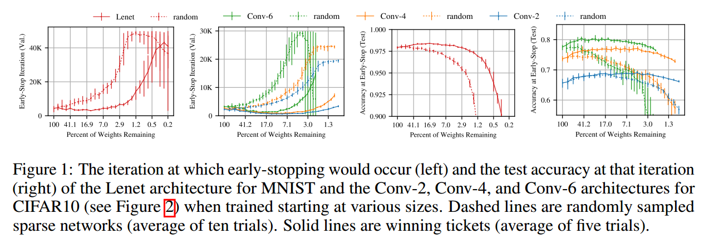
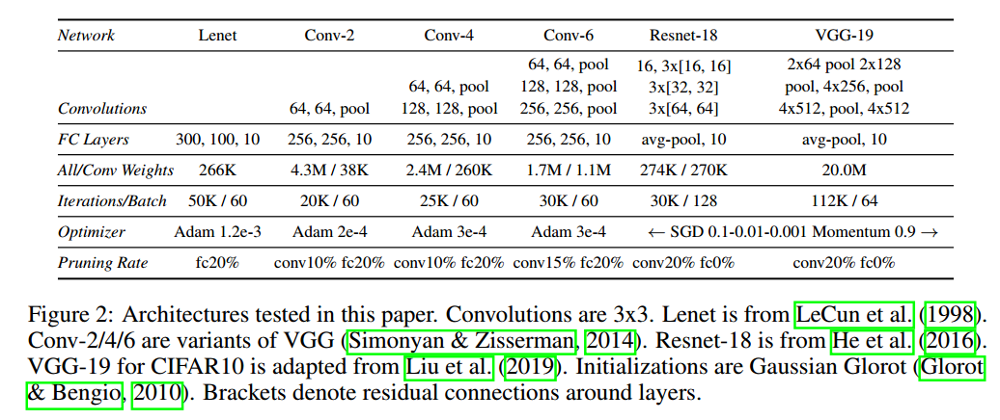
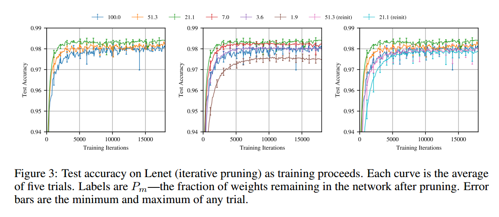
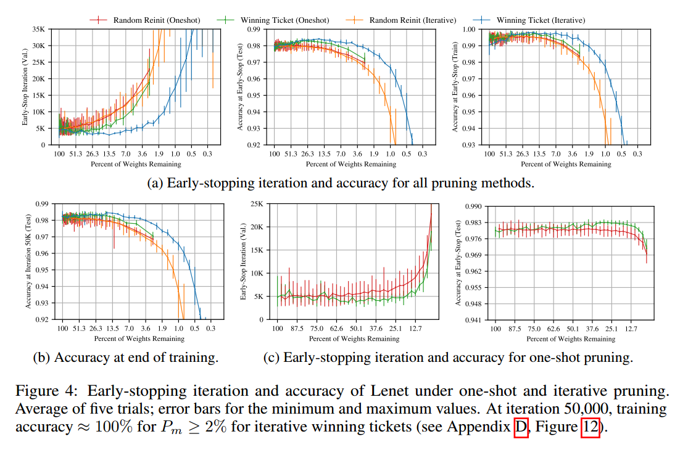

# THE LOTTERY TICKET HYPOTHESIS: FINDING SPARSE, TRAINABLE NEURAL NETWORKS

## Contact me

* Blog -> <https://cugtyt.github.io/blog/index>
* Email -> <cugtyt@qq.com>
* GitHub -> [Cugtyt@GitHub](https://github.com/Cugtyt)

> **本系列博客主页及相关见**[**此处**](https://cugtyt.github.io/blog/papers/index)

---

<head>
    
    
</head>

## ABSTRACT

神经网络剪枝可以减少超过90%的参数量，同时准确率没有太大影响。但是剪枝后的结构很难从头开始训练，不然就能近似提高训练性能了。

有一些子网络，在初始情况下就可以高效的训练网络，但我们发现标准的剪枝技术天然的没有包括它们。基于这些结果，我们提出了彩票假说：密集的，随机初始化的前馈网络包括一些子网络（中奖者），这些子网络独立训练时可以在相近的迭代次数达到相近的测试准确率。这些中奖者赢得了初始彩票：它们初始权重就能特别高效的训练。

我们提出了一个算法来找这些中奖者，一系列的实验也支持了我们的假说和那些偶然初始化的重要性。我们不断的在MNIST和CIFAR10数据集上发现，中奖者的大小只有全连接网络和卷积网络的10%到20%。除了尺寸，我们发现这些中奖者训练更快，测试准确率更高。

## 1 INTRODUCTION

有一些方法可以减少90%的参数但是没有准确率影响，但是为什么开始时不用这个更小的结构来训练呢？研究发现这样做的结果比较差。

在图1中，我们从MNIST的全连接网络和CIFAR10的卷积网络中随机采样训练一个子网络。随机采样建模了非结构化剪枝。在不同的稀疏程度上，虚线表示迭代中的最小验证损失和准确率。网络越稀疏，学的越慢，最后的准确率越低。

本文中，我们展示总存在是个更小的网络，在从头训练时至少和原始网络一样快，测试准确率相近。图1实线是我们找到的网络。

**The Lottery Ticket Hypothesis** 随机初始化的，密集的网络包括一个子网络，这个网络的初始化使得它能在单独训练时达到相似的准确率，需要的迭代次数也相近。

严格来说，考虑一个密集的前馈网络$f(x ; \theta)$，初始参数$\theta=\theta_{0} \sim \mathcal{D}_{\theta}$。在训练集中用SGD优化，$f$在迭代$j$次后达到最小验证损失$l$和测试准确率$a$。另外，考虑带参数mask $m \in\{0,1\}^{|\theta|}$训练$f(x ; m \odot \theta)$，所以初始化参数为$m \odot \theta_{0}$。当用SGD优化时，$f$在迭代$j‘$次后达到最小验证损失$l‘$和测试准确率$a’$。彩票假说预测，对于$\exists m$使得$j^{\prime} \leq j$，$a^{\prime} \geq a$，$\|m\|_{0} \ll|\theta|$参数量更少。

我们发现标准化的剪枝方法自动的略过了这样的网络。我们称这样的一个子网络为中奖者。在参数随机初始化后，$f\left(x ; m \odot \theta_{0}^{\prime}\right)$ where $\theta_{0}^{\prime} \sim \mathcal{D}_{\theta}$，它们就无法中奖了，除非初始化得好。

**Identifying winning tickets** 我们通过训练，减去梯度最小的权重来定为这个网络。剩下的，没有剪枝的就是我们的中奖者。每个未剪枝的连接值在重新训练时在次填回原来初始化的值。这就是我们的实验核心：

1. 随机初始化网络$f\left(x ; \theta_{0}\right)\left(\text { where } \theta_{0} \sim \mathcal{D}_{\theta}\right)$
2. 迭代j次，得到参数$\theta_{j}$
3. 从参数$\theta_{j}$中减去$p \%$参数，生成mask $m$。
4. 把剩下的参数值设为原来的值$\theta_{0}$，生成中奖者$f\left(x ; m \odot \theta_{0}\right)$

可以看到，这个剪枝过程是one-shot：网络训练一次，$p \%$的权重剪枝，剩下的重新设置值。但是本文关注于迭代剪枝，不断的进行训练，剪枝，重设。结果显示，迭代剪枝比one-shot剪枝找到的网络更小。

结果：我们在MNIST的全连接网络和CIFAR10的卷积网络中找到了中奖者。我们使用非结构化的剪枝方法，因此这些中奖者是稀疏的。在更深的网络中，我们的基于剪枝的方法对学习率敏感，高学习率需要warmup来找中奖者。中奖者是原始网络的10-20%大小，准确率更高，迭代次数相近。随机初始化后，效果就很差了，意味着单独说结构不能解释中奖者的成功。

**The Lottery Ticket Conjecture** 密集的随机初始化的网络相对于稀疏网络更容易训练，因为有更多可能的子网络。

**Contributions**
* 我们证明了可以剪枝得到一个子网络，在相近的迭代后可以达到相似的测试准确率
* 我们展示了中奖者相比于原来学的更快，可以达到更高的准确率，泛化性更好
* 我们提出了彩票假说可以用来解释这个发现

**Implications** 我们可以探索：
* *Improve training performance* 由于中奖者可以独立从头训练，所以我们可以设计一个训练方法来寻找中奖者，更容易的进行剪枝。
* Design better networks* 中奖者揭示了稀疏结构和初始化对学习尤其重要。我们可以试着设计新的网络结构和初始化方案。甚至可以迁移到其他任务上。
* *Improve our theoretical understanding of neural networks*

## 2 WINNING TICKETS IN FULLY-CONNECTED NETWORKS

我们试验了MNIST上的全连接网络。使用Lenet-300-100。在随机初始化和训练网络后，我们剪枝，然后重新设置参数。我们使用了简单的修建方法，移除最小梯度的权重。

**Notation** $P_{m}=\frac{\|m\|_{0}}{|\theta|}$表示m的稀疏性，例如$P_{m}=25 \%$表示75%的权重减掉了。

**Iterative pruning** 图3表示迭代剪枝的结果。第一测修建，网络学得更快，准确率更高（图3左）。51.3%权重有最好的测试准确率，比原始网络快，但是慢于21.1%。3.6%是达到原始网络一样的性能。

图4a是每次迭代剪枝20%的情况。左侧是早停与权重比例的情况。中间是测试准确率。

中奖者从$P-m$为100%到21%学得越来越快，最后早了38%。进一步的剪枝学习变慢，在3.6%的时候早停性能和原始网络一致。测试准确率在13.5%下提升了0.3个百分点，后续就降低了，在3.6%的时候返回原始网络的水平。

**Random reinitialization** 为了验证中奖者初始化的重要性，我们保持了中奖者的结构，但重新初始化。在图5中对每个中奖者随机初始化3次，发现初始化是极其重要的。图3右展示了迭代剪枝的情况。

【略】

**One-shot pruning** 图4中也展示了one-shot的实验。【略】

## 3 WINNING TICKETS IN CONVOLUTIONAL NETWORKS

【略】